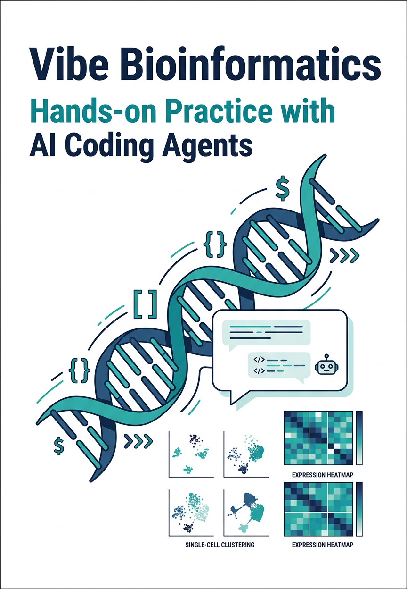

# 바이브 코딩으로 시작하는 생명정보학 실습

**저자**: 박정빈

  

## 이 책에 대하여

이 책은 AI 코딩 에이전트(Claude Code)를 활용하여 생명정보학 분석과 웹 도구 개발을 실습하는 안내서이다. 코드를 한 줄 한 줄 외우는 대신, 핵심 개념을 이해하고 AI에게 자연어로 지시하는 **바이브 코딩(Vibe Coding)** 방식을 다룬다.

프로그래밍 경험이 없거나 적은 생명과학 연구자를 주요 독자로 상정하며, 개발 환경 구성부터 Git, Docker, Python 데이터 분석, 단일세포 RNA-seq 분석, Snakemake 워크플로우 자동화, SvelteKit 기반 웹 도구 제작, MCP 프로토콜, AI Co-scientist 설계, 그리고 AI 논문 작성까지 실무에 필요한 전 과정을 단계별로 안내한다.

## 구성

| 파트 | 내용 | 챕터 |
|------|------|------|
| **I. 개발 기초 도구** | 개발 환경, 버전 관리, 컨테이너 | 1~3장 |
| **II. 파이썬으로 분석하기** | 데이터 분석, 단일세포 분석, 워크플로우 | 4~6장 |
| **III. 생명정보 웹 툴 만들기** | SvelteKit, UI 디자인, BLAST 도구 | 7~10장 |
| **IV. AI Co-scientist 만들기** | MCP, 에이전트 설계, 논문 작성, 실전 분석 | 11~14장 |
