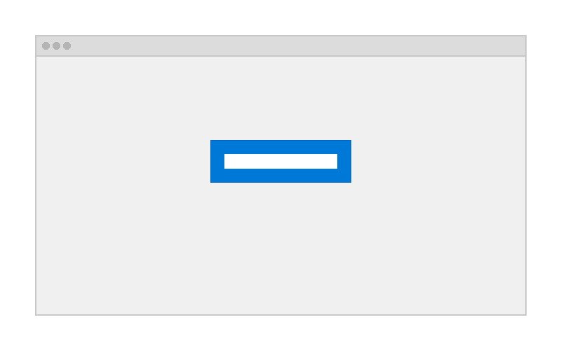
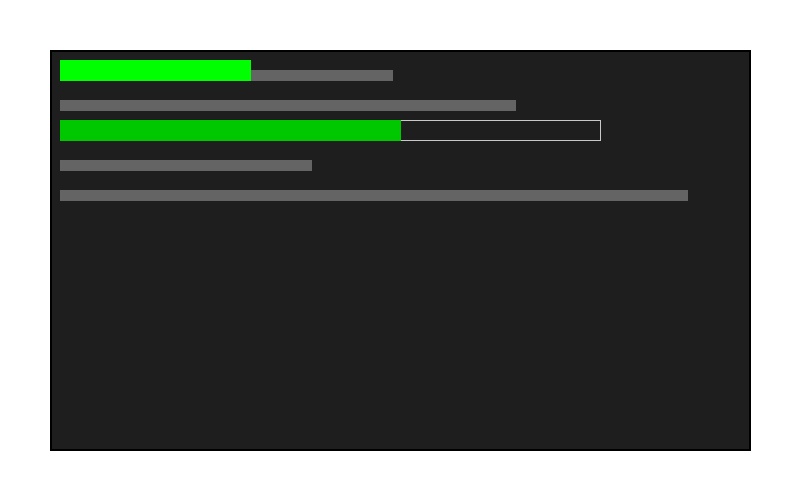
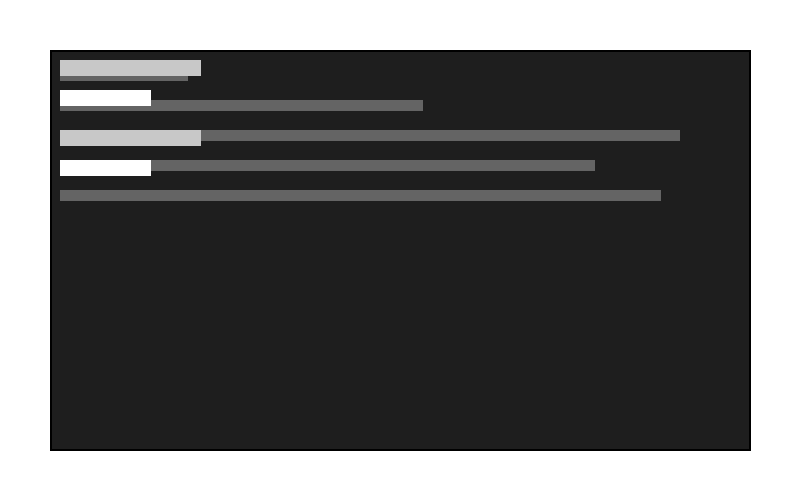
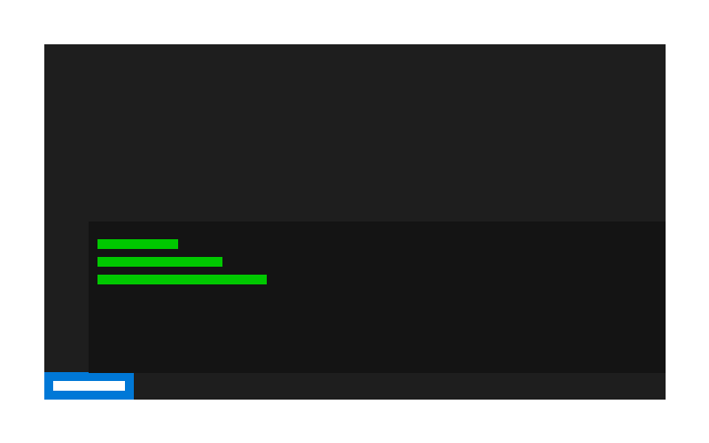
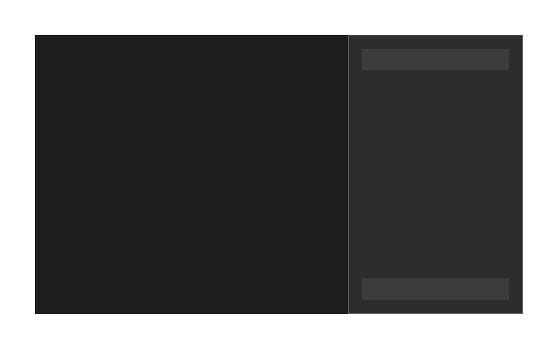
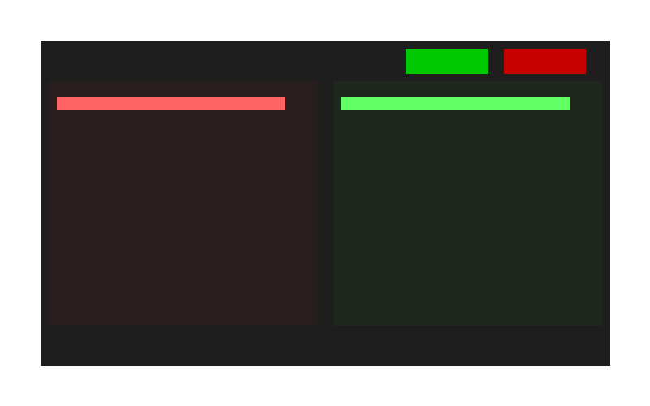

# 1장. 개발 환경 구성

## 1.1 Visual Studio Code 설치

Visual Studio Code(VS Code)는 Microsoft에서 개발한 무료 코드 편집기로, 다양한 프로그래밍 언어를 지원하며 확장 프로그램을 통해 기능을 추가할 수 있다. 이 책에서는 VS Code를 기본 개발 환경으로 사용한다.

### 설치 방법

1. https://code.visualstudio.com 에 접속한다
2. 운영체제에 맞는 설치 파일을 다운로드한다 (Windows, macOS, Linux)
3. 다운로드한 파일을 실행하여 설치를 완료한다



### 설치 확인

설치가 완료되면 VS Code를 실행하여 정상적으로 동작하는지 확인한다.


### 유용한 확장 프로그램

VS Code의 강력한 장점 중 하나는 확장 프로그램(Extension)이다. 왼쪽 사이드바의 확장 프로그램 아이콘을 클릭하거나 `Cmd+Shift+X` (Mac) / `Ctrl+Shift+X` (Windows/Linux)를 눌러 확장 프로그램 마켓플레이스를 열 수 있다. 앞으로 필요한 확장 프로그램은 이곳에서 검색하여 설치하면 된다.


## 1.2 WSL (Windows Subsystem for Linux)

Windows 사용자의 경우, 웹 개발 및 생명정보학 도구 대부분이 리눅스 환경을 기반으로 하므로 **WSL(Windows Subsystem for Linux)**을 설치하여 리눅스 환경에서 개발을 진행하는 것을 권장한다. macOS나 Linux 사용자는 이 절을 건너뛰어도 된다.

### WSL이란?

WSL은 Windows 위에서 리눅스 배포판을 직접 실행할 수 있게 해주는 기능이다. 별도의 가상 머신 없이도 리눅스 터미널과 명령어를 사용할 수 있으며, Windows의 파일 시스템과도 자연스럽게 연동된다.

### WSL 설치

PowerShell을 **관리자 권한**으로 실행한 뒤 다음 명령을 입력한다:

```powershell
wsl --install
```

이 명령 하나로 WSL 기능 활성화와 Ubuntu 배포판 설치가 자동으로 진행된다. 설치가 완료되면 컴퓨터를 재부팅한다.



재부팅 후 자동으로 Ubuntu 터미널이 열리며, 리눅스 사용자 이름과 비밀번호를 설정하라는 메시지가 나타난다.



### VS Code에서 WSL 연동

VS Code에서 WSL 환경을 사용하려면 **WSL** 확장 프로그램을 설치한다.

1. VS Code 확장 프로그램 마켓플레이스에서 "WSL"을 검색하여 설치
2. VS Code 좌측 하단의 파란색 `><` 아이콘을 클릭
3. **"Connect to WSL"**을 선택


연결이 완료되면 VS Code 좌측 하단에 **"WSL: Ubuntu"**라고 표시되며, 터미널을 열면 리눅스 셸이 실행된다. 이후 이 책의 모든 터미널 명령은 WSL 환경에서 실행하면 된다.



## 1.3 VS Code에서 Claude Code 사용하기

Claude Code는 VS Code에 직접 통합되는 AI 코딩 도구이다. Github Copilot과 마찬가지로 VS Code 확장 프로그램으로 설치하여 사용할 수 있으며, 코드 작성, 디버깅, 리팩토링 등 다양한 작업을 AI의 도움을 받아 수행할 수 있다.

### 필수 조건

- VS Code 1.98.0 이상
- Anthropic 계정 (확장 프로그램을 처음 열 때 로그인)

### 설치 방법

VS Code에서 `Cmd+Shift+X` (Mac) 또는 `Ctrl+Shift+X` (Windows/Linux)를 눌러 확장 프로그램 보기를 열고, "Claude Code"를 검색한 후 **설치**를 클릭한다.


### 시작하기

#### 1단계: Claude Code 패널 열기

편집기 오른쪽 위 모서리의 **Spark 아이콘**을 클릭하여 Claude Code 패널을 연다. 또는 다음 방법으로 열 수 있다:

- **명령 팔레트**: `Cmd+Shift+P` (Mac) 또는 `Ctrl+Shift+P` (Windows/Linux)를 누르고 "Claude Code"를 입력
- **상태 표시줄**: 창 오른쪽 아래의 **Claude Code**를 클릭



#### 2단계: 프롬프트 보내기

Claude에게 코드에 대해 질문하거나, 디버깅을 요청하거나, 변경 사항 작성을 요청한다. 편집기에서 텍스트를 선택하면 Claude가 해당 코드를 자동으로 인식한다.

- `@` 뒤에 파일명을 입력하면 특정 파일을 참조할 수 있다 (예: `@auth.js`)
- `Option+K` (Mac) / `Alt+K` (Windows/Linux)로 현재 파일과 선택 영역의 참조를 삽입할 수 있다


#### 3단계: 변경 사항 검토

Claude가 파일을 편집하려고 하면, 원본과 제안된 변경 사항을 나란히 비교하는 diff 화면이 나타난다. 수락하거나 거부하거나, Claude에게 다른 방법으로 수정하도록 요청할 수 있다.



### 주요 기능

#### 권한 모드

프롬프트 상자 하단의 모드 표시기를 클릭하여 전환한다:

| 모드 | 설명 |
|------|------|
| **일반 모드** | 각 작업 전에 권한을 요청 |
| **Plan Mode** | 수행할 작업을 설명하고 승인을 기다림 |
| **자동 수락 모드** | 요청하지 않고 바로 편집 |

#### 파일 및 폴더 참조

`@-멘션`을 사용하여 특정 파일이나 폴더에 대한 컨텍스트를 Claude에게 제공한다:

```text
> @auth.js 이 파일의 로직을 설명해줘
> @src/components/ 이 폴더의 구조를 분석해줘
```

#### 여러 대화 실행

명령 팔레트에서 **새 탭에서 열기** 또는 **새 창에서 열기**를 사용하여 여러 대화를 동시에 실행할 수 있다. 각 대화는 독립적인 기록과 컨텍스트를 유지한다.

#### Git 통합

Claude Code는 Git과 통합되어 VS Code에서 직접 버전 관리 작업을 수행할 수 있다:

```text
> 변경 사항을 설명하는 커밋 메시지로 커밋해줘
> 이 기능에 대한 PR을 만들어줘
```

### 주요 단축키

| 명령 | 단축키 (Mac / Windows·Linux) | 설명 |
|------|------|------|
| 포커스 전환 | `Cmd+Esc` / `Ctrl+Esc` | 편집기와 Claude 사이 전환 |
| 새 탭에서 열기 | `Cmd+Shift+Esc` / `Ctrl+Shift+Esc` | 새 대화를 탭으로 열기 |
| 새 대화 | `Cmd+N` / `Ctrl+N` | 새 대화 시작 (Claude 포커스 시) |
| @-멘션 삽입 | `Option+K` / `Alt+K` | 현재 파일 및 선택 영역 참조 삽입 |

## 1.4 정리

- **VS Code 설치 및 기본 사용법 숙지**
  - 확장 프로그램 마켓플레이스 활용법 익히기
- **Windows 사용자는 WSL 설치**
  - VS Code에서 WSL 연동하여 리눅스 환경에서 개발
- **Claude Code 활용하기**
  - VS Code에 Claude Code 확장 프로그램을 설치하고 코딩에 활용해보기
  - @-멘션, 권한 모드 등 주요 기능 익히기
