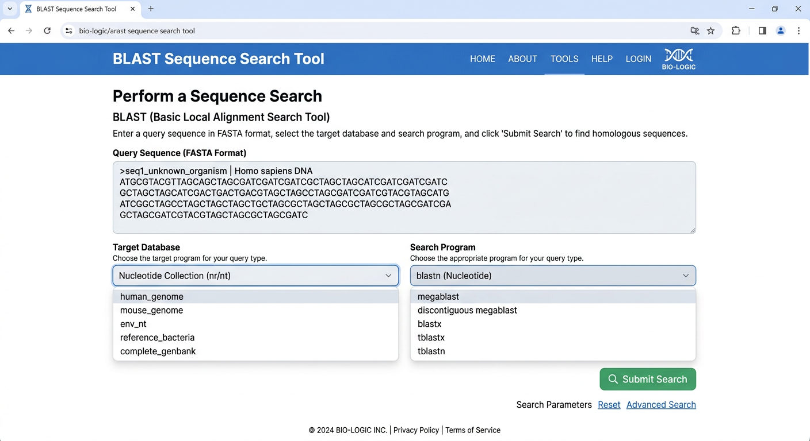
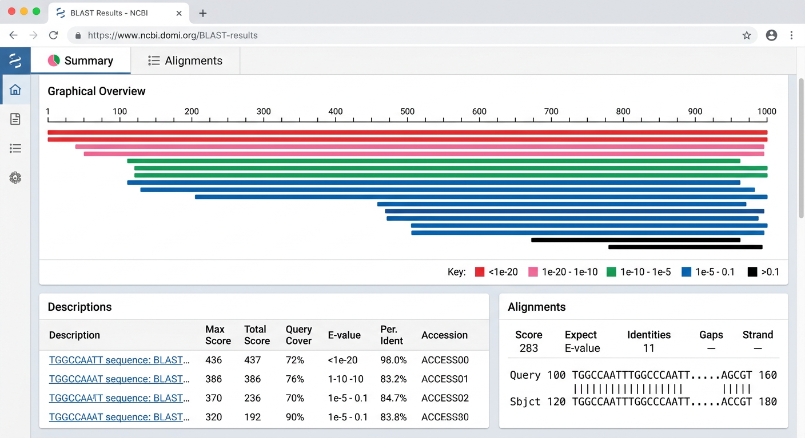

# 10장. BLAST 검색 도구 만들기

## 10.1 BLAST란?

**BLAST(Basic Local Alignment Search Tool)**는 생명정보학에서 가장 많이 사용되는 서열 유사성 검색 도구이다. 입력한 DNA 또는 단백질 서열과 유사한 서열을 데이터베이스에서 찾아주며, NCBI에서 제공하는 웹 버전(https://blast.ncbi.nlm.nih.gov)이 가장 널리 알려져 있다.

이 장에서는 7-9장에서 배운 SvelteKit + Tailwind CSS + PostgreSQL 기술 스택을 활용하여 **나만의 BLAST 검색 웹 도구**를 만든다. NCBI의 BLAST+ 명령줄 도구를 백엔드에서 실행하고, 결과를 웹 인터페이스로 보여주는 구조이다.

### 완성된 도구의 모습

```
┌──────────────────────────────────┐
│  Navbar                          │
├──────────────────────────────────┤
│  Home > Tools > BLAST Search     │
│  BLAST Search                    │
├──────────────────────────────────┤
│  ┌────────────────────────────┐  │
│  │  시퀀스 입력 (FASTA)        │  │
│  │  ┌──────────────────────┐  │  │
│  │  │ >query1              │  │  │
│  │  │ ATCGATCGATCG...      │  │  │
│  │  └──────────────────────┘  │  │
│  │  DB 선택: [nr ▾]           │  │
│  │  Program: [blastn ▾]       │  │
│  │  [검색 시작]                │  │
│  └────────────────────────────┘  │
├──────────────────────────────────┤
│  결과                            │
│  ┌────────────────────────────┐  │
│  │  [Summary] [Alignments]    │  │
│  │  ┌──────────────────────┐  │  │
│  │  │ Hit 1: seq_A  98.5%  │  │  │
│  │  │ Hit 2: seq_B  95.2%  │  │  │
│  │  │ Hit 3: seq_C  89.1%  │  │  │
│  │  └──────────────────────┘  │  │
│  └────────────────────────────┘  │
├──────────────────────────────────┤
│  Footer                          │
└──────────────────────────────────┘
```



## 10.2 BLAST+ 설치와 데이터베이스 준비

### Docker에 BLAST+ 추가

7장에서 만든 `Dockerfile`에 BLAST+ 도구를 추가한다. BLAST+는 NCBI에서 제공하는 명령줄 도구 모음으로, `blastn`(핵산 검색), `blastp`(단백질 검색) 등을 포함한다.

```dockerfile
FROM node:20-alpine

WORKDIR /app

# BLAST+ 설치
RUN apk add --no-cache ncbi-blast+

# pnpm 설치
RUN corepack enable && corepack prepare pnpm@latest --activate

# 의존성 설치
COPY package.json pnpm-lock.yaml ./
RUN pnpm install

# 소스 코드 복사
COPY . .

# 개발 서버 실행
CMD ["pnpm", "dev", "--host"]
```

> **참고**: Alpine Linux의 패키지 저장소에 `ncbi-blast+`가 없는 경우, NCBI에서 직접 바이너리를 다운로드하는 방식으로 대체할 수 있다. 이때는 `FROM ubuntu:22.04` 기반 이미지를 사용하고 `apt-get install ncbi-blast+`로 설치한다.

### 예시 데이터베이스 준비

BLAST 검색에는 검색 대상이 되는 **시퀀스 데이터베이스**가 필요하다. 여기서는 예시로 소규모 데이터베이스를 직접 만든다.

프로젝트 루트에 `data/` 디렉토리를 만들고 FASTA 파일을 준비한다:

```bash
mkdir -p data/blastdb
```

`data/sequences.fasta` 파일 예시:

```
>gene_A Human tumor protein p53
MEEPQSDPSVEPPLSQETFSDLWKLLPENNVLSPLPSQAMDDLMLSPDDIEQWFTEDPGP
DEAPRMPEAAPPVAPAPAAPTPAAPAPAPSWPLSSSVPSQKTYPQGLNGTVNLPGRNSFEV
>gene_B Human BRCA1
MDLSALRVEEVQNVINAMQKILECPICLELIKEPVSTKCDHIFCKFCMLKLLNQKKGPSQC
PLCKNDITKRSLQESTRFSQLVEELLKIICAFQLDTGLEYANSYNFAKKENNSPEHLKDEV
>gene_C E.coli beta-galactosidase
MTMITDSLAVVLQRRDWENPGVTQLNRLAAHPPFASWRNSEEARTDRPSQQLRSLNGEWRF
AWFPAPEAVPESWLECDLPEADTVVVPSNWQMHGYDAPIYTNVTYPITVNPPFVPTENPTG
```

BLAST 데이터베이스 생성:

```bash
# 단백질 데이터베이스 생성
makeblastdb -in data/sequences.fasta -dbtype prot -out data/blastdb/mydb

# 핵산 데이터베이스를 만들려면
# makeblastdb -in data/sequences.fasta -dbtype nucl -out data/blastdb/mydb
```

### compose.yml 업데이트

데이터베이스 파일을 컨테이너에서 접근할 수 있도록 볼륨을 추가한다:

```yaml
services:
  app:
    build: .
    ports:
      - "5173:5173"
    volumes:
      - .:/app
      - /app/node_modules
      - ./data:/app/data    # BLAST 데이터베이스 마운트
    environment:
      - DATABASE_URL=postgresql://postgres:postgres@db:5432/bioinfo
      - BLAST_DB_PATH=/app/data/blastdb/mydb
    depends_on:
      - db

  db:
    image: postgres:16-alpine
    ports:
      - "5432:5432"
    environment:
      POSTGRES_USER: postgres
      POSTGRES_PASSWORD: postgres
      POSTGRES_DB: bioinfo
    volumes:
      - pgdata:/var/lib/postgresql/data

volumes:
  pgdata:
```

## 10.3 백엔드 API 구현

### BLAST 실행 함수

SvelteKit의 서버 전용 코드로 BLAST 명령을 실행하는 함수를 작성한다.

```typescript
// src/lib/server/blast.ts
import { exec } from 'child_process';
import { promisify } from 'util';
import { BLAST_DB_PATH } from '$env/static/private';
import { writeFile, unlink } from 'fs/promises';
import { randomUUID } from 'crypto';
import { tmpdir } from 'os';
import { join } from 'path';

const execAsync = promisify(exec);

export interface BlastResult {
  query: string;
  hits: BlastHit[];
}

export interface BlastHit {
  subject: string;
  identity: number;
  alignmentLength: number;
  evalue: string;
  bitScore: number;
  querySeq: string;
  subjectSeq: string;
  midline: string;
}

export async function runBlast(
  sequence: string,
  program: 'blastn' | 'blastp' | 'blastx' | 'tblastn',
  dbPath: string = BLAST_DB_PATH
): Promise<BlastResult> {
  // 임시 파일에 쿼리 시퀀스 저장
  const queryFile = join(tmpdir(), `blast_${randomUUID()}.fasta`);

  try {
    // FASTA 형식이 아니면 헤더 추가
    const fasta = sequence.startsWith('>')
      ? sequence
      : `>query\n${sequence}`;
    await writeFile(queryFile, fasta);

    // BLAST 실행 (출력 형식 6: 탭 구분 표)
    const { stdout } = await execAsync(
      `${program} -query ${queryFile} -db ${dbPath} ` +
      `-outfmt "6 sseqid pident length evalue bitscore qseq sseq" ` +
      `-max_target_seqs 20 -evalue 0.01`,
      { timeout: 30000 }
    );

    const hits: BlastHit[] = stdout
      .trim()
      .split('\n')
      .filter(line => line.length > 0)
      .map(line => {
        const [subject, identity, alignmentLength, evalue, bitScore,
               querySeq, subjectSeq] = line.split('\t');
        return {
          subject,
          identity: parseFloat(identity),
          alignmentLength: parseInt(alignmentLength),
          evalue,
          bitScore: parseFloat(bitScore),
          querySeq,
          subjectSeq,
          midline: '' // 간이 구현
        };
      });

    return { query: 'query', hits };
  } finally {
    // 임시 파일 정리
    await unlink(queryFile).catch(() => {});
  }
}
```

### API 엔드포인트

SvelteKit의 서버 엔드포인트(`+server.ts`)로 BLAST 검색 API를 만든다.

```typescript
// src/routes/api/blast/+server.ts
import { json, error } from '@sveltejs/kit';
import { runBlast } from '$lib/server/blast';
import type { RequestHandler } from './$types';

export const POST: RequestHandler = async ({ request }) => {
  const { sequence, program } = await request.json();

  // 입력 검증
  if (!sequence || typeof sequence !== 'string') {
    throw error(400, '시퀀스를 입력해주세요.');
  }

  // 시퀀스에서 헤더를 제외한 순수 서열 길이 확인
  const seqOnly = sequence
    .split('\n')
    .filter(l => !l.startsWith('>'))
    .join('');

  if (seqOnly.length < 10) {
    throw error(400, '시퀀스가 너무 짧습니다 (최소 10자).');
  }

  if (seqOnly.length > 10000) {
    throw error(400, '시퀀스가 너무 깁니다 (최대 10,000자).');
  }

  const validPrograms = ['blastn', 'blastp', 'blastx', 'tblastn'];
  if (!validPrograms.includes(program)) {
    throw error(400, '유효하지 않은 BLAST 프로그램입니다.');
  }

  try {
    const result = await runBlast(sequence, program);
    return json(result);
  } catch (err) {
    console.error('BLAST 실행 오류:', err);
    throw error(500, 'BLAST 검색 중 오류가 발생했습니다.');
  }
};
```

> **보안 참고**: 실제 운영 환경에서는 사용자 입력을 명령줄에 직접 전달하지 않도록 주의해야 한다. 위 코드에서는 사용자 입력을 임시 파일로 저장한 후 파일 경로만 전달하여 **명령 주입(command injection)** 위험을 줄이고 있다.

## 10.4 검색 결과를 데이터베이스에 저장

검색 이력을 관리하기 위해 PostgreSQL에 결과를 저장한다.

### 데이터베이스 스키마

```sql
-- data/schema.sql
CREATE TABLE IF NOT EXISTS blast_searches (
  id SERIAL PRIMARY KEY,
  query_sequence TEXT NOT NULL,
  program VARCHAR(10) NOT NULL,
  created_at TIMESTAMP DEFAULT CURRENT_TIMESTAMP
);

CREATE TABLE IF NOT EXISTS blast_hits (
  id SERIAL PRIMARY KEY,
  search_id INTEGER REFERENCES blast_searches(id) ON DELETE CASCADE,
  subject_id VARCHAR(255) NOT NULL,
  identity DECIMAL(5,2) NOT NULL,
  alignment_length INTEGER NOT NULL,
  evalue VARCHAR(20) NOT NULL,
  bit_score DECIMAL(10,2) NOT NULL,
  query_seq TEXT,
  subject_seq TEXT
);
```

### 데이터베이스 연결

```typescript
// src/lib/server/db.ts
import pg from 'pg';
import { DATABASE_URL } from '$env/static/private';

const pool = new pg.Pool({ connectionString: DATABASE_URL });

export default pool;
```

### 검색 결과 저장

API 엔드포인트에 결과 저장 로직을 추가한다:

```typescript
// src/lib/server/blast-db.ts
import pool from './db';
import type { BlastResult, BlastHit } from './blast';

export async function saveSearch(
  querySequence: string,
  program: string,
  result: BlastResult
): Promise<number> {
  const client = await pool.connect();
  try {
    await client.query('BEGIN');

    const { rows } = await client.query(
      'INSERT INTO blast_searches (query_sequence, program) VALUES ($1, $2) RETURNING id',
      [querySequence, program]
    );
    const searchId = rows[0].id;

    for (const hit of result.hits) {
      await client.query(
        `INSERT INTO blast_hits
         (search_id, subject_id, identity, alignment_length, evalue, bit_score, query_seq, subject_seq)
         VALUES ($1, $2, $3, $4, $5, $6, $7, $8)`,
        [searchId, hit.subject, hit.identity, hit.alignmentLength,
         hit.evalue, hit.bitScore, hit.querySeq, hit.subjectSeq]
      );
    }

    await client.query('COMMIT');
    return searchId;
  } catch (err) {
    await client.query('ROLLBACK');
    throw err;
  } finally {
    client.release();
  }
}
```

## 10.5 프론트엔드 구현

### 검색 폼

```svelte
<!-- src/routes/tools/blast/+page.svelte -->
<script>
  let sequence = '';
  let program = 'blastp';
  let loading = false;
  let result = null;
  let errorMsg = '';
  let activeTab = 'summary';

  const programs = [
    { value: 'blastn', label: 'blastn (핵산 → 핵산)' },
    { value: 'blastp', label: 'blastp (단백질 → 단백질)' },
    { value: 'blastx', label: 'blastx (핵산 → 단백질)' },
    { value: 'tblastn', label: 'tblastn (단백질 → 핵산)' }
  ];

  async function handleSearch() {
    if (!sequence.trim()) {
      errorMsg = '시퀀스를 입력해주세요.';
      return;
    }

    loading = true;
    errorMsg = '';
    result = null;

    try {
      const response = await fetch('/api/blast', {
        method: 'POST',
        headers: { 'Content-Type': 'application/json' },
        body: JSON.stringify({ sequence, program })
      });

      if (!response.ok) {
        const data = await response.json();
        throw new Error(data.message || '검색 중 오류가 발생했습니다.');
      }

      result = await response.json();
    } catch (err) {
      errorMsg = err.message;
    } finally {
      loading = false;
    }
  }

  function loadExample() {
    sequence = `>example_query
MEEPQSDPSVEPPLSQETFSDLWKLLPENNVLSPLPSQAMDDLMLSPDDIEQWFTEDPGP`;
    program = 'blastp';
  }
</script>
```

### 검색 입력 UI

```svelte
<div class="max-w-5xl mx-auto p-6">
  <!-- Breadcrumb -->
  <nav class="text-sm text-gray-500 mb-4">
    <a href="/" class="hover:underline">Home</a> &gt;
    <a href="/tools" class="hover:underline">Tools</a> &gt;
    <span>BLAST Search</span>
  </nav>

  <h1 class="text-3xl font-bold mb-6">BLAST Search</h1>

  <!-- 입력 영역 -->
  <div class="bg-white rounded-lg shadow-md p-6 mb-6">
    <div class="flex justify-between items-center mb-4">
      <h2 class="text-xl font-semibold">Query Sequence</h2>
      <button
        on:click={loadExample}
        class="text-sm text-blue-600 hover:underline"
      >
        예시 시퀀스 불러오기
      </button>
    </div>

    <textarea
      bind:value={sequence}
      class="w-full h-48 p-3 border rounded-lg font-mono text-sm
             focus:ring-2 focus:ring-blue-500 focus:border-transparent"
      placeholder=">sequence_name&#10;MEEPQSDPSVEPPLSQETFSDLWKLLPENN..."
    ></textarea>

    <div class="flex gap-4 mt-4 items-end">
      <label class="flex-1">
        <span class="block text-sm font-medium text-gray-700 mb-1">
          Program
        </span>
        <select
          bind:value={program}
          class="w-full p-2 border rounded-lg"
        >
          {#each programs as prog}
            <option value={prog.value}>{prog.label}</option>
          {/each}
        </select>
      </label>

      <button
        on:click={handleSearch}
        disabled={loading}
        class="bg-blue-600 text-white px-8 py-2 rounded-lg
               hover:bg-blue-700 disabled:opacity-50 disabled:cursor-not-allowed"
      >
        {#if loading}
          검색 중...
        {:else}
          검색 시작
        {/if}
      </button>
    </div>

    {#if errorMsg}
      <div class="mt-4 p-3 bg-red-50 text-red-700 rounded-lg">
        {errorMsg}
      </div>
    {/if}
  </div>
```

### Summary 탭

```svelte
  <!-- 결과 영역 -->
  {#if loading}
    <div class="text-center py-12">
      <div class="inline-block animate-spin rounded-full h-8 w-8
                  border-4 border-blue-600 border-t-transparent"></div>
      <p class="mt-4 text-gray-600">BLAST 검색 중...</p>
    </div>
  {/if}

  {#if result}
    <div class="bg-white rounded-lg shadow-md p-6">
      <!-- 탭 -->
      <div class="flex border-b mb-4">
        <button
          class="px-4 py-2 font-medium border-b-2 transition-colors"
          class:border-blue-600={activeTab === 'summary'}
          class:text-blue-600={activeTab === 'summary'}
          class:border-transparent={activeTab !== 'summary'}
          on:click={() => activeTab = 'summary'}
        >
          Summary
        </button>
        <button
          class="px-4 py-2 font-medium border-b-2 transition-colors"
          class:border-blue-600={activeTab === 'alignments'}
          class:text-blue-600={activeTab === 'alignments'}
          class:border-transparent={activeTab !== 'alignments'}
          on:click={() => activeTab = 'alignments'}
        >
          Alignments
        </button>
      </div>

      {#if activeTab === 'summary'}
        <div class="overflow-x-auto">
          <table class="w-full text-sm">
            <thead>
              <tr class="bg-gray-50 text-left">
                <th class="p-3 font-medium">#</th>
                <th class="p-3 font-medium">Subject</th>
                <th class="p-3 font-medium">Identity (%)</th>
                <th class="p-3 font-medium">Length</th>
                <th class="p-3 font-medium">E-value</th>
                <th class="p-3 font-medium">Bit Score</th>
              </tr>
            </thead>
            <tbody>
              {#each result.hits as hit, i}
                <tr class="border-t hover:bg-gray-50">
                  <td class="p-3">{i + 1}</td>
                  <td class="p-3 font-mono text-blue-600">{hit.subject}</td>
                  <td class="p-3">
                    <div class="flex items-center gap-2">
                      <div class="w-20 bg-gray-200 rounded-full h-2">
                        <div
                          class="bg-blue-600 h-2 rounded-full"
                          style="width: {hit.identity}%"
                        ></div>
                      </div>
                      {hit.identity}%
                    </div>
                  </td>
                  <td class="p-3">{hit.alignmentLength}</td>
                  <td class="p-3 font-mono">{hit.evalue}</td>
                  <td class="p-3">{hit.bitScore}</td>
                </tr>
              {/each}
            </tbody>
          </table>

          {#if result.hits.length === 0}
            <p class="text-center text-gray-500 py-8">
              검색 결과가 없습니다.
            </p>
          {/if}
        </div>
      {/if}
```

### Alignments 탭

```svelte
      {#if activeTab === 'alignments'}
        <div class="space-y-6">
          {#each result.hits as hit, i}
            <div class="border rounded-lg p-4">
              <div class="flex justify-between items-center mb-3">
                <h3 class="font-semibold text-lg">
                  Hit {i + 1}: {hit.subject}
                </h3>
                <span class="text-sm text-gray-500">
                  E-value: {hit.evalue} | Identity: {hit.identity}%
                </span>
              </div>

              <pre class="bg-gray-900 text-green-400 p-4 rounded-lg
                          text-sm font-mono overflow-x-auto">
Query:   {hit.querySeq}
Subject: {hit.subjectSeq}</pre>
            </div>
          {/each}

          {#if result.hits.length === 0}
            <p class="text-center text-gray-500 py-8">
              정렬 결과가 없습니다.
            </p>
          {/if}
        </div>
      {/if}
    </div>
  {/if}
</div>
```



## 10.6 AI를 활용한 확장

기본 BLAST 도구가 완성되면, Claude Code에게 다음과 같은 기능 추가를 요청할 수 있다.

### 프롬프트 예시

```text
> BLAST 결과에 시각화를 추가해줘.
> 각 hit의 alignment 위치를 수평 막대 그래프로 보여주는
> AlignmentViewer 컴포넌트를 만들어줘.
> query 서열 전체를 회색 막대로, 각 hit의 매칭 영역을
> 색상 막대로 겹쳐서 표시해줘.
```

```text
> BLAST 검색 이력 페이지를 만들어줘.
> /tools/blast/history 경로로 접근 가능하게 하고,
> PostgreSQL에 저장된 이전 검색 결과를 테이블로 보여줘.
> 각 행을 클릭하면 해당 검색 결과를 다시 볼 수 있게 해줘.
```

```text
> FASTA 파일 업로드 기능을 추가해줘.
> 텍스트 입력 대신 .fasta 파일을 드래그 앤 드롭으로
> 업로드할 수 있게 해줘. 파일 크기는 최대 1MB로 제한해줘.
```

이처럼 기본 구조를 먼저 만들고, AI에게 점진적으로 기능을 추가 요청하는 것이 바이브 코딩의 효과적인 패턴이다.

## 10.7 정리

- **BLAST+를 Docker 컨테이너에 설치**하여 서버 사이드에서 서열 검색을 실행
- **SvelteKit API 엔드포인트**(`+server.ts`)로 BLAST 명령을 래핑하여 REST API 제공
- **프론트엔드**에서 시퀀스 입력 → 검색 → 결과 테이블/정렬 뷰를 구현
  - Summary 탭: 검색 결과를 테이블로 요약
  - Alignments 탭: 서열 정렬을 상세하게 표시
- **PostgreSQL에 검색 이력을 저장**하여 결과를 관리
- **보안 고려**: 사용자 입력을 임시 파일로 처리하여 명령 주입을 방지
- 기본 도구를 먼저 만들고, AI에게 **점진적으로 기능을 추가 요청**하는 것이 효과적
