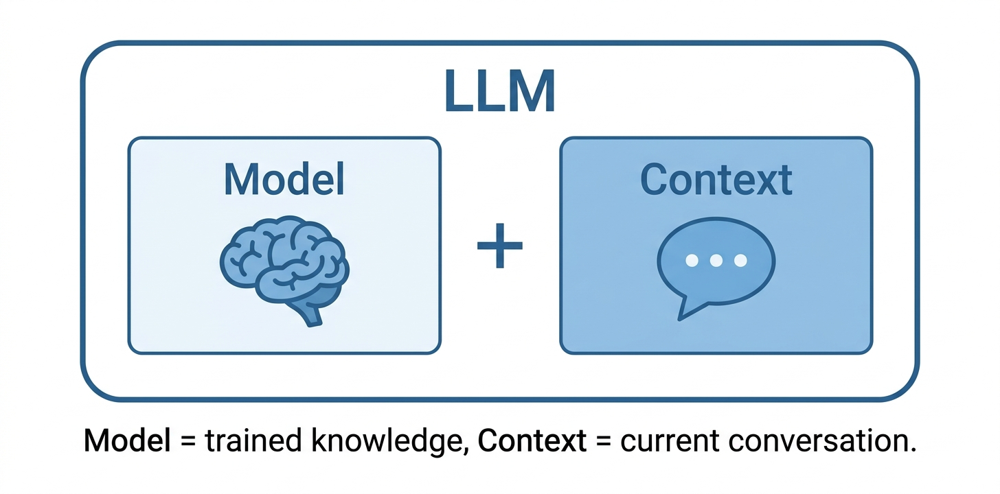
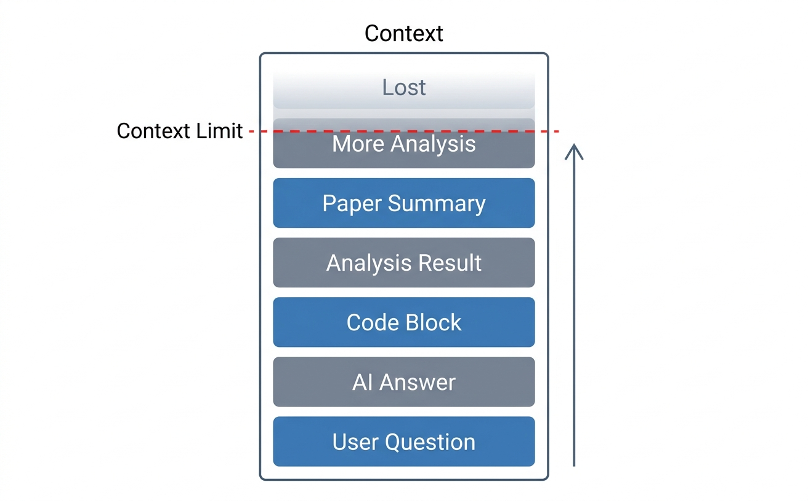
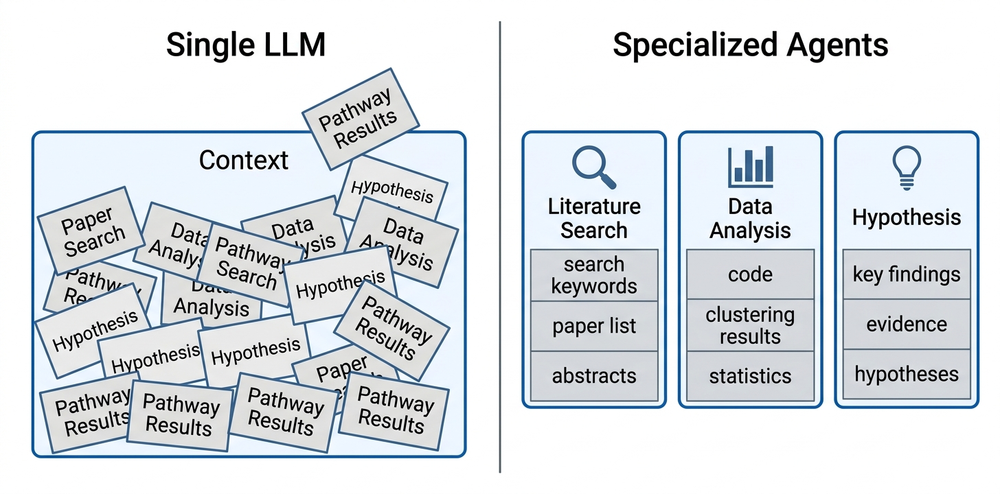
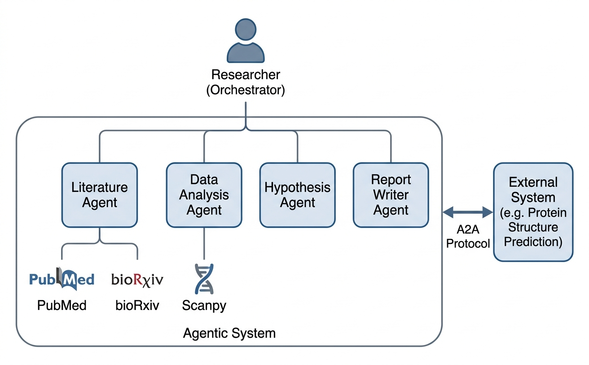
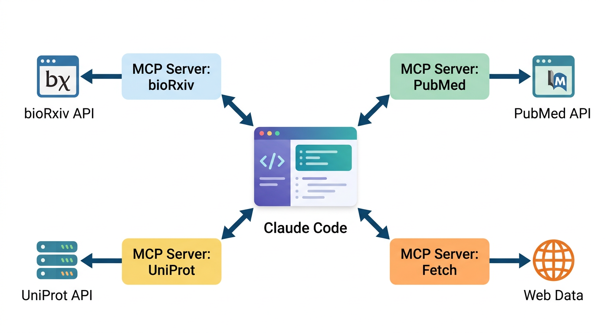
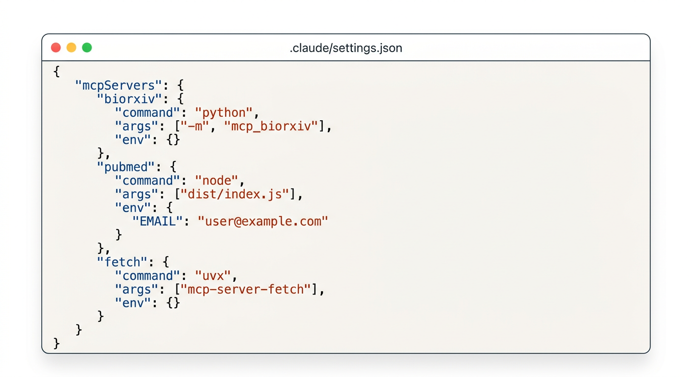
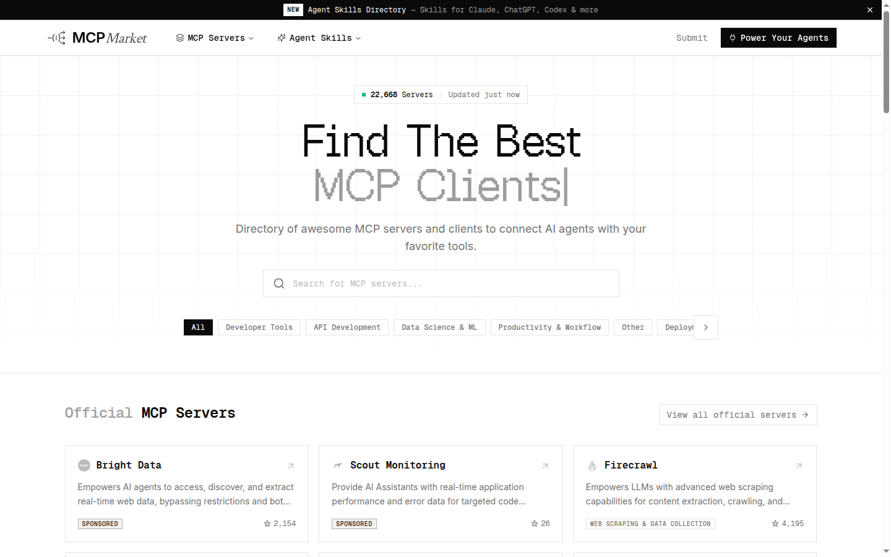

# 11장. 에이전틱 AI

## 11.1 AI 에이전트란?

10장까지는 Claude Code로 웹 도구를 만들었다. 서열을 입력하면 BLAST 검색을 실행하고, 결과를 표로 보여주는 도구였다. 그런데 실제 연구에서는 이런 단일 작업만으로 끝나지 않는다. 가령 특정 변이의 기능을 알고 싶다면, 관련 논문을 찾고, 단백질 구조 데이터를 조회하고, 발현 데이터를 분석하고, 이 결과들을 종합하여 가설을 세워야 한다. 이 모든 것을 하나의 Claude Code 대화에서 처리할 수 있을까?

### 컨텍스트의 한계

LLM은 **모델(Model)**과 **컨텍스트(Context)**로 이루어져 있다. 모델은 학습된 지식을 담은 신경망이고, 컨텍스트는 현재 대화의 내용을 담는 공간이다. 사용자의 질문, LLM의 답변, 코드, 분석 결과가 모두 컨텍스트에 쌓인다.



문제는 **컨텍스트의 크기에 한계가 있다**는 것이다. 대화가 길어지면 컨텍스트가 가득 차고, 오래된 내용부터 사라진다. ChatGPT, Claude, Gemini와 같은 LLM으로 긴 대화를 해본 사람이라면 알 것이다. 어느 순간 AI가 이전 대화를 기억하지 못하고 엉뚱한 방향으로 빠지기 시작한다. 컨텍스트가 한계에 도달한 것이다.



Claude Code와 같은 AI 기반 개발 도구는 수천 줄의 코드를 다뤄야 하므로 컨텍스트가 훨씬 빨리 찬다. 이를 완화하기 위해, 컨텍스트가 한계에 가까워지면 내용을 자동으로 요약하여 중요한 것들만 남긴다(compact 기능). 그러나 연구처럼 여러 종류의 작업이 혼재된 큰 주제에서는 이것만으로 부족하다. PubMed에서 논문을 검색하고, Scanpy로 발현 데이터를 분석하고, 경로 분석까지 하다 보면, 앞서 찾았던 논문의 핵심 내용이나 분석 맥락이 컨텍스트에서 밀려나 사라진다.

### 에이전트와 역할 분담

이 문제의 해결책은 **역할 분담**이다. 하나의 LLM에 모든 것을 맡기는 대신, 업무별로 역할을 나눈 여러 개의 LLM을 두는 것이다. 이렇게 **특정 역할에 집중하도록 정의된 LLM**을 **에이전트(Agent)**라고 부른다.

예를 들어 "논문 검색 에이전트"는 PubMed와 bioRxiv에서 논문을 찾는 일만 한다. 이 에이전트의 컨텍스트에는 검색 키워드, 찾은 논문 목록, 초록 요약만 쌓이므로, 아무리 오래 실행해도 맡은 역할을 안정적으로 수행한다. 마찬가지로 "데이터 분석 에이전트"는 Scanpy로 클러스터링과 통계 분석만 처리하고, "가설 생성 에이전트"는 분석 결과와 문헌을 종합하여 가설을 제안하는 데 집중한다.

| 에이전트 | 역할 | 컨텍스트에 유지되는 내용 |
|----------|------|------------------------|
| 논문 검색 | PubMed, bioRxiv에서 관련 문헌 검색 | 검색어, 논문 목록, 초록 |
| 데이터 분석 | scRNA-seq 데이터 전처리, 클러스터링 | 코드, 분석 결과, 통계 |
| 가설 생성 | 분석 결과에서 패턴을 찾아 가설 제안 | 핵심 발견, 문헌 근거, 가설 |

이렇게 역할을 나누면 각 에이전트가 자기 업무에 필요한 맥락만 유지하므로 컨텍스트 한계 문제가 줄어든다. 또한 독립적인 에이전트를 **병렬로 실행**할 수도 있다. 논문 검색 에이전트 여러 개를 동시에 실행하여 서로 다른 키워드로 논문을 찾게 하면, 순차적으로 처리할 때보다 훨씬 빠르다.



### 에이전틱 시스템

이 에이전트들이 모여서 하나의 연구 과제를 수행하면 **에이전틱 시스템(Agentic System)**이 된다. 에이전틱 시스템에서는 각 에이전트가 자율적으로 도구를 사용하고, 필요할 때 다른 에이전트에게 **작업을 위임**한다. 연구자는 전체 방향을 설정하고 결과를 판단하는 역할을 맡는다. 연구팀에서 팀장이 팀원들에게 업무를 분배하고 결과를 종합하는 것과 같은 구조다.

```
연구자 (팀장)
    ├── 논문 검색 에이전트  →  PubMed, bioRxiv 검색
    ├── 데이터 분석 에이전트  →  scRNA-seq 분석, 시각화
    ├── 가설 생성 에이전트  →  패턴 발견, 가설 제안
    └── 보고서 작성 에이전트  →  결과 정리, 논문 초안
```

이 개념은 하나의 시스템 안에만 머물지 않는다. 서로 다른 에이전틱 시스템이 협업해야 할 때도 있다. 예를 들어 한 연구실의 유전체 분석 시스템과 다른 연구실의 단백질 구조 예측 시스템이 데이터를 주고받아야 한다면, 두 시스템의 에이전트들이 서로를 발견하고 통신할 수 있어야 한다. 이를 위해 **A2A(Agent-to-Agent)**와 같은 에이전트 간 표준 프로토콜이 등장했다. 이 책에서 A2A를 직접 다루지는 않지만, 에이전틱 시스템이 단일 도구를 넘어 시스템 간 협업으로 확장되는 방향이라는 점은 알아둘 만하다.



### 에이전트의 메모리

역할을 나누고 병렬로 실행하면 컨텍스트 문제는 해결된다. 하지만 또 다른 문제가 있다. 대화가 끝나면 에이전트가 쌓아온 맥락이 모두 사라진다는 것이다. 어제 "이 데이터셋은 배치 효과가 크다"는 사실을 발견했어도, 오늘 새 대화를 시작하면 같은 설명을 처음부터 다시 해야 한다.

초기 LLM 에이전트는 모두 이런 한계를 가지고 있었다. 2024년 ChatGPT가 대화 간 사용자 선호도를 기억하는 메모리 기능을 도입하면서 변화가 시작되었다. 이후 Cursor의 `.cursorrules`, Claude Code의 `CLAUDE.md`처럼 프로젝트 맥락을 파일로 유지하는 방식이 등장했고, 2026년에는 Claude Code의 MEMORY.md, GitHub Copilot의 자동 메모리 등 에이전트가 스스로 경험을 기록하고 업데이트하는 자동 메모리가 주요 도구에 기본 탑재되었다.

사람의 기억이 단기 기억과 장기 기억으로 나뉘듯, AI 에이전트의 메모리도 비슷한 구조를 가진다:

| 메모리 유형 | 사람의 비유 | AI 에이전트에서의 역할 |
|------------|-----------|---------------------|
| **컨텍스트** | 작업 기억 (Working Memory) | 현재 대화 내용. 대화가 끝나면 사라진다 |
| **명시적 메모리** | 노트, 매뉴얼 | 사용자가 직접 작성한 규칙과 지침 |
| **자동 메모리** | 경험에서 얻은 교훈 | 에이전트가 스스로 축적한 패턴과 선호도 |

Claude Code는 이 구조를 **두 가지 파일**로 구현한다:

**CLAUDE.md**

프로젝트의 규칙, 코딩 컨벤션, 분석 파이프라인의 세부 사항을 기록하는 파일이다. 사용자가 직접 작성하며, 새로운 대화를 시작해도 Claude Code가 이 파일을 읽고 이전 맥락을 기억한다. 12장에서 CLAUDE.md 작성법을 자세히 다룬다.

**MEMORY.md**

Claude Code가 **자동으로 관리**하는 파일이다. 대화 과정에서 학습한 내용을 Claude Code가 알아서 이 파일에 기록한다. 예를 들어 "이 데이터셋은 배치 효과가 크므로 Harmony 보정이 필요하다"는 사실을 발견하면 MEMORY.md에 기록하고, 다음 대화에서 같은 데이터를 분석할 때 이 메모리를 읽어 처음부터 Harmony 보정을 적용한다. 사용자가 별도로 관리할 필요 없이, Claude Code가 알아서 경험을 축적하고 행동을 개선한다.

이처럼 경험에서 배우고 자신의 행동을 개선하는 것이 에이전트의 **자가 진화**다. CLAUDE.md가 사용자가 작성한 매뉴얼이라면, MEMORY.md는 에이전트가 현장에서 쌓은 노하우다.

이런 접근 방식은 Claude Code만의 것이 아니다. AI 에이전트의 메모리 관리는 최근 빠르게 발전하는 분야로, 다양한 기법이 등장하고 있다:

- **그래프 기반 메모리**: Mem0, Zep 같은 프레임워크는 단순한 텍스트 기록 대신 **지식 그래프**로 메모리를 구조화한다. "BRCA1은 TP53과 상호작용한다"는 사실을 노드와 관계로 저장하여, 관련 정보를 더 정확하게 검색할 수 있다.
- **에피소드 메모리**: Amazon Bedrock AgentCore는 에이전트의 행동을 **에피소드**(맥락 → 추론 → 행동 → 결과) 단위로 기록하고, 이를 분석하여 패턴을 추출한다. 과거의 성공과 실패에서 체계적으로 학습하는 방식이다.
- **계층적 메모리**: Letta 프레임워크는 운영체제의 메모리 관리에서 영감을 받아, 자주 쓰는 정보는 컨텍스트에 유지하고 덜 쓰는 정보는 외부 저장소로 내보내는 구조를 사용한다.

이 책에서는 Claude Code의 CLAUDE.md와 MEMORY.md를 활용하는 방법에 집중하지만, 메모리 관리 기술이 발전할수록 에이전트는 더 똑똑해진다는 점을 기억하면 좋다.

Claude Code에서 에이전트를 만드는 방법은 간단하다. `.claude/agents/` 디렉토리에 각 에이전트의 역할을 정의한 마크다운 파일을 만들면 된다. 12장에서 에이전트 설계 방법을, 14장에서 실제 연구 프로젝트에 적용하는 과정을 다룬다.

에이전트가 외부 데이터에 접근하려면 도구가 필요하다. 논문 검색 에이전트가 PubMed를 검색하려면 PubMed API에 접근할 수 있어야 하고, 데이터 분석 에이전트가 UniProt 정보를 조회하려면 UniProt API에 접근할 수 있어야 한다. 이 장의 나머지 부분에서는 이런 외부 도구 연결을 가능하게 하는 **MCP(Model Context Protocol)**를 설정하는 방법을 살펴본다.

## 11.2 MCP란?

**MCP(Model Context Protocol)**는 AI 에이전트가 외부 도구와 데이터 소스에 접근할 수 있게 해주는 표준 프로토콜이다. Claude Code에 MCP 서버를 연결하면, Claude가 데이터베이스 조회, API 호출, 파일 시스템 접근 등 다양한 작업을 직접 수행할 수 있다.

쉽게 말해, MCP는 **Claude Code에 새로운 능력을 플러그인처럼 추가하는 방법**이다. 스마트폰에 앱을 설치하면 새로운 기능이 생기는 것처럼, Claude Code에 MCP 서버를 추가하면 새로운 데이터 소스에 접근할 수 있게 된다.

### MCP가 필요한 이유

Claude Code는 기본적으로 로컬 파일을 읽고 쓰고, 터미널 명령을 실행하는 능력을 가지고 있다. 하지만 외부 웹 서비스나 데이터베이스에 직접 접근하는 능력은 제한적이다. 예를 들어 "최신 TP53 관련 논문을 찾아줘"라고 요청하면, Claude는 자신의 학습 데이터에 있는 정보만 활용할 수 있다. 학습 이후에 발표된 논문은 알 수 없다.

MCP 서버를 연결하면 이 한계가 해소된다. PubMed MCP 서버를 추가하면 Claude가 실시간으로 PubMed를 검색할 수 있고, bioRxiv MCP 서버를 추가하면 최신 프리프린트를 직접 조회할 수 있다.

### MCP 이전 vs 이후

| | MCP 없이 | MCP 사용 |
|---|---|---|
| **논문 검색** | 사용자가 PubMed에서 검색 → 결과를 복사 → Claude에 붙여넣기 | Claude가 직접 PubMed 검색 → 결과 분석 |
| **단백질 정보** | UniProt 웹사이트에서 조회 → 복사 → 붙여넣기 | Claude가 UniProt API로 직접 조회 → 해석 |
| **프리프린트** | bioRxiv 사이트에서 검색 → PDF 다운로드 → Claude에 전달 | Claude가 bioRxiv 검색 → 초록 분석 → 요약 |

MCP를 사용하면 **사람이 중간 다리 역할을 할 필요 없이**, Claude가 데이터를 직접 가져와서 분석할 수 있다. 이것이 12~13장에서 다루는 "도메인 지식 조사 자동화"의 핵심 기술이다.

### MCP의 구조

MCP는 클라이언트-서버 구조로 동작한다. Claude Code가 **MCP 클라이언트** 역할을 하고, 각 외부 서비스에 대한 **MCP 서버**가 데이터를 제공한다.

```
Claude Code (MCP 클라이언트)
    ├── bioRxiv MCP 서버  →  bioRxiv API
    ├── PubMed MCP 서버   →  PubMed API
    └── UniProt MCP 서버  →  UniProt API
```

MCP 서버는 Claude Code가 시작할 때 함께 실행되고, Claude가 필요할 때 호출한다. 사용자가 "bioRxiv에서 논문 찾아줘"라고 말하면, Claude는 bioRxiv MCP 서버를 통해 검색을 수행하고 결과를 사용자에게 보여준다.



## 11.3 Claude Code에서 MCP 서버 설정하기

### `claude mcp add` 명령

MCP 서버를 추가하는 가장 간단한 방법은 터미널에서 `claude mcp add` 명령을 사용하는 것이다. JSON 설정 파일을 직접 편집할 필요 없이, 명령 한 줄로 MCP 서버를 등록할 수 있다.

```bash
# bioRxiv MCP 서버 추가 (전역)
claude mcp add --transport http --scope user biorxiv https://mcp.deepsense.ai/biorxiv/mcp

# PubMed MCP 서버 추가 (전역)
claude mcp add --transport http --scope user pubmed https://pubmed.mcp.claude.com/mcp
```

- **`--scope user`**: 전역 설정에 추가한다. 모든 프로젝트에서 사용 가능. 프로젝트별로만 사용하려면 `--scope project`를 지정한다.
- **`--transport http`**: 원격 MCP 서버에 HTTP로 연결한다. bioRxiv와 PubMed는 클라우드에서 운영되는 원격 서버이므로 별도 설치 없이 URL만 지정하면 된다.

> **중요**: MCP 서버를 추가한 후에는 **Claude Code를 재시작해야 한다**. MCP 서버는 Claude Code가 시작할 때 함께 실행되므로, 새로 추가한 서버를 인식하려면 재시작이 필요하다.

생명정보학 MCP 서버처럼 여러 프로젝트에서 공통으로 사용할 서버는 전역 설정(`--scope user`)에, 특정 프로젝트에만 필요한 서버는 프로젝트 설정(`--scope project`)에 추가하는 것이 좋다.

### 설정 확인

등록된 MCP 서버를 확인하려면 다음 명령을 사용한다:

```bash
claude mcp list
```

### 여러 MCP 서버 동시 사용

MCP 서버는 여러 개를 동시에 등록할 수 있다. 생명정보학 연구를 위해 bioRxiv, PubMed 서버를 조합하면, Claude Code가 논문 검색부터 분석까지 직접 수행할 수 있다.

> **참고**: MCP 설정에 대한 자세한 문서는 https://code.claude.com/docs/ko/mcp 에서 확인할 수 있다.



## 11.4 MCP 마켓플레이스

### mcpmarket.com

[mcpmarket.com](https://mcpmarket.com/)은 MCP 서버를 찾아 설치할 수 있는 마켓플레이스다. 스마트폰의 앱 스토어처럼, 필요한 기능을 검색하고 설정 방법을 확인할 수 있다.

주요 카테고리:
- **Data Science & ML**: 데이터 분석, 머신러닝 관련 도구
- **Developer Tools**: 개발 생산성 도구
- **Database Management**: 데이터베이스 연동
- **Web Scraping & Data Collection**: 웹 데이터 수집

그 외에도 [mcp.so](https://mcp.so/), [pulsemcp.com](https://www.pulsemcp.com/servers) 등 다양한 MCP 서버 디렉토리가 있다. "bioinformatics", "genomics", "protein" 등으로 검색하면 생명정보학 관련 MCP 서버를 찾을 수 있다.

직접 해보자. https://mcpmarket.com/server/uniprot-1 에 접속하면 UniProt MCP 서버의 설치 방법과 제공하는 기능 목록을 확인할 수 있다. 페이지의 안내에 따라 Claude Code에 UniProt MCP 서버를 추가해 보자. 설치 후 Claude Code를 재시작하면, "TP53 단백질의 기능 도메인을 조회해줘" 같은 요청을 바로 처리할 수 있다.

MCP 생태계는 빠르게 성장하고 있다. 2024년 말 MCP가 공개된 이후 수천 개의 서버가 만들어졌으며, 생명정보학 분야도 예외가 아니다. 자주 사용하는 데이터베이스에 대한 MCP 서버가 아직 없다면, AI에게 "UniProt MCP 서버를 만들어줘"라고 요청하여 직접 만들 수도 있다.



## 11.5 생명정보학 MCP 서버

### bioRxiv / medRxiv

생명과학(bioRxiv)과 의학(medRxiv) 프리프린트를 검색하고 분석할 수 있다. 프리프린트는 동료 심사(peer review)를 거치기 전에 공개된 논문으로, 최신 연구 동향을 가장 빠르게 파악할 수 있는 소스이다.

> 최근 30일간 단일세포 RNA-seq 관련 bioRxiv 프리프린트 찾아줘. 이 프리프린트의 초록을 요약하고, 사용된 분석 방법을 정리해줘

Claude가 bioRxiv API를 통해 최신 프리프린트를 검색하고, 초록을 읽어 분석 방법론을 정리해 준다. 문헌 조사 초기 단계에서 시간을 크게 절약할 수 있다.

### UniProt

UniProt 단백질 데이터베이스에서 직접 정보를 조회할 수 있다. 서열 검색, 기능 도메인 분석, 비교 유전체학 등을 수행할 수 있다.

> TP53 단백질의 기능 도메인과 알려진 변이를 조회해줘. 이 단백질 서열의 UniProt 정보를 검색해줘

10장에서 만든 BLAST 도구와 조합하면 강력한 워크플로우가 만들어진다. BLAST로 유사 서열을 찾고, UniProt MCP로 해당 서열의 기능 정보를 조회하는 과정을 Claude가 연속으로 수행할 수 있다.

### PubMed

의생명 문헌 데이터베이스 PubMed를 검색할 수 있다. 3,600만 건 이상의 논문 메타데이터에 접근할 수 있다.

> CRISPR base editing 관련 최신 논문 10편 찾아줘. 이 논문들의 주요 발견을 비교 정리해줘

PubMed MCP 서버를 사용하면, Claude가 논문을 검색하고 초록을 읽어 핵심 내용을 정리해 준다. "이 논문들 중에서 in vivo 실험 결과가 있는 것만 골라줘" 같은 후속 질문도 가능하다.

## 11.6 Claude for Life Sciences

Anthropic은 2025년 10월 **Claude for Life Sciences**를 발표하며 생명과학 분야에 특화된 기능을 제공하기 시작했다. 이는 생명과학이 AI 활용 가능성이 높은 분야라는 인식을 반영한 것이다.

### Scientific Connectors

생명과학 분야의 주요 플랫폼과 연동할 수 있는 커넥터가 있다:

| 커넥터 | 용도 |
|--------|------|
| **Benchling** | 실험 데이터 관리, 전자 실험 노트북 |
| **BioRender** | 과학 일러스트 및 논문 그림 제작 |
| **PubMed** | 의생명 문헌 검색 |
| **10x Genomics** | 단일세포/공간 전사체 분석 |
| **Synapse.org** | 협업 기반 데이터 분석 플랫폼 |
| **ClinicalTrials.gov** | 임상시험 데이터 |
| **ChEMBL** | 약물-표적 상호작용 데이터베이스 |
| **bioRxiv / medRxiv** | 프리프린트 서버 |

이 커넥터들은 MCP 서버와 유사한 역할을 하지만, Anthropic이 공식적으로 관리하고 최적화한 것이라 안정성과 성능이 더 높을 수 있다.

### Agent Skills

Claude for Life Sciences에는 생명정보학 전용 **에이전트 스킬**도 포함되어 있다. 예를 들어 `single-cell-rna-qc` 스킬은 scverse 모범 사례에 따라 RNA 시퀀싱 데이터의 품질 관리와 필터링을 도와준다. 5장에서 배운 QC 과정을 Claude가 더 정확하게 수행할 수 있도록 전문 지식이 내장되어 있다.

### 주요 활용 분야

- **문헌 리뷰와 가설 생성**: 수천 편의 논문을 빠르게 검토하고 연구 방향 제안
- **프로토콜 작성**: 실험 프로토콜, SOP(표준 운영 절차), 동의서 초안 작성
- **생명정보학 분석**: 유전체 데이터 분석 코드 작성 및 결과 해석
- **규제 문서**: 임상시험 관련 규제 문서 초안 작성

> **참고**: Claude for Life Sciences의 일부 기능은 기업용(Enterprise) 플랜에서만 쓸 수 있다. 개인 사용자도 MCP 서버를 조합하면 비슷한 워크플로우를 구현할 수 있다. 이 책에서 다루는 MCP 설정 방법이 그 기반이 된다.

## 11.7 MCP와 바이브 코딩

MCP는 바이브 코딩의 가능성을 크게 확장한다. 10장까지는 "사람이 도메인 지식을 알아야 AI에게 정확한 지시를 내릴 수 있다"고 했다. MCP를 사용하면 여기서 한 발 더 나아간다.

예를 들어, BLAST 도구를 만들 때 "E-value가 뭔지, FASTA 형식이 어떻게 생겼는지" 같은 도메인 지식이 필요했다. MCP가 연결된 Claude Code에게는 이렇게 요청할 수 있다:

> bioRxiv에서 최신 BLAST 웹 도구 관련 논문을 찾아보고, 다른 연구자들이 BLAST 웹 인터페이스를 어떻게 구현했는지 조사해줘. 그 내용을 바탕으로 우리 BLAST 도구의 UI를 개선해줘.

Claude가 논문을 검색하고, 분석하고, 그 결과를 코드에 반영하는 과정을 하나의 대화에서 처리할 수 있다. 12~13장에서는 이 패턴을 본격적으로 활용하여, 도메인 지식 조사부터 구현까지 AI에게 맡기는 방법을 다룬다.

## 11.8 정리

- **MCP(Model Context Protocol)**: Claude Code에 외부 도구와 데이터 소스를 연결하는 표준 프로토콜
  - 사람이 중간 다리 역할을 하지 않아도 Claude가 직접 데이터에 접근
- **설정 방법**: 터미널에서 `claude mcp add` 명령으로 서버 등록
  - `--scope user`(전역) 또는 `--scope project`(프로젝트별)로 범위 지정
  - 추가 후 Claude Code 재시작 필요
- **MCP 마켓플레이스**: mcpmarket.com 등에서 필요한 MCP 서버를 검색하고 설치
  - 생태계가 빠르게 성장 중
- **생명정보학 MCP 서버**: bioRxiv, PubMed, UniProt 등 주요 데이터베이스에 Claude가 직접 접근
- **Claude for Life Sciences**: Scientific Connectors와 Agent Skills로 생명과학 연구 지원
- **핵심**: MCP 서버를 조합하면 Claude Code를 **생명정보학 연구 도우미**로 확장할 수 있다. 12~13장에서는 이를 활용해 도메인 지식 조사까지 자동화한다
