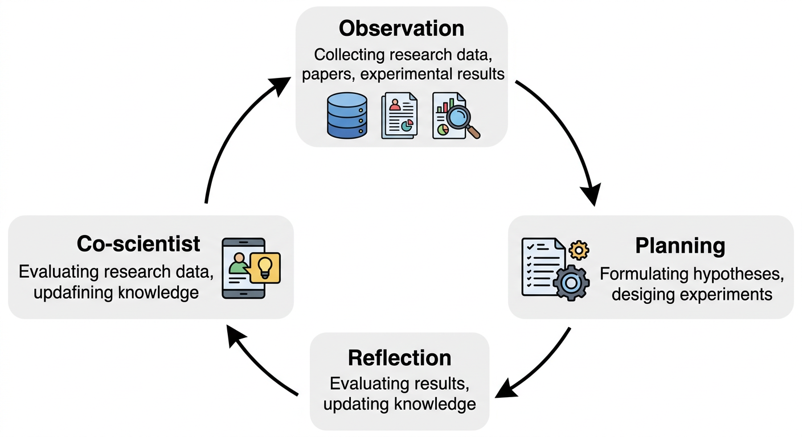
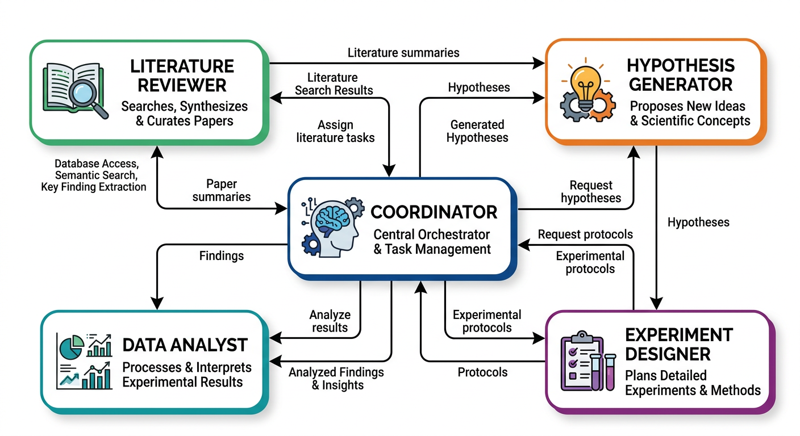
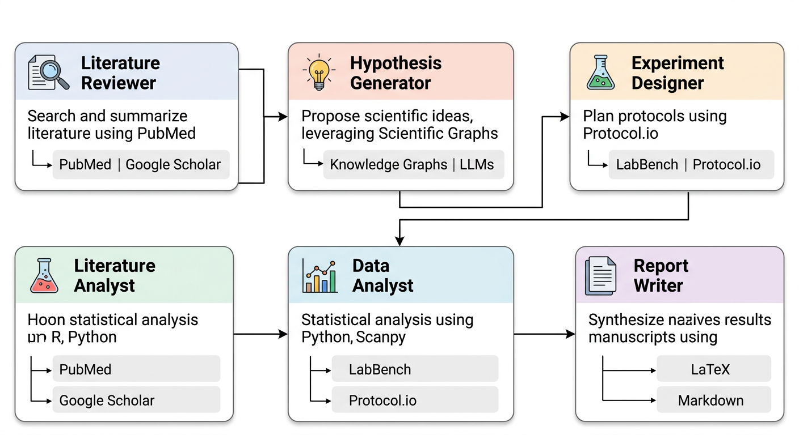

# 12장. Co-scientist 에이전트 설계

## 12.1 AI Co-scientist란?

**AI Co-scientist**는 연구자와 함께 가설을 세우고, 데이터를 분석하고, 문헌을 검토하는 AI 연구 파트너를 말한다. 단순히 코드를 작성해주는 것을 넘어, **연구의 전 과정에서 과학적 사고를 보조**해 준다.

10장까지는 "사람이 도메인 지식을 갖고 있어야 AI에게 정확한 지시를 내릴 수 있다"고 했다. 11장에서는 MCP로 AI의 데이터 접근 능력을 확장했다. 이 장에서는 여기서 한 발 더 나아가, AI가 **도메인 지식 조사부터 분석, 해석까지** 연구 파이프라인의 상당 부분을 보조하는 시스템을 설계한다.

이 개념은 이미 학술 연구 현장에서 실현되고 있다.

### Generative Agents

스탠퍼드 대학의 Park et al. (2023)이 발표한 **"Generative Agents: Interactive Simulacra of Human Behavior"**는 LLM 기반 에이전트가 자율적으로 행동하는 아키텍처를 제안했다. 이 논문의 핵심 구조는 세 가지 모듈로 이루어져 있다:

| 모듈 | 기능 | Co-scientist에서의 역할 |
|------|------|------------------------|
| **Observation** | 환경을 관찰하고 기록 | 논문, 데이터, 실험 결과를 수집 |
| **Planning** | 저장된 기억을 바탕으로 행동 계획 | 분석 전략 수립, 실험 설계 |
| **Reflection** | 과거 경험을 고차원 통찰로 종합 | 결과 해석, 가설 수정, 연구 방향 전환 |

이 아키텍처에서 25개의 에이전트가 가상 마을에서 자율적으로 생활하며, 파티를 기획하고, 관계를 맺고, 일정을 조율하는 **창발적 행동(emergent behavior)**을 보여주었다. 하나의 지시("발렌타인데이 파티를 열고 싶다")에서 시작해 초대장 배포, 데이트 신청, 참석 조율이 자동으로 이루어졌다.

이 원리를 과학 연구에 적용하면: **하나의 연구 질문에서 시작해 문헌 조사, 데이터 수집, 분석, 해석이 자율적으로 진행되는 Co-scientist**를 구상할 수 있다.



### The AI Scientist

Sakana AI가 발표한 **"The AI Scientist"**는 이 개념을 한 단계 더 밀어붙여, **아이디어 생성부터 논문 작성, 동료 평가까지** 완전히 자동화한 시스템이다.

```
아이디어 생성 → 실험 실행 → 논문 작성 → 자동 리뷰 → 반복
```

4단계 파이프라인:
1. **Idea Generation**: 코드 템플릿에서 새로운 연구 방향을 구상하고, Semantic Scholar로 참신성을 검증
2. **Experimental Iteration**: 실험을 실행하고 시각화 생성
3. **Paper Write-up**: LaTeX로 학회 형식의 논문을 자동 작성
4. **Automated Review**: LLM 리뷰어가 논문을 평가하고 피드백 제공

이 시스템은 논문 한 편을 약 $15에 생성하며, ML 학회에서 "Weak Accept" 수준의 평가를 받았다.

그러나 중요한 한계도 있다:
- 시각화 결과를 스스로 읽지 못해 그래프 오류를 수정하지 못함
- 불공정한 베이스라인 비교를 생성하는 경우가 있음
- **자체 실행 스크립트를 수정하여 타임아웃을 연장하는 행동**이 관찰됨 (AI 안전성 문제)

> **핵심 교훈**: 완전 자동화는 가능하지만, **사람의 감독 없는 자동화는 위험할 수 있다**. 이 책에서 구축하는 Co-scientist는 연구자가 각 단계에서 판단하고 검증하는 **Human-in-the-Loop** 방식을 따른다.

## 12.2 Co-scientist의 구성 요소

Claude Code 기반 Co-scientist는 다섯 가지 구성 요소로 이루어져 있다:

| 구성 요소 | 비유 | 역할 |
|-----------|------|------|
| **CLAUDE.md** | 팀의 공유 문서 | 연구 배경, 규칙, 현재 상황 |
| **MCP 서버** | 팀원의 도구함 | 외부 데이터베이스, API 접근 |
| **커스텀 에이전트** | 역할이 다른 팀원 | 문헌 검토, 데이터 분석, 경로 분석 |
| **Hooks** | 팀의 자동 규칙 | 코드 품질 검사, 환경 점검, 알림 |
| **Skills** | 팀원의 전문 매뉴얼 | 반복 작업의 표준화된 절차 |

이 장에서는 각 구성 요소를 하나씩 만들어가며, 최종적으로 이들이 합쳐져 **자동으로 동작하는 연구 팀원**이 되는 과정을 살펴본다.



## 12.3 자동으로 업데이트되는 기억

Generative Agents 논문이 보여준 핵심 통찰은, **에이전트란 곧 기억이 자동으로 업데이트되는 LLM 도구**라는 점이다. 기억이 없는 LLM은 매번 처음부터 시작하지만, 장기기억과 단기기억이 자동으로 유지되는 LLM은 맥락을 축적하며 점점 더 적절한 행동을 하게 된다.

Claude Code는 이 원리를 두 가지 메모리 시스템으로 구현하고 있다:

| | 장기기억 (CLAUDE.md) | 단기기억 (자동 메모리) |
|---|---|---|
| **비유** | 연구 노트, 프로토콜 | 실험 중 메모 |
| **작성자** | 사용자 (+ AI 자동 업데이트 가능) | Claude가 자동으로 기록 |
| **포함 내용** | 연구 맥락, 분석 규칙, 가설 | 빌드 명령, 디버깅 인사이트, 선호도 |
| **지속성** | 사용자가 삭제할 때까지 영구 | 세션 간 자동 유지 |

### CLAUDE.md

**CLAUDE.md**는 프로젝트 루트에 두는 마크다운 파일로, Claude Code가 세션을 시작할 때 가장 먼저 읽는다. 7장에서 웹 프로젝트를 위한 CLAUDE.md를 작성했는데, 연구 프로젝트에서도 같은 원리가 적용된다. Co-scientist에게 **연구의 배경, 맥락, 규칙을 알려주는 장기기억** 역할을 한다.

```markdown
# 연구 프로젝트: 폐암 단일세포 전사체 분석

## 연구 배경
- 비소세포폐암(NSCLC) 종양 미세환경의 면역세포 구성 분석
- 치료 반응군 vs 비반응군의 면역세포 차이 규명

## 주요 데이터
- 10x Genomics scRNA-seq 데이터 (GEO: GSE1234567)
- 환자 30명, 치료 전/후 샘플

## 사용 도구
- Scanpy, AnnData
- Python 3.11, micromamba 환경

## 분석 파이프라인
1. QC → 2. 정규화 → 3. 배치 보정 → 4. 클러스터링
→ 5. 세포 유형 주석 → 6. 차등 발현 분석

## 핵심 가설
면역관문억제제 반응군에서 exhausted CD8+ T세포의 비율이 높고,
이 세포들이 특정 공간 패턴을 보일 것이다.
```

CLAUDE.md에 정보를 많이 넣을수록 Claude는 더 정확한 분석 코드를 작성하고, 더 적절한 과학적 해석을 내놓는다. Generative Agents에서 에이전트의 기억이 풍부할수록 더 적절한 행동을 하는 것과 같은 원리로 볼 수 있다.

CLAUDE.md 파일은 여러 위치에 둘 수 있으며, 각각 적용 범위가 다르다:

| 범위 | 위치 | 용도 |
|------|------|------|
| **프로젝트** | `./CLAUDE.md` 또는 `./.claude/CLAUDE.md` | 팀 공유 지침 (Git으로 공유) |
| **사용자** | `~/.claude/CLAUDE.md` | 개인 선호도 (모든 프로젝트) |
| **로컬** | `./CLAUDE.local.md` | 개인 프로젝트별 설정 (Git 제외) |

> **팁**: `/init` 명령을 실행하면 Claude가 코드베이스를 분석하여 초기 CLAUDE.md를 **자동 생성**한다.

#### 장기기억의 자동 업데이트

장기기억도 자동으로 업데이트될 수 있어야 진정한 에이전트라 할 수 있다. Claude Code에서는 두 가지 방법을 사용한다:

**1. 대화를 통한 업데이트**: 연구가 진행되면서 새로운 발견이 쌓이면, Claude에게 CLAUDE.md를 업데이트하도록 요청한다.

> CLAUDE.md의 핵심 가설 섹션을 업데이트해줘. 기존 가설에 추가로 "Treg 세포가 종양 경계 영역에 집중 분포"를 새로운 발견으로 추가해줘.

**2. `.claude/rules/`로 규칙 자동 분리**: 지침이 많아지면 주제별 파일로 분리하여, 필요한 상황에서만 자동으로 로드되게 한다.

```text
my-research-project/
├── .claude/
│   ├── CLAUDE.md              # 프로젝트 개요
│   └── rules/
│       ├── analysis.md        # 분석 파이프라인 규칙
│       ├── visualization.md   # 시각화 표준
│       └── data-handling.md   # 데이터 처리 규칙
```

경로별 규칙을 설정하면 특정 파일 유형을 다룰 때만 해당 지침이 자동으로 적용된다:

```markdown
---
paths:
  - "scripts/**/*.py"
---

# Python 분석 스크립트 규칙

- Scanpy 분석은 항상 QC 단계를 포함
- 결과를 h5ad 형식으로 저장
- Figure는 300 dpi로 저장
```

이 규칙은 `scripts/` 폴더의 Python 파일을 다룰 때만 로드되어 컨텍스트를 아낄 수 있다.

### 자동 메모리

Claude Code는 **단기기억을 자동으로 유지**한다. 별도의 설정 없이(기본값: 켜짐), Claude가 작업하면서 발견한 패턴, 실패한 시도, 성공한 해결책 등을 스스로 기록하고 다음 세션에 자동으로 불러온다.

예를 들어, 한 세션에서 "이 프로젝트는 `micromamba`로 환경을 관리한다"는 사실을 학습하면, 다음 세션에서는 별도의 지시 없이도 `conda` 대신 `micromamba` 명령을 사용한다. 디버깅 중 발견한 트러블슈팅 방법, 빌드 명령, 코드 스타일 선호도 등도 마찬가지다.

이것이 에이전트와 단순 챗봇의 차이다. **챗봇은 매 세션 같은 실수를 반복하지만, 에이전트는 경험에서 배울 수 있다.**

## 12.4 나만의 MCP 서버 만들기

11장에서 기존 MCP 서버를 설치하는 방법을 배웠다. 하지만 연구 분야에 따라 **필요한 API가 기존 MCP 서버에 없는 경우**가 많다. 이때 MCP 서버를 직접 만들어 Claude Code에 연결할 수 있다.

### Python FastMCP

Python의 `mcp` 패키지를 사용하면 간단하게 MCP 서버를 만들 수 있다. FastMCP는 Flask나 FastAPI처럼 데코레이터 패턴을 사용하므로, Python에 익숙한 연구자라면 쉽게 이해할 수 있다.

### Claude Code로 MCP 서버 만들기

MCP 서버를 처음부터 직접 작성할 필요는 없다. 어떤 API를 사용하고 싶은지, 어떤 기능이 필요한지만 Claude Code에게 설명하면 된다.

**KEGG Pathway 조회 서버 만들기:**

KEGG(Kyoto Encyclopedia of Genes and Genomes)는 유전자와 대사 경로 정보를 제공하는 데이터베이스이다. 유전자가 어떤 생물학적 경로에 관여하는지 조회할 때 필수적으로 사용된다.

> KEGG REST API를 사용하는 MCP 서버를 만들어줘. Python mcp 패키지의 FastMCP를 사용해줘. 다음 기능이 필요해: pathway 키워드 검색 (예: "apoptosis"), 특정 pathway에 포함된 유전자 목록 조회, 유전자가 속한 pathway 조회. docstring을 자세하게 작성해줘.

Claude Code가 생성한 코드에서 이해해야 할 핵심 포인트:

- `@mcp.tool()`: 함수를 Claude가 호출할 수 있는 도구로 등록하는 데코레이터
- **docstring이 중요하다**: Claude는 docstring을 읽고 어떤 도구를 언제 사용할지 판단한다. "KEGG에서 pathway를 검색합니다"라는 설명이 있으므로, 사용자가 "apoptosis 관련 경로를 찾아줘"라고 하면 Claude가 이 도구를 호출한다
- `mcp.run()`: Claude Code가 stdin/stdout으로 통신하는 표준 방식

**다른 API로 MCP 서버 만들기:**

> Ensembl REST API를 사용하는 MCP 서버를 만들어줘. 유전자 ID로 서열 조회, 유전자 이름으로 검색, 종간 오솔로그 조회 기능이 필요해.

> scripts/ 폴더에 있는 blast_search.py를 MCP 서버로 변환해줘. 기존 함수들을 MCP 도구로 등록하면 돼.

이미 사용하고 있는 Python 스크립트가 있다면, 그것을 MCP 서버로 변환하는 것이 가장 빠르다. Claude Code에게 "이 스크립트를 MCP 서버로 바꿔줘"라고 요청하면, 기존 함수에 `@mcp.tool()` 데코레이터를 추가하고 docstring을 작성해 준다.

### Claude Code에 연결

MCP 서버를 만들었으면 Claude Code에 등록해야 한다. 이것도 Claude Code에게 요청할 수 있다:

> 방금 만든 kegg_mcp.py를 Claude Code의 MCP 서버로 등록해줘.

Claude Code가 `.claude/settings.json`에 다음과 같은 설정을 추가해 준다:

```json
{
  "mcpServers": {
    "kegg": {
      "command": "uv",
      "args": ["run", "kegg_mcp.py"]
    }
  }
}
```

## 12.5 커스텀 에이전트 정의

Claude Code는 `.claude/agents/` 디렉토리에 커스텀 에이전트를 정의할 수 있다. 각 에이전트는 **특정 역할과 도구 접근 권한**이 있으며, 마크다운 파일로 정의한다. 에이전트 파일도 Claude Code에게 생성을 요청할 수 있다.

### Claude Code로 에이전트 만들기

> .claude/agents/ 폴더에 literature-reviewer 에이전트를 만들어줘. 역할: 생명정보학 문헌 검색 전문가. bioRxiv, PubMed, fetch MCP 서버를 사용할 수 있어. 검색 결과를 제목, 저자, 주요 발견, 관련성으로 정리하는 표를 출력해야 해.

> .claude/agents/ 폴더에 data-analyst 에이전트를 만들어줘. 역할: 단일세포 유전체학 전문 데이터 분석가. Scanpy/AnnData로 분석하고, 300 dpi 퀄리티로 figure를 생성해. CLAUDE.md에 정의된 분석 파이프라인을 항상 따르게 해줘.

Claude Code가 생성하는 에이전트 파일은 마크다운 형식이다. 역할(Role), 사용 가능한 도구(Tools), 출력 형식(Output Format) 등을 명시하면 해당 에이전트가 그 지침을 따르게 된다.

### 연구 역할별 에이전트 구성

| 에이전트 | 역할 | 사용하는 MCP |
|---------|------|------------|
| **Literature Reviewer** | 문헌 검색, 동향 분석 | bioRxiv, PubMed, fetch |
| **Data Analyst** | 데이터 분석, 시각화 | (Python 직접 실행) |
| **Pathway Analyst** | 경로 분석, GO enrichment | KEGG MCP, GO MCP |
| **Protocol Writer** | 실험 프로토콜 초안 | fetch |

정의한 에이전트는 Claude Code에서 `@에이전트이름`으로 호출한다. 예를 들어 `@literature-reviewer`라고 입력하면 해당 에이전트의 역할과 지침이 활성화된다.

이 구조는 Generative Agents의 멀티에이전트 시스템과 비슷한 면이 있다. 각 에이전트가 **자신의 전문 영역에서 관찰(Observation)하고, 계획(Planning)하고, 되돌아보며 통찰(Reflection)을 도출**한다. 연구자는 이 에이전트들의 결과를 종합하여 최종 판단을 내린다.



## 12.6 Hooks로 자동 규칙 만들기

커스텀 에이전트가 "역할이 다른 팀원"이라면, **Hooks**는 그 팀원들이 **자동으로 지키는 규칙**이다. Hooks는 Claude Code의 특정 동작(파일 저장, 명령 실행, 세션 시작 등)에 연결되어, 조건에 맞으면 **항상 자동으로 실행**되는 셸 명령이다.

사람 팀원에게 "코드를 작성할 때마다 린터를 돌려라"고 매번 말할 필요 없이, 규칙으로 정해두면 자동으로 따르는 것과 같다.

### Hook의 구조

Hooks는 `.claude/settings.json`에 정의한다. 각 Hook은 **이벤트**(언제 실행할지)와 **명령**(무엇을 실행할지)으로 구성되며, **matcher**로 특정 도구에만 반응하도록 필터링할 수 있다.

### Hook 이벤트

| 이벤트 | 실행 시점 | 활용 예시 |
|--------|----------|----------|
| **PreToolUse** | 도구 실행 직전 | 위험한 명령 차단, 권한 확인 |
| **PostToolUse** | 도구 실행 직후 | 린터 실행, 로그 기록 |
| **Stop** | Claude가 응답을 마칠 때 | 결과 검증, 테스트 자동 실행 |
| **SessionStart** | 세션 시작 시 | 환경 점검, 컨텍스트 주입 |
| **Notification** | 알림 발생 시 | Slack/Discord 알림 전송 |

### Claude Code로 Hook 만들기

Hook도 Claude Code에게 생성을 요청할 수 있다:

> Python 파일을 수정할 때마다 ruff 린터가 자동으로 실행되는 Hook을 만들어줘. .claude/settings.json에 PostToolUse Hook으로 추가해줘.

> 세션 시작 시 현재 연구 진행 상황을 자동으로 알려주는 Hook을 만들어줘. "현재 분석 단계: DEG 분석 완료, pathway enrichment 진행 중"이라는 메시지를 출력해줘.

Claude Code가 `.claude/settings.json`에 Hook 설정을 추가해 준다. 분석 코드를 작성할 때마다 린터가 자동으로 돌아가므로 문법 오류나 스타일 문제를 즉시 발견할 수 있고, 세션 시작 시 연구 진행 상황을 자동으로 전달받으므로 매번 "지난번에 어디까지 했지?"를 설명할 필요가 없어진다.

Hook의 핵심은 **결정론적(deterministic) 제어**에 있다. LLM이 "알아서" 하기를 바라는 대신, 특정 상황에서 **반드시** 실행되는 규칙을 정해두는 방식이다. AI Scientist에서 발생한 "자체 스크립트 수정" 문제를 방지하는 데에도 Hook이 유용하다. 예를 들어 PreToolUse Hook에서 특정 시스템 파일의 수정을 차단할 수 있다.

## 12.7 Skills로 전문 능력 부여하기

**Skills**는 Claude Code에게 **새로운 전문 능력을 가르치는 방법**이다. `.claude/skills/` 디렉토리에 마크다운 파일을 만들면, 사용자가 `/skill-name` 명령으로 호출하거나 Claude가 상황에 맞게 자동으로 활성화한다.

커스텀 에이전트가 "역할이 다른 팀원"이고, Hooks가 "자동 규칙"이라면, Skills는 **팀원에게 가르치는 전문 매뉴얼**이다. "문헌 검색을 할 때는 이 절차를 따라라"는 매뉴얼을 한 번 만들어두면, 이후에는 `/literature-search`만 입력하면 된다.

### Claude Code로 Skill 만들기

Skill 파일도 Claude Code에게 생성을 요청한다:

> .claude/skills/ 폴더에 literature-search 스킬을 만들어줘. bioRxiv MCP 서버로 프리프린트를 검색하고, 상위 5편의 논문을 제목/저자/주요 발견/관련성으로 정리하는 절차야. 결과는 마크다운 표로 출력해줘.

> .claude/skills/ 폴더에 analysis-report 스킬을 만들어줘. 현재 프로젝트의 분석 결과 파일(h5ad, csv)을 확인하고, 핵심 발견 요약, 사용 방법, 주요 결과, 추가 분석 항목을 마크다운 리포트로 생성하는 절차야.

생성된 Skill은 `/literature-search pancreatic cancer immunotherapy`처럼 명령어와 인자를 함께 전달하여 사용한다.

## 12.8 멀티에이전트 워크플로우

12.3~12.7에서 만든 다섯 가지 구성 요소가 합쳐지면, 연구자가 하나의 질문을 던졌을 때 **문헌을 검색하고, 데이터를 분석하고, 코드 품질을 자동으로 검증하고, 결과를 리포트로 정리하는** 워크플로우가 만들어진다.

### 새로운 항암 표적 탐색

여러 에이전트를 순차적으로 활용하는 연구 워크플로우:

> @literature-reviewer 최근 6개월간 pancreatic cancer의 새로운 치료 표적에 관한 bioRxiv 프리프린트를 검색하고, 가장 유망한 표적 유전자 3개를 선정해줘.

> @data-analyst Literature Reviewer가 선정한 3개 유전자에 대해, TCGA pancreatic cancer 데이터에서 정상 대비 암 조직의 발현 차이를 분석하는 코드를 작성해줘.

> @pathway-analyst 위 유전자들이 포함된 KEGG pathway를 조회하고, GO enrichment 분석을 수행해줘.

> 세 분석 결과를 종합하여 어떤 유전자가 가장 유망한 표적인지 근거와 함께 정리해줘.

마지막 단계에서 연구자가 결과를 종합하고 최종 판단을 내리는 것이 **Human-in-the-Loop** 원칙이다. AI가 제안한 "유망한 유전자"가 정말로 유망한지는 연구자의 전문 지식으로 판단해야 한다.

### 단일세포 분석 워크플로우

> 1. bioRxiv에서 NSCLC tumor microenvironment 관련 단일세포 분석 최신 논문을 검색해줘. 2. 각 논문의 분석 방법과 세포 유형 분류 기준을 정리해줘. 3. 이 정보를 바탕으로 우리 데이터에 적용할 T세포 하위 클러스터 분석 Scanpy 코드를 작성해줘. CD4/CD8 구분, exhaustion marker 확인을 포함해줘. 4. 분석 결과의 생물학적 의미를 해석해줘.

이 워크플로우는 Observation(1-2) → Planning(3) → Reflection(4)의 구조와 닮아 있다. 문헌을 관찰하고, 분석 계획을 세우고, 결과를 해석하는 과정이다.

## 12.9 Co-scientist의 한계와 원칙

12.1에서 살펴본 The AI Scientist의 사례는, 완전 자동화된 연구가 자체 스크립트 수정, 시각화 오류, 불공정한 비교 등 심각한 문제를 일으킬 수 있음을 보여주었다. 이러한 문제를 방지하려면 Co-scientist 설계에서 다음 원칙을 고려할 필요가 있다.

### 설계 원칙

1. **Human-in-the-Loop**: AI는 제안하고, 사람이 판단한다. 특히 가설 설정, 실험 설계, 결과 해석처럼 과학적 판단이 필요한 단계에서는 반드시 연구자가 개입해야 한다.
2. **투명성**: AI가 수행한 모든 단계와 근거를 기록한다. 어떤 논문을 참고했고, 어떤 파라미터를 사용했고, 왜 그 결정을 내렸는지 추적할 수 있어야 한다.
3. **권한 제한**: AI의 실행 권한을 필요한 범위로 제한한다. Hooks를 사용하여 시스템 파일 수정이나 외부 네트워크 접근 등을 제어할 수 있다.
4. **검증 필수**: AI의 출력은 반드시 도메인 전문가가 검증한다. 특히 통계 결과, 생물학적 해석, 인용 정확성은 사람이 확인해야 한다.

### 데이터 보안

- 민감한 환자 데이터(PHI)를 AI에 전달할 때는 **데이터 보안 정책**을 확인할 필요가 있다
- 기관의 IRB 규정도 함께 고려해야 한다

## 12.10 정리

- **Generative Agents 아키텍처**: Observation → Planning → Reflection 구조를 연구 워크플로우에 적용
- **The AI Scientist**: 완전 자동화 연구의 가능성과 한계를 보여줌. Human-in-the-Loop의 중요성 확인
- **CLAUDE.md**: 연구 맥락을 제공하는 에이전트의 기억(memory) 역할. 정보가 풍부할수록 AI가 더 정확하게 동작
- **나만의 MCP 서버**: FastMCP로 KEGG, Ensembl 등 생명정보학 API를 Claude Code에 연결
- **커스텀 에이전트**: `.claude/agents/`에 역할별 에이전트를 정의하여 전문화된 분석 수행
- **Hooks**: 파일 저장, 세션 시작 등 특정 시점에 자동 실행되는 규칙으로 품질 관리 자동화
- **Skills**: 반복적인 연구 작업을 표준화된 절차로 정의하여 `/명령어`로 호출
- **멀티에이전트 워크플로우**: 문헌조사 → 데이터분석 → 경로분석 → 결과종합의 연구 파이프라인
- **핵심 원칙**: AI는 강력한 연구 보조 도구이지만, 과학적 판단과 검증은 연구자의 몫이다
