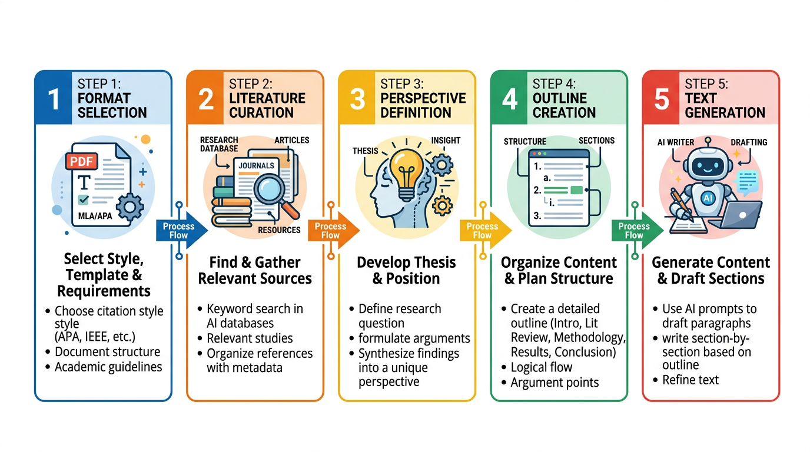
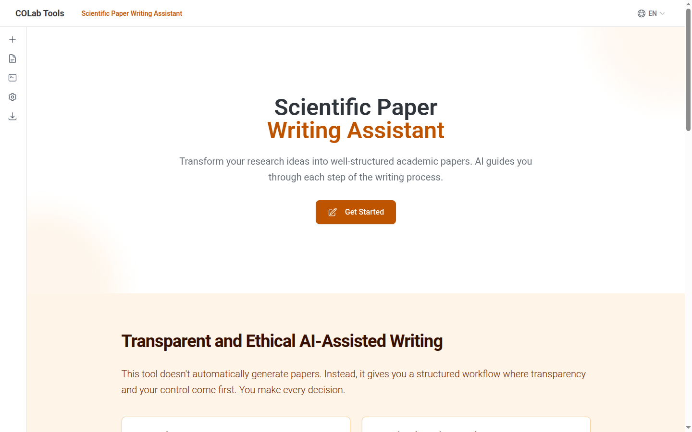

# 13장. AI로 논문 작성하기

## 13.1 AI 논문 작성의 현실

AI를 활용한 학술 논문 작성은 이미 널리 퍼지고 있다. 특히 영어가 모국어가 아닌 연구자에게 AI는 언어 장벽을 낮춰주는 좋은 도구다. 한국어로 생각한 내용을 자연스러운 학술 영어로 표현하는 일은 연구 내용 자체만큼이나 어렵고 시간이 많이 걸리는데, AI가 이 과정을 크게 단축해 준다.

그러나 동시에 **AI 환각(hallucination)**으로 인한 허위 인용, 콘텐츠의 진정성 문제가 학술 커뮤니티에서 꾸준히 논란이 되고 있다. AI에게 "참고문헌을 넣어줘"라고 하면, 실제로 존재하지 않는 논문을 그럴듯한 제목과 저자명으로 생성하는 경우가 있다. 이를 **허위 인용(fabricated citations)**이라 한다.

12장에서 살펴본 The AI Scientist는 논문을 $15에 자동 생성했지만, 시각화 오류와 불공정한 비교 등의 문제를 보여주었다. 결국 문제는 이것이다: **AI를 어떻게 사용해야 과학적 무결성을 지키면서도 효율적으로 논문을 작성할 수 있을까?**

### 올바른 사용과 잘못된 사용

| | 올바른 사용 | 잘못된 사용 |
|---|---|---|
| **역할** | 연구자의 아이디어를 영어로 표현 | AI가 연구 내용을 만들어냄 |
| **인용** | 연구자가 선별한 논문만 참조 | AI가 존재하지 않는 논문을 생성 |
| **핵심 논지** | 연구자가 정의 | AI가 임의로 구성 |
| **투명성** | 작성 과정을 문서화 | 프롬프트만 공개하거나 비공개 |

이 구분의 핵심은 **지적 기여(intellectual contribution)가 누구에게 있는가**이다. 연구의 핵심 아이디어, 가설, 실험 설계, 결과 해석은 연구자가 수행하고, AI는 그것을 학술적 영어로 표현하는 도구로 사용하는 것이 올바른 접근이다.

## 13.2 투명하고 재현 가능한 AI 논문 작성

[Towards a transparent and reproducible AI-assisted research paper writing](https://link.springer.com/article/10.1186/s44342-025-00057-0) (Park, 2025, *Genomics & Informatics*)에서 제안된 프레임워크는 AI 논문 작성의 투명성과 재현성을 보장하는 5단계 워크플로우를 제시한다.

이 프레임워크의 핵심 원리는 간단하다. **AI에게 텍스트 생성을 맡기기 전에, 연구자가 모든 핵심 결정을 먼저 내린다.** AI는 연구자가 이미 결정한 내용을 영어로 표현하는 역할만 한다.

### 5단계 워크플로우

```
1. 형식 선택 → 2. 문헌 선별 → 3. 관점 정의 → 4. 개요 작성 → 5. 텍스트 생성
```



#### 1단계. 형식 선택

논문 유형(원저, 리뷰, 레터 등)과 분량을 선택한다. 학술지마다 요구하는 형식이 다르므로, 투고할 학술지의 가이드라인을 먼저 확인한다. 원저 논문이라면 Introduction, Methods, Results, Discussion(IMRAD) 구조를 따르고, 리뷰 논문이라면 주제별 섹션 구조를 선택한다.

#### 2단계. 문헌 선별

**연구자가 직접** 인용할 논문을 선택한다. AI가 논문을 추천하는 것이 아니라, 연구자가 읽고 판단한 논문만 참조 목록에 포함한다. 이렇게 하면 **허위 인용(fabricated citations)** 문제를 원천적으로 방지할 수 있다.

12장에서 구축한 Co-scientist의 Literature Reviewer 에이전트가 이 단계를 보조할 수 있다. MCP를 통해 bioRxiv나 PubMed에서 관련 논문을 검색하고, 초록을 요약해 주므로 후보 논문을 빠르게 파악할 수 있다. 단, 최종 선별은 연구자의 몫이다. AI가 "이 논문이 관련 있다"고 제안하더라도, 실제로 읽고 내용을 확인한 논문만 인용해야 한다.

#### 3단계. 관점 정의

연구의 핵심 관점과 주장을 **모국어로** 작성한다. AI가 이를 다듬어주지만, 핵심 아이디어는 반드시 연구자가 제공해야 한다. 이 단계가 가장 중요하다고 볼 수 있는데 — **연구자의 과학적 사고가 논문의 뼈대를 결정**하기 때문이다.

예를 들어 한국어로 이렇게 작성할 수 있다:

> "기존 bulk RNA-seq 분석은 종양 미세환경의 세포 이질성을 포착하지 못한다. 우리는 단일세포 분석으로 종양 침윤 T세포의 하위 집단을 규명하고, 이 중 exhausted CD8+ T세포가 면역관문억제제 반응과 상관관계가 있음을 보여준다."

이 한 문단이 논문 전체의 방향을 결정한다. AI는 이것을 학술적 영어로 변환하고 확장하는 역할을 한다.

#### 4단계. 개요 작성

섹션별 핵심 포인트를 작성한다. 역시 모국어로 작성할 수 있으며, AI가 구조화를 도와준다.

- **Introduction**: 연구 배경, 기존 연구의 한계, 본 연구의 목적
- **Methods**: 사용한 데이터, 분석 방법, 실험 설계
- **Results**: 주요 발견, 통계적 유의성
- **Discussion**: 결과의 의미, 기존 연구와의 비교, 한계점

각 섹션에 "이것만은 반드시 포함해야 한다"는 핵심 포인트를 미리 정리해 두면, AI가 빠뜨리거나 임의로 추가하는 것을 방지할 수 있다.

#### 5단계. 텍스트 생성

앞서 제공한 문헌, 관점, 개요를 바탕으로 AI가 영어 원고를 생성한다. AI 프롬프트는 **연구자가 제공한 자료만** 사용하도록 제한되어 있어, retrieval-augmented generation(RAG) 원리로 환각을 줄이는 데 도움이 된다.

RAG는 AI가 자체 학습 데이터 대신 사용자가 제공한 문서에서 정보를 검색하여 답변을 생성하는 방식이다. "이 10편의 논문만 참조하여 Introduction을 작성해줘"라고 하면, AI는 그 10편의 내용만 기반으로 텍스트를 생성하므로 존재하지 않는 논문을 인용할 가능성이 크게 줄어든다.

## 13.3 Paper Writing Assistant

이 프레임워크를 구현한 오픈소스 웹 도구가 **Paper Writing Assistant**이다. 이 책에서 배운 SvelteKit + Tailwind CSS 기술 스택으로 개발되었다.

- **웹 도구**: https://research.pnucolab.com
- **소스 코드**: https://github.com/pnucolab/paper-writing-assistant

### 주요 특징

| 특징 | 설명 |
|------|------|
| **Human-in-the-Loop** | 텍스트 생성 전 모든 핵심 결정에 연구자가 개입 |
| **환각 억제** | 연구자가 제공한 자료만 참조하도록 프롬프트 설계 |
| **투명성 보고서** | 모델 정보, 섹션 개요, 핵심 포인트를 자동으로 문서화 |
| **데이터 보안** | SvelteKit 기반 클라이언트 사이드 실행, 서버에 데이터 저장 없음 |
| **다중 LLM 지원** | OpenRouter API를 통해 GPT, Claude, Gemini 등 다양한 모델 사용 |
| **Docker 배포** | 컨테이너화하여 오프라인 환경에서도 실행 가능 |

이 도구는 연구자가 5단계 워크플로우를 순서대로 따라가도록 안내하며, 각 단계의 입력을 수집한 뒤 마지막에 텍스트를 생성한다. 중요한 것은 연구자가 1~4단계에서 이미 모든 핵심 결정을 내린 상태이므로, 5단계에서 AI가 생성하는 텍스트는 연구자의 아이디어를 영어로 표현한 것에 불과하다.



### 투명성 보고서

기존에 학술지들은 AI 사용 시 **전체 프롬프트 공개**를 요구하는 경우가 있었다. 그러나 프롬프트가 점점 길고 복잡해지면서 이 방식은 현실적이지 않다. 수천 단어의 프롬프트를 공개하더라도, 그것만으로는 AI가 생성한 텍스트의 과학적 기여가 누구에게 있는지 판단하기 어렵다.

Paper Writing Assistant는 대안으로 **투명성 보고서(transparency report)**를 자동 생성한다. 투명성 보고서에는 다음이 포함된다:

- 사용한 AI 모델 정보 (모델명, 버전, 파라미터)
- 각 섹션의 개요와 핵심 포인트 (연구자가 직접 작성한 내용)
- 텍스트 생성을 이끈 핵심 요소들

이로써 **논문의 지적 기여가 연구자에게 있음**을 명확히 보여줄 수 있다. 프롬프트 전체를 공개하는 것보다, 연구자가 어떤 과학적 결정을 내렸는지를 보여주는 것이 더 의미 있는 투명성이다.

## 13.4 Co-scientist로 논문 작성 보조하기

11~12장에서 구축한 Co-scientist 환경을 논문 작성에 직접 활용할 수 있다. MCP 서버로 문헌을 검색하고, 커스텀 에이전트로 분석 코드를 작성하고, Skills로 리포트를 생성하는 통합 워크플로우를 만들 수 있다.

### 문헌 리뷰 → 논문 작성 워크플로우

> 1. bioRxiv에서 spatial transcriptomics와 tumor microenvironment 관련 최근 6개월 프리프린트를 검색해줘. 2. 검색된 논문 중 우리 연구와 관련된 것을 선별하고, 각 논문의 주요 방법론과 발견을 표로 정리해줘. 3. 이 문헌들을 바탕으로 Introduction 섹션의 핵심 포인트 개요를 작성해줘. 우리 연구의 관점: "기존 bulk RNA-seq 기반 분석의 한계를 공간 전사체 분석으로 극복"

이 워크플로우에서 1~2단계는 AI가 수행하지만, 3단계의 "우리 연구의 관점"은 연구자가 직접 제공한다. AI가 문헌을 정리해 주면 연구자가 더 빠르게 판단할 수 있지만, 최종 선별과 관점 설정은 연구자의 몫이다.

### 섹션별 작성 요청

> Methods 섹션을 작성해줘. 핵심 포인트: 10x Visium 플랫폼으로 FFPE 조직 슬라이드 분석, Space Ranger로 전처리, Scanpy + Squidpy로 분석, Leiden 클러스터링 후 세포 유형 주석, 공간 자기상관 분석으로 공간 패턴 확인. 학술 논문 형식으로 작성하되, 내가 제공한 내용만 사용해줘.

"내가 제공한 내용만 사용해줘"라는 제약이 중요하다. 이 지시가 없으면 AI가 추가적인 분석 방법을 임의로 포함하거나, 실제로 사용하지 않은 도구를 언급할 수 있다.

### Figure 생성

> Figure 1을 위한 코드를 작성해줘: (A) 조직 슬라이드의 H&E 이미지 위에 클러스터 오버레이, (B) 세포 유형별 UMAP, (C) 주요 마커 유전자의 공간 발현 패턴. Matplotlib subplot으로 구성하고, 논문 출판 품질(300 dpi)로 저장해줘.

논문 figure는 학술지마다 요구하는 해상도, 색상 모드(CMYK vs RGB), 파일 형식(TIFF, EPS, PDF)이 다르다. 투고 전에 해당 학술지의 가이드라인을 확인하고, AI에게 정확한 사양을 전달하는 것이 좋다.

### Discussion 작성

Discussion은 논문에서 가장 많은 과학적 사고가 필요한 섹션이다. 여기서 AI의 역할은 연구자의 해석을 영어로 표현하고, 기존 문헌과의 비교를 체계적으로 정리하는 것이다.

> Discussion 섹션을 작성해줘. 핵심 포인트: 우리 결과에서 exhausted CD8+ T세포가 반응군에서 유의하게 높았음. 이는 Zheng et al. (2021)의 NSCLC 단일세포 분석 결과와 일치. 그러나 Treg 분포 패턴은 기존 연구와 달랐음 — 가능한 이유 논의. 한계점: 샘플 수(30명)가 일반화에 충분하지 않을 수 있음. 추후 연구: 공간 전사체 분석으로 세포 간 상호작용 확인 필요. 2단계에서 선별한 문헌만 인용해줘.

## 13.5 AI 논문 작성 시 주의사항

### 학술지별 AI 사용 정책 확인

학술지마다 AI 사용에 대한 정책이 다르다. 주요 학술지의 정책은 대체로 다음과 같은 방향으로 수렴하고 있다:

- AI를 저자로 등재할 수 없다 (대부분의 학술지에서 공통)
- AI 사용 시 고지(disclosure)를 요구한다
- 논문의 과학적 정확성에 대한 책임은 저자에게 있다

투고 전에 확인해둘 사항:
- AI를 저자로 등재할 수 있는지 (대부분의 학술지에서 불가)
- AI 사용 고지(disclosure) 요구 사항과 형식
- 투명성 보고서 제출 필요 여부

Nature, Science, PNAS 등 주요 학술지는 AI 사용 자체를 금지하지는 않지만, AI가 생성한 내용에 대한 책임을 저자가 진다는 점을 명확히 하고 있다. 이는 AI를 사용하더라도 연구자가 모든 내용을 검증해야 한다는 뜻이다.

### 반드시 사람이 검증

AI가 생성한 텍스트는 연구자가 꼼꼼히 검토하는 것이 좋다:

- **사실 확인**: AI가 생성한 주장이 인용된 논문의 내용과 실제로 일치하는지 확인한다. AI가 논문 A의 결과를 논문 B의 것으로 잘못 귀속하는 경우가 있다.
- **논리 흐름**: 섹션 간 논리적 연결이 자연스러운지 검토한다. Introduction에서 제기한 문제가 Results에서 답변되고, Discussion에서 해석되는 일관된 흐름이 있어야 한다.
- **통계 정확성**: 숫자, p-value, 신뢰구간 등이 정확한지 확인한다. AI가 통계 값을 반올림하거나, 유의미하지 않은 결과를 유의미한 것처럼 표현할 수 있다.
- **인용 검증**: 참고문헌이 실제로 존재하고, 인용 맥락이 정확한지 확인한다. 이것이 가장 흔하고 치명적인 문제이다.

### 알려진 한계

- **의존성**: AI 도구에 지나치게 의존하면 독립적 작문 능력이 퇴화할 수 있다. 초기 연구자(대학원생 등)에게는 먼저 직접 작성하는 경험을 쌓은 후 AI를 보조 도구로 활용하는 것이 바람직하다.
- **문체 획일화**: AI가 생성한 논문들의 문체가 유사해지는 경향이 있다. "In recent years", "has garnered significant attention", "plays a crucial role" 같은 상투적 표현이 남발되는 것이 대표적이다.
- **자원 불균형**: AI 도구 접근성의 차이가 연구 경쟁력 격차를 만들 수 있다. 유료 AI 서비스를 사용할 수 있는 연구자와 그렇지 못한 연구자 사이의 격차가 우려된다.

이런 한계가 있지만, **투명한 방법론**으로 AI를 활용하면 과학적 무결성을 유지하면서 연구 생산성을 높일 수 있다. 핵심은 AI를 "논문을 써주는 도구"가 아닌 "연구자의 아이디어를 표현하는 도구"로 인식하는 것이다.

## 13.6 이 책을 마치며

1장에서 개발 환경을 설정하는 것으로 시작해, 13장에서 AI 논문 작성까지 도달했다. 이 여정을 돌아보면, 일관된 원칙이 있었다.

**바이브 코딩에서 사람의 역할은 코드를 작성하는 것이 아니라, 무엇을 만들어야 하는지 아는 것이다.**

- 4장에서는 DataFrame, 화산 그림(volcano plot), 히트맵의 의미를 알아야 분석 결과를 해석할 수 있었다
- 5장에서는 QC, 정규화, 클러스터링의 순서와 이유를 알아야 Scanpy 분석을 지시할 수 있었다
- 8~9장에서는 Navbar, Hero, Card 같은 UI 컴포넌트 이름을 알아야 디자인을 요청할 수 있었다
- 10장에서는 BLAST, E-value, FASTA의 개념을 알아야 검색 도구를 만들 수 있었다
- 12장에서는 Observation-Planning-Reflection 아키텍처를 이해해야 Co-scientist를 설계할 수 있었다
- 13장에서는 학술 논문의 구조와 과학적 무결성의 원칙을 알아야 AI 논문 작성을 올바르게 할 수 있었다

AI 기술은 빠르게 변하지만, 이 책에서 다룬 **도메인 지식의 가치**는 변하지 않는다. 어떤 AI 도구를 사용하든, 생명정보학의 기본 원리를 이해하고 있는 연구자가 더 정확한 결과를 얻을 수 있다.

## 13.7 정리

- **AI는 언어 도구**: 연구자의 아이디어를 표현하는 도구이지, 콘텐츠를 생성하는 도구가 아니다
- **5단계 워크플로우**: 형식 선택 → 문헌 선별 → 관점 정의 → 개요 작성 → 텍스트 생성
  - 핵심: AI에게 텍스트 생성을 맡기기 전에 연구자가 모든 결정을 먼저 내린다
- **Paper Writing Assistant**: 투명성 보고서를 자동 생성하는 오픈소스 웹 도구
  - SvelteKit + Tailwind CSS로 개발 (이 책의 기술 스택)
- **환각 억제**: 연구자가 제공한 자료만 참조하도록 제한하여 허위 인용 방지 (RAG 원리)
- **Co-scientist 통합**: MCP 서버와 커스텀 에이전트를 활용하여 문헌 검색부터 figure 생성까지 통합 워크플로우 구축
- **학술지 정책**: AI 사용 고지, 저자 등재 불가, 과학적 정확성 책임은 저자에게
- **핵심 원칙**: AI가 무엇을 생성하든, 과학적 판단과 최종 검증은 연구자의 책임이다
