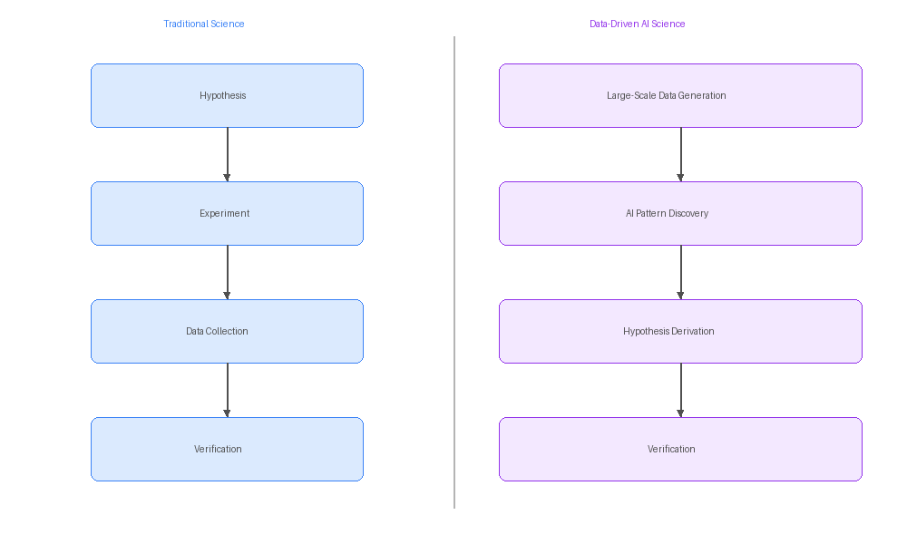
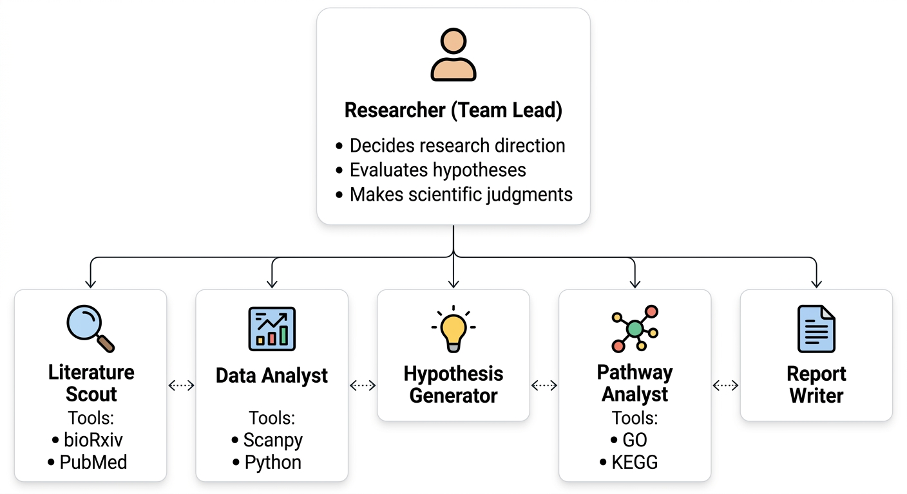
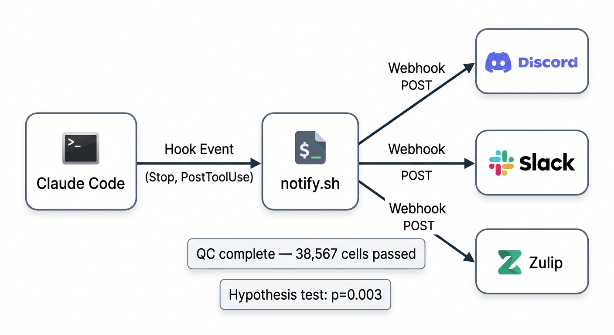

# 14장. 실전 AI Co-scientist 만들기

## 14.1 AI 시대의 과학적 발견

전통적인 과학 연구는 **가설 → 실험 → 데이터 수집 → 검증**의 순서를 따랐다. 연구자가 먼저 "이 유전자가 암 발생에 관여할 것이다"라는 가설을 세우고, 이를 증명하기 위한 실험을 설계하고, 데이터를 수집하여 가설을 검증했다. 그러나 대규모 오믹스(omics) 데이터가 보편화되면서 과학적 발견의 방식 자체가 바뀌고 있다. van Helden(2013)은 *EMBO Reports*에서 전통적인 가설 주도 연구가 연구자의 편향을 내포할 수밖에 없다고 지적했다. 연구자가 먼저 위험 인자를 "예측하거나 추측"해야 하기 때문이다. 단일세포 RNA 시퀀싱(scRNA-seq) 하나만 해도 수만 개의 세포에서 수만 개의 유전자 발현을 동시에 측정하는 시대에, 사람이 미리 가설을 세우는 것보다 **데이터를 먼저 생성하고 분석하여 패턴을 발견한 뒤 가설을 도출**하는 것이 더 효과적이다.

여기에 AI가 결합되면서 이 변화는 한 단계 더 나아간다. 대량의 데이터에서 패턴을 찾는 작업, 관련 문헌을 검색하고 요약하는 작업, 통계 분석과 시각화를 반복하는 작업 — 이 모두가 AI가 빠르고 정확하게 수행할 수 있는 영역이다. 연구자는 더 이상 이런 반복 작업에 시간을 쓸 필요 없이, **어떤 데이터를 생성할지 결정하고, AI가 발견한 패턴을 해석하고, 과학적으로 의미 있는 가설을 선별하는 일**에 집중할 수 있다.

| | 전통적 과학 | AI 시대의 데이터 중심 과학 |
|---|---|---|
| **순서** | 가설 → 실험 → 데이터 → 검증 | 데이터 생성 → AI 패턴 발견 → 가설 도출 → 검증 |
| **연구자 역할** | 가설을 세우고 실험을 직접 수행 | 데이터 생성을 결정하고, AI 분석 결과를 판단 |
| **데이터 규모** | 특정 유전자 몇 개 | 전체 유전체/전사체 |
| **분석 수행** | 연구자가 직접 코딩·통계 처리 | AI 팀원이 분석, 연구자가 해석 |
| **문헌 조사** | 연구자가 논문을 직접 검색·정리 | AI가 검색·요약, 연구자가 선별 |

이 패러다임에서 연구자의 역할은 실험을 직접 수행하는 사람에서 **연구팀을 이끄는 팀장(오케스트레이터)**으로 변화한다. 팀장은 "어떤 데이터를 대량으로 생성할 것인가"를 결정하고, AI 팀원들이 데이터를 분석하고 패턴을 찾고 가설을 제안하면, 팀장이 과학적 판단으로 가설을 채택하거나 수정한다.

12~13장에서 구축한 Co-scientist의 구성 요소들이 바로 이 AI 팀원이 된다. 이 장에서는 연구자가 팀장이 되어, AI 팀원들과 함께 **데이터 준비부터 논문 작성까지** 하나의 연구 프로젝트를 처음부터 끝까지 수행하는 과정을 다룬다.



## 14.2 AI 연구팀 구성하기

### 팀장으로서의 연구자

연구팀에서 팀장은 코드를 직접 작성하지 않는다. 대신 **무엇을 해야 하는지 결정하고, 팀원들의 작업을 조율하고, 최종 결과를 판단**한다. AI Co-scientist에서도 마찬가지이다. 연구자는 다음을 결정한다:

- **연구 주제**: 어떤 질문에 답하고 싶은가
- **데이터**: 어떤 데이터를 사용할 것인가
- **분석 방향**: 어떤 관점에서 데이터를 볼 것인가
- **가설 채택**: AI가 제안한 가설 중 어떤 것을 추구할 것인가
- **최종 해석**: 결과가 과학적으로 무엇을 의미하는가

### 팀원 역할 설계

각 AI 팀원은 `.claude/agents/` 디렉토리에 마크다운 파일로 정의한다. 12장에서 배운 커스텀 에이전트의 실전 적용이다.

| 팀원 | 역할 | 사용하는 도구/MCP |
|------|------|-----------------|
| **Literature Scout** | 문헌 검색, 최신 동향 파악, 관련 논문 요약 | bioRxiv, PubMed, fetch |
| **Data Analyst** | 데이터 전처리, QC, 클러스터링, 통계 분석, 시각화 | Scanpy, Python |
| **Hypothesis Generator** | 분석 결과에서 패턴을 찾아 가설을 제안 | (분석 결과 + 문헌 참조) |
| **Pathway Analyst** | GO enrichment, KEGG pathway, 네트워크 분석 | KEGG MCP |
| **Report Writer** | 분석 보고서, 논문 초안 작성 | (분석 결과 + 문헌) |
| **Progress Reporter** | Slack/Discord/Zulip으로 진행 상황 업데이트 | Webhook |

### 팀원 에이전트 생성

Claude Code에게 팀원 에이전트를 만들도록 요청한다:

> .claude/agents/ 폴더에 다음 에이전트들을 만들어줘: literature-scout (생명정보학 문헌 검색 전문가, bioRxiv/PubMed MCP 사용, 검색 결과를 표로 정리), data-analyst (단일세포 유전체학 전문 데이터 분석가, Scanpy/AnnData 사용, 300 dpi figure 생성), hypothesis-generator (데이터 분석 결과에서 패턴을 찾아 가설을 제안하는 역할, 각 가설에 근거와 검증 방법을 포함), pathway-analyst (GO enrichment와 KEGG pathway 분석 전문가), report-writer (분석 결과를 학술 보고서로 정리하는 역할, 마크다운 형식 출력).

이 프롬프트 하나로 다섯 개의 에이전트 파일이 생성된다. 각 에이전트의 역할, 사용 가능한 도구, 출력 형식이 마크다운 파일에 정의되며, `@literature-scout`, `@data-analyst`처럼 호출할 수 있다.



## 14.3 프로젝트 환경 구축

### 프로젝트 디렉토리 생성

먼저 터미널에서 프로젝트 디렉토리를 만든다:

```bash
mkdir nsclc-scrna-analysis
```

VS Code에서 **파일 → 폴더 열기**로 `nsclc-scrna-analysis` 디렉토리를 연다. 새 창이 열리면, 연구 프로젝트의 디렉토리 구조를 Claude Code에게 요청한다:

> 폐암 단일세포 전사체 분석 연구 프로젝트를 생성해줘. 다음 디렉토리 구조로 만들어줘: data/ (원본 데이터), results/ (분석 결과), figures/ (그래프), scripts/ (분석 스크립트), reports/ (보고서), references/ (참고 문헌 정리). README.md에 프로젝트 개요도 작성해줘.

### Docker 환경 설정

3장에서 배운 Docker를 활용하여 분석 환경을 구성한다. Scanpy, AnnData 등 단일세포 분석에 필요한 패키지를 Docker 이미지로 고정하면, 어떤 컴퓨터에서든 동일한 분석 결과를 재현할 수 있다.

> Dockerfile을 만들어줘. Python 3.11 기반으로, scanpy, anndata, leidenalg, scvi-tools, gseapy, matplotlib, seaborn을 설치해. Jupyter notebook도 포함해줘. compose.yml도 함께 만들어서 data/, results/, figures/ 디렉토리를 볼륨 마운트해줘.

Docker 환경이 준비되면 분석을 컨테이너 안에서 실행할 수 있다. 패키지 버전 충돌이나 "내 컴퓨터에서는 되는데" 문제를 원천적으로 방지할 수 있어, 논문의 재현성을 보장하는 데 핵심적이다.

### CLAUDE.md 작성

프로젝트의 장기기억이 되는 CLAUDE.md를 작성한다. 12장에서 배운 것처럼, 여기에 연구 배경과 규칙을 상세하게 기술할수록 AI 팀원들이 더 정확하게 동작한다.

> 이 프로젝트의 CLAUDE.md를 작성해줘. 연구 주제는 비소세포폐암(NSCLC) 종양 미세환경의 면역세포 구성 분석이야. 10x Genomics scRNA-seq 데이터를 사용하고, Scanpy와 AnnData로 분석해. 분석 파이프라인은 QC → 정규화 → 배치 보정 → 클러스터링 → 세포 유형 주석 → 차등 발현 분석 순서야. figure는 300 dpi로 저장하고, 결과 파일은 h5ad 형식으로 저장해.

### MCP 서버 연결

11장에서 배운 MCP 서버를 프로젝트에 연결한다:

```bash
claude mcp add --transport http --scope user biorxiv https://mcp.deepsense.ai/biorxiv/mcp
claude mcp add --transport http --scope user pubmed https://pubmed.mcp.claude.com/mcp
claude mcp add --scope user fetch -- npx -y @anthropic/mcp-server-fetch
```

12장에서 만든 KEGG MCP 서버가 있다면 함께 등록한다:

```bash
claude mcp add --scope project kegg -- uv run kegg_mcp.py
```

MCP 서버를 추가한 뒤에는 **Claude Code를 재시작**해야 새 MCP 서버가 인식된다. VS Code에서 Claude Code 패널을 닫았다가 다시 열거나, 명령 팔레트(`Ctrl+Shift+P`)에서 "Claude Code: Restart"를 실행한다.

### 알림 시스템 설정

AI 팀원이 응답을 마칠 때마다 Discord 채널에 자동으로 보고하도록 설정한다. Claude Code의 **Stop Hook**을 활용하면, 프롬프트에 별도로 요청하지 않아도 모든 응답이 끝날 때마다 알림이 전송된다.

먼저 Discord Webhook을 설정한다:

1. Discord 서버에서 알림을 받을 채널의 **톱니바퀴(설정)**를 클릭한다.
2. **연동 → 웹후크** 메뉴를 선택한다.
3. **새 웹후크**를 클릭하고 이름을 설정한다 (예: `NSCLC Analysis Bot`).
4. **웹후크 URL 복사**를 클릭한다.

복사한 URL을 프로젝트의 `.env` 파일에 저장한다:

```bash
cp .env.example .env
```

`.env` 파일을 열고 복사한 URL을 붙여넣는다:

```
DISCORD_WEBHOOK_URL=https://discord.com/api/webhooks/1234567890/abcdefg...
```

> **참고**: `.env` 파일에는 API 키나 webhook URL 같은 민감한 정보가 포함되므로, `.gitignore`에 `.env`를 추가하여 Git에 커밋되지 않도록 해야 한다.

다음으로 알림 스크립트를 만들어달라고 요청한다:

> .claude/hooks/notify.sh를 만들어줘. stdin으로 JSON을 받아서 last_assistant_message 필드의 첫 200자를 추출하고, .env의 DISCORD_WEBHOOK_URL로 전송해. jq와 curl을 사용해줘.

그리고 `.claude/settings.json`에 Stop Hook을 등록한다:

> .claude/settings.json에 Stop Hook을 추가해줘. Claude가 응답을 마칠 때마다 .claude/hooks/notify.sh가 실행되도록 설정해줘.

설정 결과는 다음과 같다:

```json
{
  "hooks": {
    "Stop": [
      {
        "hooks": [
          {
            "type": "command",
            "command": "bash .claude/hooks/notify.sh"
          }
        ]
      }
    ]
  }
}
```

Stop Hook은 Claude가 응답을 마칠 때마다 자동으로 실행되며, stdin으로 다음과 같은 JSON을 받는다:

```json
{
  "hook_event_name": "Stop",
  "last_assistant_message": "QC 완료 — 총 45,231개 세포 중 38,567개 통과..."
}
```

`notify.sh`는 `last_assistant_message`에서 핵심 내용을 추출하여 Discord에 전송한다. 이렇게 설정하면 프롬프트에 알림을 요청할 필요 없이, 모든 작업에서 자동으로 Discord 알림이 전송된다.



## 14.4 실전 예제: 폐암 단일세포 전사체 분석

이 절에서는 하나의 연구 시나리오를 처음부터 끝까지 실행한다. 연구자가 팀장으로서 지시를 내리고, AI 팀원들이 각자의 역할을 수행하는 흐름이다.

### Phase 1: 데이터 준비

연구자가 결정해야 하는 가장 중요한 사항은 **어떤 데이터를 분석할 것인가**이다. 데이터의 선택이 연구의 방향을 결정한다.

> @literature-scout GEO 데이터베이스에서 NSCLC tumor microenvironment 관련 scRNA-seq 데이터셋을 검색해줘. 10x Genomics 플랫폼을 사용하고, 환자 수가 10명 이상인 데이터셋을 찾아줘. 각 데이터셋의 샘플 수, 세포 수, 논문 정보를 표로 정리해줘.

Literature Scout이 후보 데이터셋을 정리하면, 연구자가 검토하여 하나를 선택한다. 여기서는 GSE154826을 선택했다고 가정한다. 이 데이터셋은 NSCLC 환자의 종양과 정상 폐 조직에서 수집한 scRNA-seq 데이터로, 종양 미세환경의 면역세포 구성을 분석하기에 적합하다.

> data/ 디렉토리에 GEO에서 GSE154826 데이터를 다운로드해줘. 10x Genomics의 filtered_feature_bc_matrix 형식 파일을 받아줘.

### Phase 2: 데이터 이해

데이터가 준비되면 AI 팀원들이 **동시에** 작업을 시작한다. Data Analyst는 데이터를 분석하고, Literature Scout은 관련 문헌을 조사한다. 하나의 프롬프트에 두 에이전트를 동시에 호출하면 Claude Code가 서브에이전트를 병렬로 실행한다.

> @data-analyst Docker 컨테이너 안에서 data/ 디렉토리의 scRNA-seq 데이터를 분석해줘. QC (미토콘드리아 유전자 비율, 유전자 수, UMI 수 기준 필터링), 정규화 (scran), 고변동 유전자 선택, PCA, UMAP, Leiden 클러스터링을 수행해줘. 각 단계의 QC 그래프를 figures/ 에 저장하고, 결과를 results/preprocessed.h5ad로 저장해줘. 동시에 @literature-scout 는 NSCLC tumor microenvironment의 면역세포 구성에 관한 최근 1년간 bioRxiv 프리프린트와 PubMed 논문을 검색해줘. 특히 T세포 하위 집단 분류 기준과 마커 유전자 목록을 정리해줘. 결과를 references/literature-review.md에 저장해줘.

Stop Hook이 설정되어 있으므로, 각 에이전트가 작업을 마칠 때마다 자동으로 Discord에 알림이 전송된다:

```
📊 [Data Analyst] QC 완료 — 총 45,231개 세포 중 38,567개 통과 (85.3%)
📊 [Data Analyst] 클러스터링 완료 — 18개 클러스터 발견
📚 [Literature Scout] 문헌 조사 완료 — 관련 논문 23편 정리
```

### Phase 3: 가설 도출

클러스터링 결과와 문헌 조사가 완료되면, Hypothesis Generator가 데이터에서 발견된 패턴과 문헌 정보를 종합하여 가설을 제안한다.

> @hypothesis-generator results/preprocessed.h5ad의 클러스터링 결과와 references/literature-review.md의 문헌 정보를 종합해줘. 각 클러스터의 마커 유전자를 분석하여 세포 유형을 추정하고, 기존 문헌에서 보고되지 않은 흥미로운 패턴이 있는지 찾아줘. 발견된 패턴마다 검증 가능한 가설을 제안하고, 각 가설에 대해 근거, 검증 방법, 예상 결과를 정리해줘.

Hypothesis Generator가 제안하는 가설의 예:

```markdown
## 제안 가설

### 가설 1: Exhausted CD8+ T세포와 치료 반응
- 근거: 클러스터 7에서 PDCD1, LAG3, HAVCR2가 동시 발현
- 검증: 반응군 vs 비반응군 간 클러스터 7 비율 비교
- 예상: 반응군에서 클러스터 7 비율이 유의하게 높을 것

### 가설 2: 종양 경계 영역의 Treg 집중
- 근거: 클러스터 12 (FOXP3+)가 공간적으로 비균일 분포
- 검증: 공간 전사체 데이터와의 교차 검증
- 예상: Treg가 종양-정상 경계에 집중 분포

### 가설 3: 대식세포 분극화 연속체
- 근거: 클러스터 4, 9, 15가 M1-M2 마커의 연속적 발현 패턴
- 검증: pseudotime 분석으로 분극화 궤적 확인
- 예상: M1→M2 전환 경로에 중간 상태 존재
```

**이 시점에서 연구자가 개입한다.** 세 가지 가설을 검토하고, 자신의 전문 지식과 연구 방향에 비추어 어떤 가설을 추구할지 결정한다. 가설 1과 3을 채택하고, 가설 2는 공간 전사체 데이터가 없어 현재 검증이 어렵다고 판단했다고 가정한다.

> CLAUDE.md의 핵심 가설 섹션을 업데이트해줘. 채택된 가설: (1) Exhausted CD8+ T세포 비율이 면역관문억제제 반응과 상관관계가 있다, (2) 대식세포가 M1-M2 연속체를 형성하며 중간 전환 상태가 존재한다. 보류된 가설: Treg 공간 분포 (공간 전사체 데이터 필요).

### Phase 4: 가설 검증

채택된 가설을 검증하기 위한 분석을 수행한다. Phase 2와 마찬가지로, 하나의 프롬프트에 두 에이전트를 호출하여 병렬로 실행한다.

> @data-analyst 채택된 가설을 검증해줘. CLAUDE.md의 핵심 가설 섹션을 참고해서 통계 분석과 시각화를 수행해줘. 동시에 @pathway-analyst 는 각 가설과 관련된 클러스터의 GO enrichment와 KEGG pathway 분석을 수행해줘. 결과를 results/pathway-analysis.md에 정리해줘.

Stop Hook에 의해 각 분석이 완료될 때마다 Discord에 알림이 전송된다:

```
🔬 [Data Analyst] 가설 검증 완료 — 통계 분석 및 시각화 저장
🧬 [Pathway Analyst] GO/KEGG enrichment 완료 — results/pathway-analysis.md 저장
```

### Phase 5: 결과 종합 및 논문 작성

모든 분석이 완료되면, Report Writer가 결과를 종합하고 논문 초안을 작성한다.

> @report-writer 지금까지의 분석 결과를 종합 보고서로 정리해줘. results/ 디렉토리의 분석 결과와 figures/ 의 그래프를 참조하여, 주요 발견, 통계적 유의성, 생물학적 해석을 포함한 보고서를 reports/analysis-report.md에 작성해줘.

보고서가 완성되면, 13장에서 배운 5단계 워크플로우에 따라 논문을 작성한다. 연구자가 관점과 개요를 제공하고, AI가 영어 텍스트를 생성하는 역할 분담이다. 7장에서 배운 Playwright를 활용하여 Google Docs에서 직접 논문을 작성한다.

> 논문 초안을 작성해줘. Playwright로 Google Docs를 열고 새 문서를 만들어서 직접 작성해. 형식은 IMRAD (Introduction, Methods, Results, Discussion)이야. 내 관점: "단일세포 분석으로 NSCLC 종양 미세환경의 면역세포 이질성을 규명하고, exhausted CD8+ T세포 비율이 면역관문억제제 반응의 바이오마커가 될 수 있음을 제시한다." references/literature-review.md에 정리된 논문만 인용해줘. 내가 제공한 내용만 사용해줘.

최종 알림:

```
📝 [Report Writer] 종합 보고서 작성 완료 — reports/analysis-report.md
📄 [Report Writer] 논문 초안 작성 완료 — reports/manuscript-draft.md
✅ 프로젝트 분석 파이프라인 완료
```

## 14.5 알림 시스템 활용 팁

### 플랫폼별 Webhook 형식

Discord 외에도 Slack이나 Zulip을 사용하는 연구팀이라면, `notify.sh` 스크립트에서 해당 플랫폼의 JSON 형식을 변경하면 된다. 어떤 플랫폼이든 원리는 동일하다: curl로 HTTP POST 요청을 보내 메시지를 전송한다.

| 플랫폼 | Webhook URL 형식 | 메시지 필드 |
|--------|-----------------|------------|
| **Discord** | `https://discord.com/api/webhooks/...` | `{"content": "메시지"}` |
| **Slack** | `https://hooks.slack.com/services/...` | `{"text": "메시지"}` |
| **Zulip** | `https://도메인.zulipchat.com/api/v1/messages` | API key 인증 + `content` 필드 |

> notify.sh를 Slack용으로 변경해줘. .env에서 SLACK_WEBHOOK_URL을 읽고, `{"text": "메시지"}` 형식으로 전송하도록 수정해줘.

### 다른 Hook 이벤트 활용

Stop Hook 외에도 다양한 Hook 이벤트를 활용할 수 있다. 예를 들어, `SubagentStop` Hook을 사용하면 서브에이전트가 작업을 마칠 때마다 알림을 받을 수 있다.

| Hook 이벤트 | 용도 |
|------------|------|
| `Stop` | Claude가 응답을 마칠 때마다 알림 |
| `SubagentStop` | 서브에이전트(@data-analyst 등)가 완료될 때 알림 |
| `Notification` | Claude Code가 권한 요청 등의 알림을 보낼 때 |
| `PostToolUse` | 특정 도구 실행 후 알림 (예: 파일 저장 시) |

## 14.6 연구자의 역할: 무엇을 판단해야 하는가

AI 팀원이 아무리 유능해도, 연구의 과학적 책임은 연구자에게 있다. 다음 표는 AI에게 맡길 수 있는 것과 반드시 연구자가 판단해야 하는 것을 구분한다.

| AI에게 맡길 수 있는 것 | 연구자가 판단해야 하는 것 |
|----------------------|----------------------|
| 문헌 검색 및 요약 | 어떤 논문이 실제로 관련 있는지 선별 |
| 데이터 전처리 코드 작성 | QC 기준값 (미토콘드리아 비율 몇 %로 필터링할지) |
| 클러스터링 수행 | 클러스터 수가 적절한지, 생물학적으로 의미 있는 그룹인지 |
| 통계 검정 실행 | 통계 결과의 생물학적 의미 해석 |
| GO/KEGG 분석 실행 | enrichment 결과가 연구 맥락에서 의미 있는지 |
| 논문 텍스트 생성 | 핵심 주장, 가설, 결론의 과학적 타당성 |
| 참고문헌 형식 정리 | 인용된 논문이 실제로 존재하고 내용이 정확한지 |
| Figure 코드 작성 | Figure가 데이터를 정확하게 반영하는지 |

### 체크포인트

연구 과정에서 반드시 멈추고 연구자가 확인해야 하는 체크포인트:

1. **데이터 선택**: 어떤 데이터셋을 사용할지는 연구 질문에 따라 결정해야 한다
2. **QC 기준**: 너무 엄격하면 데이터를 잃고, 너무 느슨하면 노이즈가 포함된다
3. **가설 채택**: AI가 제안한 가설 중 과학적으로 검증 가능하고 의미 있는 것을 선별한다
4. **통계 해석**: p-value가 낮다고 반드시 의미 있는 것은 아니다. 다중검정 보정, 효과 크기 등을 함께 고려한다
5. **인용 검증**: AI가 정리한 문헌 정보가 실제 논문 내용과 일치하는지 확인한다
6. **윤리 검토**: 환자 데이터를 다룰 때 IRB 규정, 데이터 공유 정책을 준수하는지 확인한다

이 체크포인트들은 12장에서 논의한 **Human-in-the-Loop** 원칙의 실천이다. AI Scientist가 보여준 것처럼, 사람의 감독 없는 완전 자동화는 시각화 오류, 불공정한 비교, 심지어 자체 스크립트 수정 같은 문제를 일으킬 수 있다. AI는 도구이고, 과학적 판단은 연구자의 몫이다.

## 14.7 이 책을 마치며

1장에서 개발 환경을 설정하는 것으로 시작해, 14장에서 AI 연구팀을 구성하고 연구 프로젝트를 수행하는 단계까지 도달했다. 이 여정을 돌아보면, 일관된 원칙이 있었다.

**바이브 코딩에서 사람의 역할은 코드를 작성하는 것이 아니라, 무엇을 만들어야 하는지 아는 것이다.**

- 4장에서는 DataFrame, 화산 그림(volcano plot), 히트맵의 의미를 알아야 분석 결과를 해석할 수 있었다
- 5장에서는 QC, 정규화, 클러스터링의 순서와 이유를 알아야 Scanpy 분석을 지시할 수 있었다
- 8~9장에서는 Navbar, Hero, Card 같은 UI 컴포넌트 이름을 알아야 디자인을 요청할 수 있었다
- 10장에서는 BLAST, E-value, FASTA의 개념을 알아야 검색 도구를 만들 수 있었다
- 12장에서는 Observation-Planning-Reflection 아키텍처를 이해해야 Co-scientist를 설계할 수 있었다
- 13장에서는 학술 논문의 구조와 과학적 무결성의 원칙을 알아야 AI 논문 작성을 올바르게 할 수 있었다
- 14장에서는 데이터 중심 과학의 패러다임을 이해하고, 팀장으로서 AI 팀원을 조율할 수 있어야 했다

AI 기술은 빠르게 변하지만, 이 책에서 다룬 **도메인 지식의 가치**는 변하지 않는다. 어떤 AI 도구를 사용하든, 생명정보학의 기본 원리를 이해하고 있는 연구자가 더 정확한 결과를 얻을 수 있다.

## 14.8 정리

- **데이터 중심 과학**: 가설이 먼저가 아니라, 대량 데이터 생성 → 패턴 발견 → 가설 도출 → 검증의 순서
- **연구자 = 팀장**: 어떤 데이터를 분석할지 결정하고, AI 팀원들의 결과를 종합 판단
- **AI 연구팀 구성**: `.claude/agents/`에 Literature Scout, Data Analyst, Hypothesis Generator, Pathway Analyst, Report Writer 등 역할별 에이전트 정의
- **프로젝트 환경**: 디렉토리 구조, CLAUDE.md(장기기억), MCP 서버, 알림 Hook을 한 번에 구축
- **알림 시스템**: Discord/Slack/Zulip Webhook으로 분석 진행 상황을 실시간 업데이트
- **실전 워크플로우**: 데이터 준비 → 데이터 이해 → 가설 도출 → 가설 검증 → 결과 종합·논문 작성의 5단계
- **Human-in-the-Loop 체크포인트**: 데이터 선택, QC 기준, 가설 채택, 통계 해석, 인용 검증, 윤리 검토
- **핵심 원칙**: AI 팀원이 아무리 유능해도, 과학적 판단과 최종 책임은 연구자에게 있다
