# 2장. Git & GitHub

## 2.1 버전 관리 시스템 (Version Control System)

### 버전 관리가 없다면?

버전 관리 시스템 없이 파일을 관리하면 어떻게 될까? 연구자라면 한 번쯤은 다음과 같은 경험이 있을 것이다.

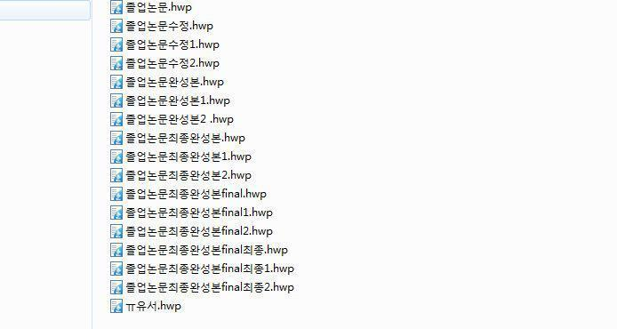

졸업논문, 졸업논문수정1, 졸업논문수정2, 졸업논문완성본, 졸업논문완성본final, 졸업논문완성본final1, 졸업논문최종완성본final, 졸업논문최종완성본final1... 파일 이름만으로는 어떤 것이 최신 버전인지, 어떤 변경이 있었는지 알 수 없다. 코드도 마찬가지다. 분석 스크립트를 수정하다 이전 버전으로 되돌리고 싶은데, 어느 시점의 코드가 정상적으로 동작했는지 기억나지 않는 경우가 흔하다.

이러한 문제를 해결하기 위해 **버전 관리 시스템(VCS, Version Control System)**이 등장했다. VCS는 파일의 모든 변경 이력을 기록하여, 언제든 특정 시점의 상태로 되돌아갈 수 있게 해준다. 누가, 언제, 무엇을 변경했는지 추적할 수 있어 협업에도 필수적이다.

## 2.2 Git이란?

Git은 **분산형 버전 관리 시스템**이다. 2005년 리누스 토르발즈(Linux 운영체제의 창시자)가 Linux 커널 개발을 위해 만들었으며, 현재 전 세계 소프트웨어 개발의 사실상 표준이 되었다.

"분산형"이란 각 사용자가 버전 트리의 전체 사본을 로컬에 가지고 있다는 뜻이다. 따라서 **오프라인에서도 커밋, 브랜치 생성, 이력 조회 등 모든 버전 관리 작업이 가능**하다. 네트워크가 연결되면 변경 사항을 원격 저장소와 동기화하면 된다. 프로젝트 폴더 안의 `.git` 디렉토리에 버전 트리가 저장된다.

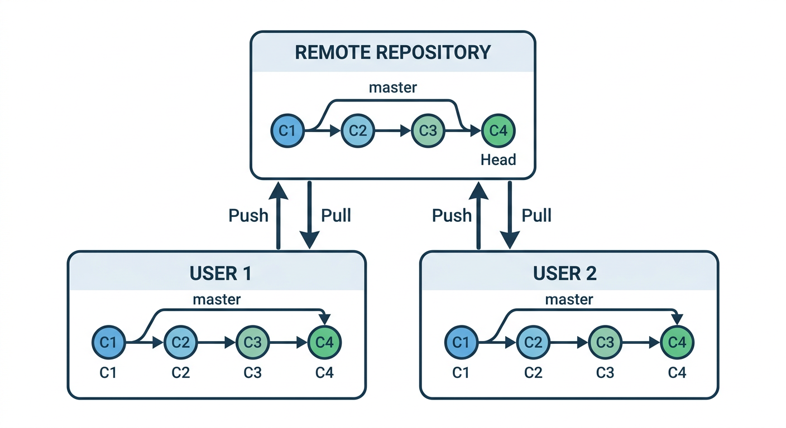


생명정보학에서 Git은 분석 스크립트, Snakemake 파이프라인, 설정 파일 등의 버전을 관리하는 데 널리 사용된다. 이 책에서는 Claude Code를 통해 Git을 사용하므로, 명령어를 외울 필요 없이 개념만 이해하면 된다.

### Git 기본 용어

| 용어 | 설명 |
|------|------|
| **Repository** (Repo, 리포지토리) | Git 버전 트리의 저장소. 프로젝트의 모든 파일과 변경 이력이 담겨 있다 |
| **Clone** (클론) | 원격의 버전 트리를 로컬에 처음으로 가져오는 작업 |
| **Commit** (커밋) | 특정 시점의 파일 상태를 기록한 스냅샷. "저장" 버튼과 비슷하지만, 이전 상태로 되돌아갈 수 있다는 점이 다르다 |
| **HEAD** (헤드) | 현재 작업 중인 가장 최신 커밋을 가리키는 포인터 |
| **Push** (푸시) | 로컬의 커밋들을 원격 저장소에 업로드 |
| **Pull** (풀) | 원격 저장소의 최신 변경 사항을 로컬로 다운로드하고 병합 |
| **Stash** (스태시) | 현재 작업 중인 변경사항을 임시로 저장해두고 HEAD 상태로 되돌림 |
| **.gitignore** | Git이 추적하지 않을 파일을 정의하는 파일. 바이너리 파일, 비밀번호, 대용량 데이터 등을 제외할 때 사용 |

### GitHub 기본 용어

| 용어 | 설명 |
|------|------|
| **GitHub** (깃헙) | 원격 Git 저장소를 호스팅하는 세계에서 가장 유명한 플랫폼 |
| **Fork** (포크) | 다른 사람의 Git 저장소를 내 계정으로 복제. 원본에 대한 쓰기 권한 없이도 자유롭게 수정 가능 |
| **Pull Request** (PR) | Fork한 저장소의 변경 사항을 원본 저장소에 반영해달라고 요청하는 것 |
| **GitHub Actions** | GitHub 저장소에서 자동화 작업(테스트, 배포 등)을 실행하는 CI/CD 도구 |
| **GitHub Copilot** | GitHub에서 개발한 AI 기반 코드 어시스트 도구 |

## 2.3 Git 설치 및 설정

### Git 설치

Git을 사용하려면 먼저 설치해야 한다. 운영체제별 설치 방법은 다음과 같다.

**Linux / WSL (Ubuntu)**

```bash
sudo apt update && sudo apt install git
```

> **중요**: `sudo`는 시스템 전체에 영향을 미치는 관리자 권한으로 명령을 실행하는 것이므로, 비밀번호를 입력해야 한다. **LLM(Claude Code 등)에게 sudo 비밀번호를 전달하는 것은 보안상 위험하므로**, `sudo`가 필요한 설치 작업은 반드시 사용자가 직접 터미널에서 실행한다.

**macOS**

터미널에서 `git --version`을 입력하면, Git이 설치되어 있지 않을 경우 Xcode Command Line Tools 설치를 자동으로 안내한다. 안내에 따라 설치하면 된다.

설치 확인:

```bash
git --version
```

### 사용자 정보 설정

Git을 처음 사용할 때는 **이름과 이메일**을 설정해야 한다. 이 정보는 커밋에 기록되어, 누가 어떤 변경을 했는지 추적할 수 있게 해준다.

```bash
git config --global user.name "홍길동"
git config --global user.email "hong@example.com"
```

이메일은 GitHub 계정에 등록된 이메일과 동일하게 설정하는 것이 좋다. GitHub에서 커밋 기록이 본인의 프로필과 연결되기 때문이다.

## 2.4 GitHub CLI (gh) 설치 및 설정

**GitHub CLI(`gh`)**는 터미널에서 GitHub의 기능을 사용할 수 있게 해주는 도구이다. Claude Code가 저장소 생성, Pull Request, Issue 관리 등 GitHub 관련 작업을 수행할 때 내부적으로 `gh`를 사용하므로, 반드시 설치하고 인증을 완료해야 한다.

**Linux / WSL (Ubuntu)**

```bash
sudo apt update && sudo apt install gh
```

**macOS**

```bash
brew install gh
```

> `brew`는 macOS의 패키지 관리자이다. 설치되어 있지 않다면 https://brew.sh 에서 설치할 수 있다.

설치 확인:

```bash
gh --version
```

**GitHub 인증**

`gh`를 설치한 후, GitHub 계정과 연결하는 인증 과정이 필요하다.

```bash
gh auth login
```

이 명령을 실행하면 대화형으로 인증 방식을 선택하게 된다. 다음과 같이 진행한다:

1. **"Where do you use GitHub?"** → `GitHub.com` 선택
2. **"What is your preferred protocol for Git operations on this host?"** → `HTTPS` 선택
3. **"Authenticate Git with your GitHub credentials?"** → `Yes` 선택
4. **"How would you like to authenticate GitHub CLI?"** → `Login with a web browser` 선택
5. 화면에 표시된 **one-time code**를 복사하고 Enter를 누른다
6. 자동으로 열리는 브라우저에서 코드를 붙여넣고 인증을 완료한다

인증이 완료되면 다음 명령으로 확인할 수 있다:

```bash
gh auth status
```

## 2.5 GitHub에 저장소 만들기

Claude Code에게 요청하면 저장소 생성부터 로컬 Clone까지 한 번에 처리할 수 있다:

> my-analysis라는 이름의 공개 GitHub 저장소를 만들고 클론해줘

Claude Code가 내부적으로 `gh repo create` 명령을 실행하여 GitHub에 저장소를 생성하고, 로컬에 Clone까지 완료해 준다.

직접 터미널에서 만들 수도 있다:

```bash
gh repo create my-analysis --public --clone
```

이 명령은 GitHub에 `my-analysis`라는 공개 저장소를 만들고, 자동으로 로컬에 Clone까지 해준다. 비공개 저장소를 만들려면 `--public` 대신 `--private`을 사용한다.

GitHub 웹사이트에서도 저장소를 만들 수 있다:

1. https://github.com 에 로그인한다
2. 오른쪽 상단의 **`+`** 버튼 → **"New repository"**를 클릭한다
3. 저장소 이름을 입력한다 (예: `my-analysis`)
4. **"Add a README file"** 체크박스를 선택한다
5. **"Add .gitignore"**에서 프로젝트에 맞는 템플릿을 선택한다 (Python 프로젝트라면 `Python` 선택)
6. **"Create repository"** 버튼을 클릭한다

### 마크다운(Markdown)이란?

README 파일의 확장자 `.md`는 **마크다운(Markdown)**을 의미한다. 마크다운은 간단한 기호로 문서의 서식을 지정하는 경량 마크업 언어이다. GitHub에서 README.md 파일을 자동으로 렌더링하여 보기 좋게 표시해 주며, 이 책에서도 CLAUDE.md, 에이전트 정의 파일 등 다양한 곳에서 마크다운을 사용한다.

기본 문법은 다음과 같다:

```markdown
# 제목 1
## 제목 2
### 제목 3

**굵게**, *기울임*, `코드`

- 목록 항목 1
- 목록 항목 2

1. 번호 목록 1
2. 번호 목록 2

[링크 텍스트](https://example.com)

> 인용문
```

마크다운은 일반 텍스트로 작성하면서도 구조적인 문서를 만들 수 있어, 프로그래머들 사이에서 문서 작성의 사실상 표준이 되었다. 자세한 문법은 외울 필요 없이, 필요할 때 Claude Code에게 물어보면 된다.

웹에서 저장소를 만든 경우, 로컬에 Clone하여 작업을 시작한다:

```bash
gh repo clone 사용자명/my-analysis
```

또는 Claude Code에게 요청할 수도 있다:

> https://github.com/사용자명/my-analysis 이 저장소를 클론해줘

> 참고: 반드시 원격 저장소로 GitHub을 쓸 필요는 없다. Bitbucket, GitLab, Phorge 등 다른 서비스도 활용 가능하다. 다만 이 책에서는 가장 널리 사용되는 GitHub을 기준으로 설명한다.

## 2.6 Claude Code로 Git 사용하기

이 책에서는 Git 명령어를 직접 입력하는 대신, Claude Code에게 자연어로 요청하여 Git을 사용한다. Git의 개념을 이해하고 있으면, 세부 명령어는 Claude Code가 알아서 처리해 준다.

### 혼자 작업하기

가장 기본적인 워크플로우이다. 원격 저장소를 Clone한 뒤, 파일을 수정하고 Commit, 그리고 Push하는 과정이다.

**1단계: Clone**

원격 저장소를 로컬로 복제한다. Claude Code에게 저장소 주소를 알려주면 된다.

> https://github.com/사용자명/저장소명 이 저장소를 클론해줘

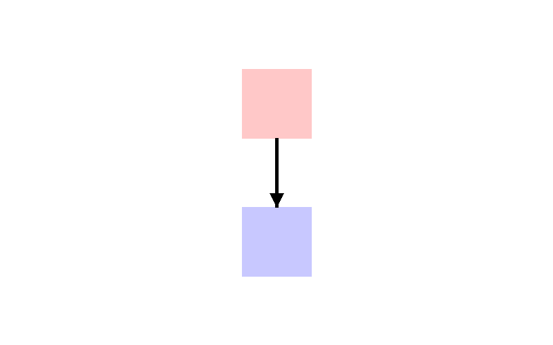

**2단계: Commit**

파일을 수정한 뒤, Claude Code에게 커밋을 요청한다. Claude가 변경 사항을 분석하여 적절한 커밋 메시지를 자동으로 생성해 준다.

> 변경 사항을 커밋해줘

커밋 메시지를 직접 지정하고 싶다면 이렇게 요청할 수도 있다:

> "분석 스크립트에 QC 단계 추가" 메시지로 커밋해줘

커밋은 Git에서 가장 기본적인 단위이다. Claude Code는 내부적으로 변경된 파일을 스테이징(`git add`)하고 커밋(`git commit`)하는 과정을 한 번에 처리해 준다. "수정" 같은 모호한 메시지보다 "BLAST 결과 파싱 함수에서 빈 결과 처리 추가"처럼 구체적인 메시지가 좋은데, Claude Code에게 맡기면 변경 내용을 분석하여 이런 구체적인 메시지를 자동으로 작성해 준다.

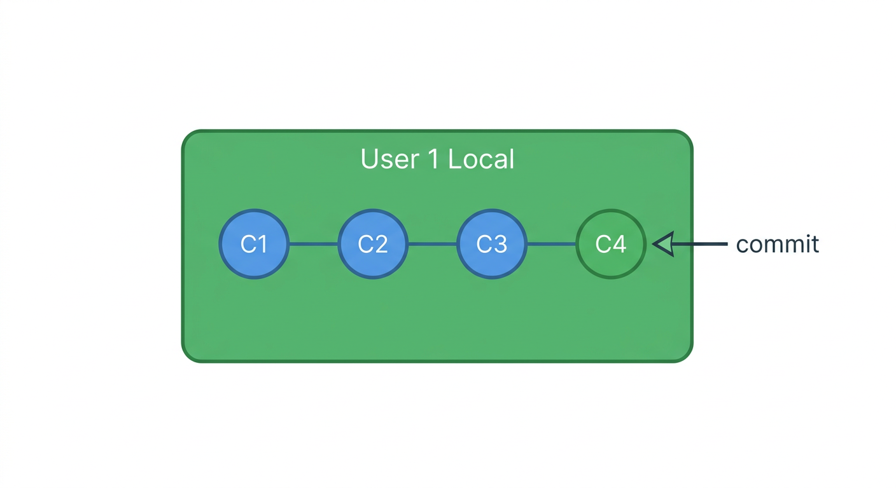

**3단계: Push**

커밋한 내용을 원격 저장소에 업로드한다.

> 푸시해줘

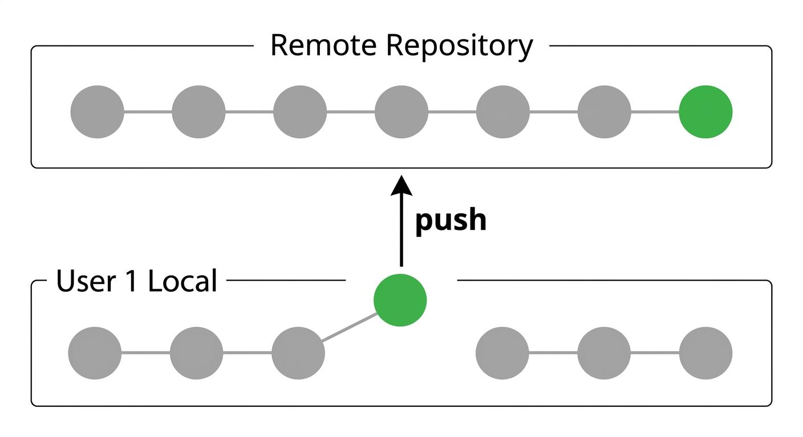

### 함께 작업하기

두 명 이상이 같은 저장소에서 작업할 때 발생할 수 있는 상황이다. 이 시나리오를 이해하면 협업 과정에서 생기는 대부분의 문제를 해결할 수 있다.

**1단계: User1과 User2가 각각 Clone**

두 사람이 같은 원격 저장소를 각자의 컴퓨터에 Clone한다. 이 시점에서 두 사람의 로컬 저장소는 동일한 상태이다.

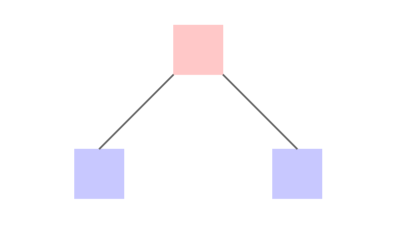

**2단계: User1이 먼저 Commit & Push**

User1이 파일을 수정하고 커밋한 뒤, 원격 저장소에 Push한다. 이제 원격 저장소는 User1의 변경 사항이 반영된 상태이다.

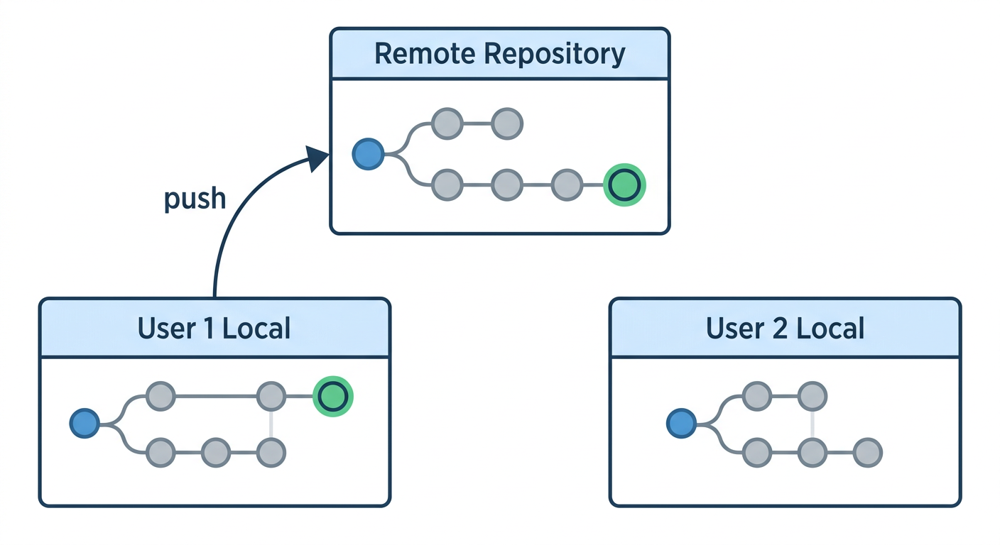

**3단계: User2도 Commit 후 Push 시도 — 실패!**

User2도 파일을 수정하고 커밋한 뒤 Push를 시도하지만, User1이 이미 Push한 변경 사항이 있으므로 **Push가 거부**된다. Git은 원격 저장소의 이력이 로컬보다 앞서 있으면 Push를 허용하지 않는다. 데이터 손실을 방지하기 위한 안전장치이다.


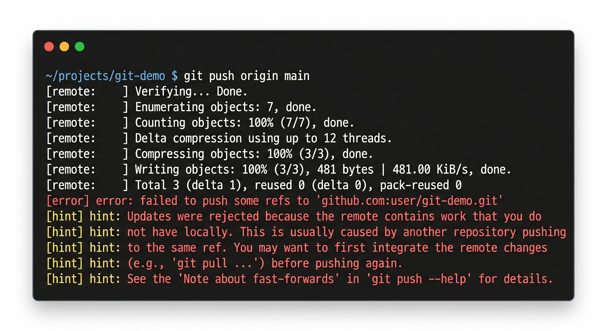

**4단계: User2가 Pull**

먼저 원격의 변경 사항을 Pull로 가져온다. Git이 자동으로 User1의 변경 사항과 User2의 변경 사항을 병합(merge)하려고 시도한다.

> 원격 저장소의 최신 변경 사항을 가져와줘


**5단계: 충돌(Conflict) 해결**

같은 파일의 같은 부분을 수정했다면 **merge conflict(병합 충돌)**이 발생한다. Git이 자동으로 병합할 수 없는 경우이다. 충돌이 발생하면 해당 파일에 다음과 같은 표시가 나타난다.

```
<<<<<<< HEAD
User2가 수정한 내용
=======
User1이 수정한 내용
>>>>>>> origin/main
```

`<<<<<<< HEAD`와 `=======` 사이는 내(User2)의 변경 사항이고, `=======`과 `>>>>>>>` 사이는 원격(User1)의 변경 사항이다.

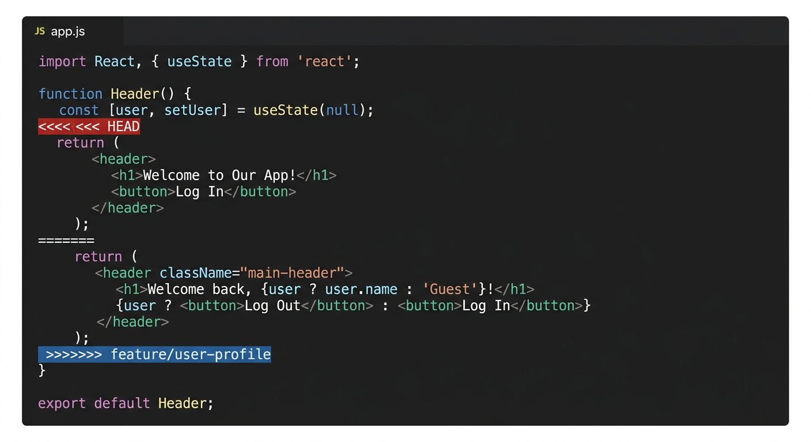

충돌이 발생하면 Claude Code에게 해결을 요청할 수 있다:

> merge conflict를 해결해줘. 양쪽 변경 사항을 모두 반영해줘

Claude Code가 충돌 마커를 분석하고, 양쪽 변경 사항을 적절히 병합한 뒤, 결과를 커밋해 준다. 물론 VS Code에서 직접 해결할 수도 있다. 충돌이 발생한 파일을 열면 "현재 변경 사항 수락", "상대방 변경 사항 수락", "양쪽 모두 수락" 같은 버튼이 표시되어 편리하게 해결할 수 있다.

> 참고: GitHub 웹 인터페이스에서도 merge conflict를 해결할 수 있다.
> https://docs.github.com/en/pull-requests/collaborating-with-pull-requests/addressing-merge-conflicts/resolving-a-merge-conflict-on-github

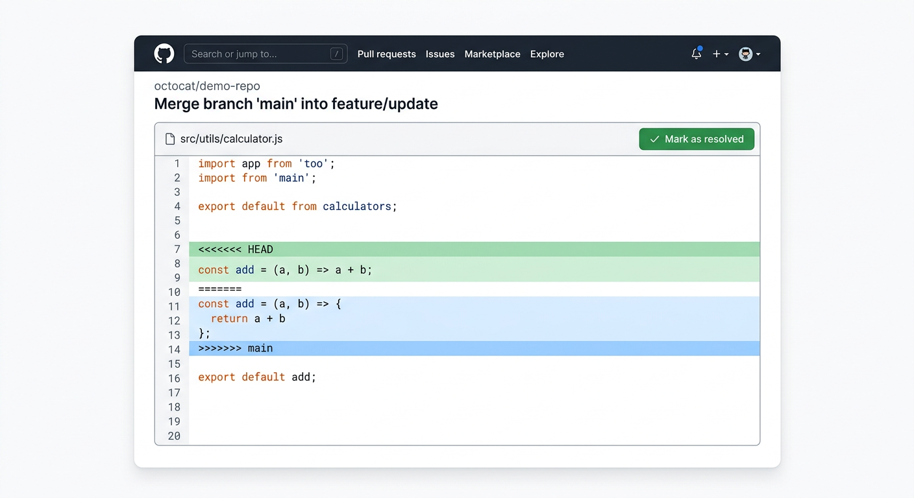

**6단계: Merge 후 Push**

충돌을 해결하고 merge 커밋을 생성한 뒤, 최종적으로 Push한다.

> 푸시해줘

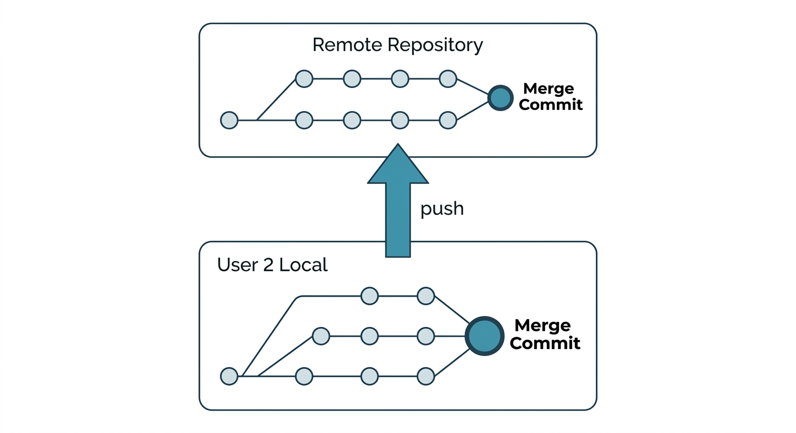

### Stash 활용하기

파일을 수정했으나 아직 Commit하지 않은 상태에서, Pull을 깜빡 잊었을 때 사용하는 방법이다. 작업을 시작하기 전에 Pull을 실행하는 습관을 들이면 이 상황을 피할 수 있지만, 현실에서는 종종 발생한다.

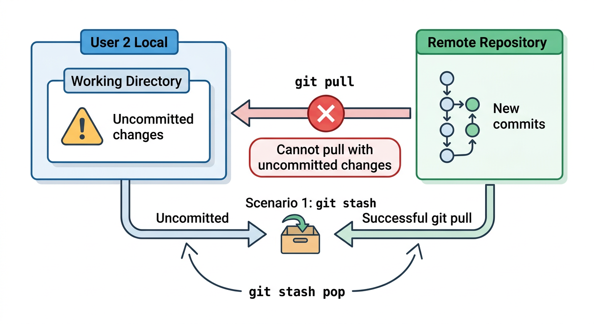

**Git stash**: 로컬의 변경사항을 임시로 저장하고 HEAD로 되돌린다. 마치 작업 중인 서류를 서랍에 넣어두는 것과 비슷하다. Claude Code에게 이렇게 요청하면 된다:

> 현재 변경 사항을 임시 저장하고, 원격에서 최신 코드를 가져온 다음, 임시 저장한 내용을 다시 적용해줘

Claude Code가 내부적으로 `git stash` → `git pull` → `git stash pop` 순서로 처리해 준다. 만약 conflict가 발생하면 앞의 시나리오와 동일한 방식으로 해결을 요청할 수 있다.

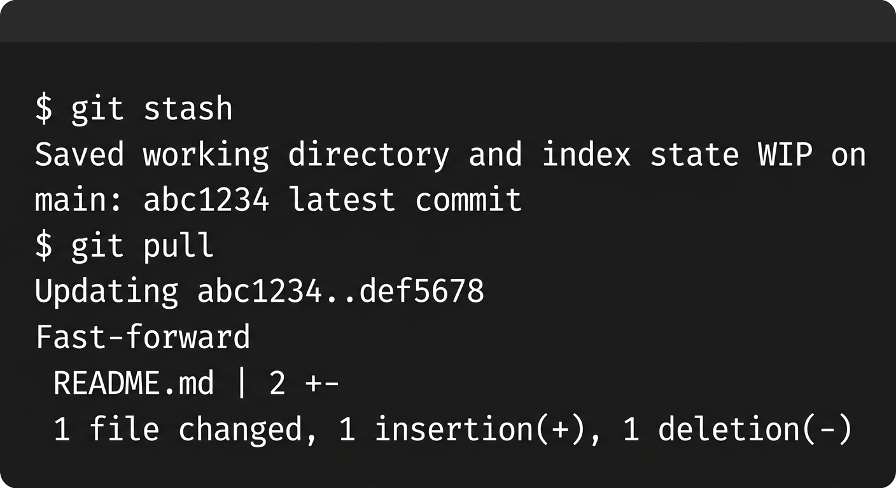

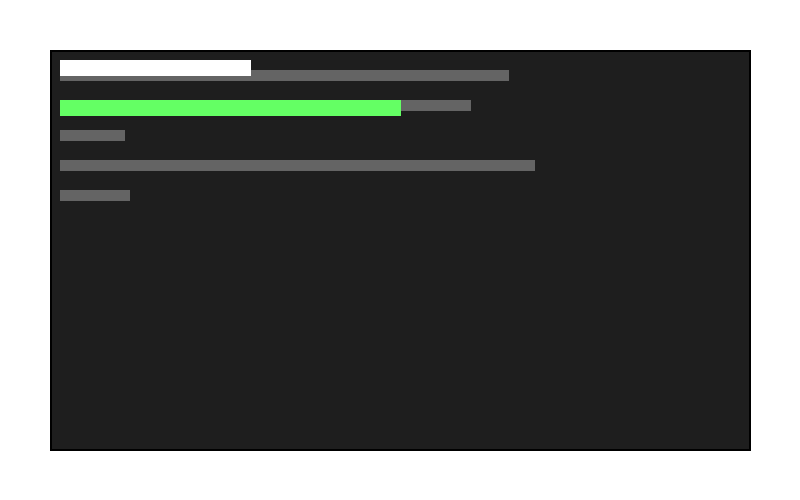

## 2.7 GitHub에서 협업하기

### 다른 개발자의 프로젝트에 기여하기

오픈소스 생태계에서는 다른 사람의 프로젝트에 기여(contribution)하는 문화가 활발하다. 예를 들어 Scanpy에서 버그를 발견했다면, 직접 수정하여 프로젝트에 반영을 요청할 수 있다. 이 과정은 다음과 같다.

1. 다른 개발자의 저장소를 **Fork**한다
2. Fork한 저장소를 로컬에 **Clone**한다
3. 자유롭게 수정한 후 GitHub에 **Push**한다 (이때 Push되는 저장소는 내가 Fork한 저장소)
4. GitHub 상에서 **Pull Request**를 보낸다
5. 상대방이 변경 사항을 **Merge**해 주면 기여 완료

### Fork

Fork는 다른 개발자의 프로젝트(쓰기 권한 없음)를 내 계정의 프로젝트(쓰기 권한 있음)로 복제하는 것이다. GitHub 웹사이트에서 저장소 페이지 오른쪽 상단의 "Fork" 버튼을 클릭하면 된다.

Fork된 저장소는 원본과 독립적이므로, 어떤 실험적인 수정을 하더라도 원본에 영향을 주지 않는다. 이 점이 Clone과의 차이이다 — Clone은 원본 저장소를 그대로 가져오는 것이고, Fork는 내 계정에 별도의 복사본을 만드는 것이다.

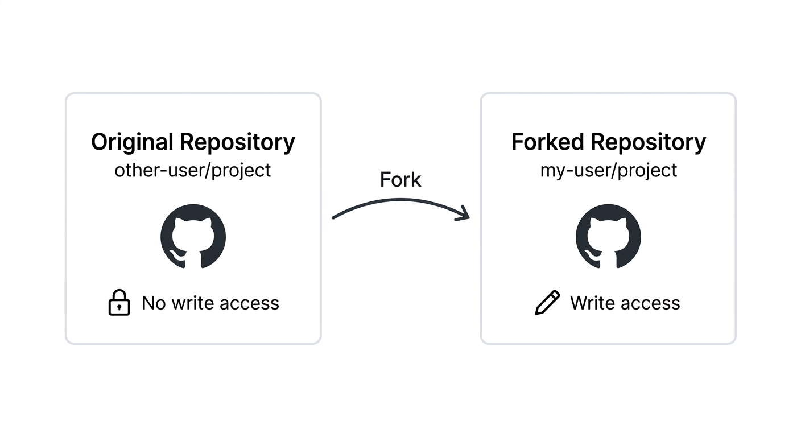

### Pull Request

Fork한 저장소에서 변경 사항을 Push한 뒤, 원본 저장소에 Pull Request(PR)를 열어 변경 사항의 반영을 요청한다. Claude Code를 사용하면 PR 생성도 간편하다:

> 이 변경 사항으로 PR을 만들어줘

Claude Code가 변경 내용을 분석하여 PR 제목과 설명을 자동으로 작성해 준다. 어떤 문제를 해결했는지, 어떤 방식으로 수정했는지를 포함한 설명이 생성된다.

PR이 열리면 원본 저장소의 관리자가 코드를 검토(code review)한다. 수정 요청이 올 수도 있고, 바로 승인될 수도 있다. 이 과정을 통해 코드의 품질을 유지하면서 외부 기여를 받아들일 수 있다.

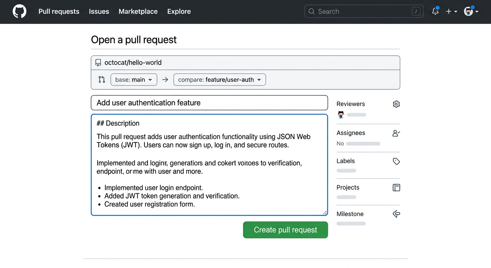

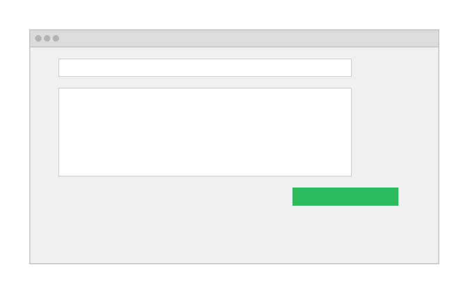

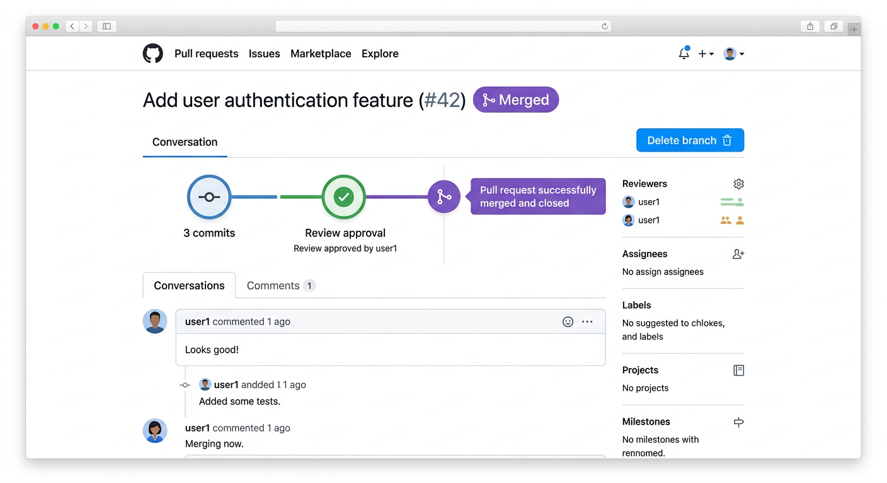

## 2.8 바이브 코딩에서의 Git

바이브 코딩에서 Git은 특히 중요한 역할을 한다. AI가 코드를 수정하는 과정에서 예상치 못한 결과가 나올 수 있기 때문이다. Git을 통해 변경 이력을 추적하고, 문제가 생기면 이전 상태로 되돌릴 수 있다.

Claude Code에게 자주 사용하는 Git 관련 요청:

> 현재 변경 사항을 커밋해줘

> 마지막 커밋을 되돌려줘

> feature/blast-search 브랜치를 만들어줘

> main 브랜치로 돌아가줘

> 이 변경 사항으로 PR을 만들어줘

> 최근 커밋 이력을 보여줘

Git의 개념만 이해하고 있으면, 세부 명령어는 Claude Code에게 맡길 수 있다. 중요한 것은 **커밋, 브랜치, 머지, PR이 무엇인지 개념적으로 이해**하는 것이다. 특히 AI가 코드를 수정하기 전에 커밋해두는 습관을 들이면, 언제든 안전하게 이전 상태로 돌아갈 수 있다.

## 2.9 정리

- **버전 관리 시스템(VCS)**은 파일의 변경 이력을 추적하여 협업과 되돌리기를 가능하게 한다
- **Git**은 분산형 VCS로, 오프라인에서도 모든 버전 관리 작업이 가능하다
- **기본 워크플로우**: Clone → 수정 → Commit → Push
  - Claude Code에게 자연어로 요청하여 모든 Git 작업을 수행할 수 있다
  - Commit은 자주 하기 (특히 AI가 코드를 수정하기 전에 반드시 커밋)
- **협업 시 충돌 해결**: Pull → Conflict 해결 → Merge → Push
- **GitHub 협업**: Fork → Clone → 수정 → Push → Pull Request
- **바이브 코딩에서의 Git**: AI가 코드를 수정하므로, 변경 이력 추적과 되돌리기가 더욱 중요하다
