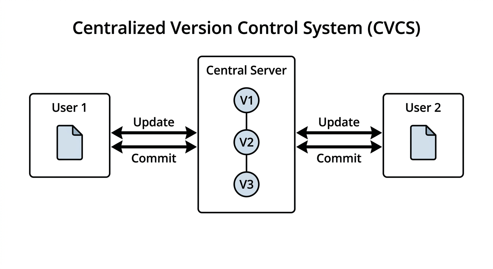

# 2장. Git & Github

## 2.1 버전 관리 시스템 (Version Control System)

### 버전 관리가 없다면?

버전 관리 시스템 없이 파일을 관리하면 어떻게 될까? 아마 다음과 같은 경험이 있을 것이다.

졸업논문, 졸업논문수정1, 졸업논문수정2, 졸업논문완성본, 졸업논문완성본final, 졸업논문완성본final1, 졸업논문최종완성본final, 졸업논문최종완성본final1... 파일 이름만으로는 어떤 것이 최신 버전인지, 어떤 변경이 있었는지 알 수 없다. 이러한 문제를 해결하기 위해 **버전 관리 시스템(VCS, Version Control System)**이 등장했다.

### 버전 관리 시스템의 종류

버전 관리 시스템은 크게 두 가지로 나뉜다.

- **중앙집중형**: SVN, CVS 등
- **분산형**: Git

#### 중앙집중형 VCS

중앙집중형 VCS에서는 하나의 중앙 서버에 버전 트리가 저장된다. 사용자들은 중앙 서버에 접속하여 파일을 가져오고, 수정한 내용을 다시 서버에 올린다.

중앙집중형의 가장 큰 단점은 **항상 온라인이어야 버전 트리에 접근 가능**하다는 점이다. 네트워크 연결이 끊기면 버전 관리 작업을 할 수 없다.

#### 분산형 VCS

분산형 VCS에서는 각 사용자가 버전 트리의 전체 사본을 로컬에 가지고 있다. 따라서 **오프라인에서도 버전 트리 수정이 가능**하다.

## 2.2 Git이란?

Git은 **분산형 버전 컨트롤 시스템**이다. 프로젝트 폴더 안의 `.git` 디렉토리에 버전 트리가 저장된다.

### Git 기본 용어

| 용어 | 설명 |
|------|------|
| **Repository** (Repo, 리포지토리) | Git 버전 트리의 저장소 |
| **Clone** (클론) | 원격의 버전 트리를 로컬에 처음으로 가져옴 |
| **Commit** (커밋) | 버전 스냅샷 |
| **HEAD** (헤드) | 가장 최신 커밋 |
| **Push** (푸시) | 로컬의 버전 트리를 원격에 업로드 |
| **Pull** (풀) | 원격의 버전 트리를 로컬로 다운로드 |
| **Stash** (스태시) | 로컬의 변경사항을 저장해두고 HEAD로 되돌림 |
| **.gitignore** | 원격에 업로드하지 말아야 할 파일 정의 (바이너리, 비밀번호 등) |

### Github 기본 용어

| 용어 | 설명 |
|------|------|
| **Github** (깃헙) | 원격 Git 저장소들을 모아놓은 현재 가장 유명한 웹사이트 |
| **Fork** (포크) | 다른 사람의 Git 저장소를 내 계정으로 복제 |
| **Pull Request** (PR) | Fork된 저장소의 변경 사항을 원본 저장소에 merge 해달라고 요청하는 것 |
| **Github Actions** | Github상에서 동작하는 자동화 CI 도구 |
| **Github Copilot** | Github에서 개발한 AI 기반 코드 어시스트 도구 |

### Github에 저장소 만들기

저장소를 만드는 방법은 두 가지가 있다.

1. 로컬에 Git 저장소 생성 후 Github에 업로드
2. **Github에 저장소 생성 후 로컬에 clone** (이 방법이 더 쉬움)

물론 반드시 원격 저장소로 Github을 쓸 필요는 없다. Bitbucket, Gitlab, Phorge 등 다른 서비스도 활용 가능하다.

## 2.3 Git 사용 시나리오

### 혼자 작업하기

가장 기본적인 워크플로우이다. 원격 저장소를 Clone한 뒤, 파일을 수정하고 Commit, 그리고 Push하는 과정이다.

**1단계: Clone**

원격 저장소를 로컬로 복제한다.

**2단계: Commit**

파일을 수정한 뒤, 변경 사항을 커밋한다.

**3단계: Push**

커밋한 내용을 원격 저장소에 업로드한다.

### 함께 작업하기

두 명 이상이 같은 저장소에서 작업할 때 발생할 수 있는 상황이다.

**1단계: User1과 User2가 각각 Clone**

**2단계: User1이 먼저 Commit & Push**

User1이 파일을 수정하고 커밋한 뒤, 원격 저장소에 Push한다.

**3단계: User2도 Commit 후 Push 시도 — 실패!**

User2도 파일을 수정하고 커밋한 뒤 Push를 시도하지만, User1이 이미 Push한 변경 사항이 있으므로 **Push가 거부**된다.

**4단계: User2가 Pull**

먼저 원격의 변경 사항을 Pull로 가져온다.

**5단계: 충돌(Conflict) 해결**

같은 파일의 같은 부분을 수정했다면 **merge conflict(병합 충돌)**이 발생한다. 충돌이 발생하면 해당 파일에 다음과 같은 표시가 나타난다.

충돌을 수동으로 해결한 뒤, 다시 커밋하고 Push하면 된다.

> 참고: Github 웹 인터페이스에서도 merge conflict를 해결할 수 있다.
> https://docs.github.com/en/pull-requests/collaborating-with-pull-requests/addressing-merge-conflicts/resolving-a-merge-conflict-on-github

**6단계: Merge 후 Push**

충돌을 해결하고 merge 커밋을 생성한 뒤, 최종적으로 Push한다.

### Stash 활용하기

파일을 수정했으나 아직 Commit하지 않은 상태에서, Pull을 깜빡 잊었을 때 사용하는 방법이다.

**Git stash**: 로컬의 변경사항을 임시로 저장하고 HEAD로 되돌린다. 로컬 변경사항이 없어지므로 `git pull`이 가능해진다.

이제 `git stash pop` 명령으로 임시로 저장했던 변경 사항을 다시 불러온다. 만약 conflict가 발생하면 시나리오 2와 동일한 방식으로 해결할 수 있다.

## 2.4 Github에서 협업하기

### 다른 개발자의 프로젝트에 기여하기

다른 개발자의 프로젝트에 기여하는 과정은 다음과 같다.

1. 다른 개발자의 저장소를 **Fork**한다
2. Fork한 저장소를 로컬에 **Clone**한다
3. 자유롭게 수정한 후 Github에 **Push**한다 (이때 Push되는 저장소는 내가 Fork한 저장소)
4. Github 상에서 **Pull Request**를 보낸다
5. 상대방이 변경 사항을 **Merge**해 주면 기여 완료

### Fork

Fork는 다른 개발자의 프로젝트(쓰기 권한 없음)를 내 계정의 프로젝트(쓰기 권한 있음)로 복제하는 것이다.

### Pull Request

Fork한 저장소에서 변경 사항을 Push한 뒤, 원본 저장소에 Pull Request를 열어 변경 사항의 반영을 요청한다.

## 2.5 정리

- **Git 사용법을 확실히 숙지할 것**
  - Clone, Push, Pull 등 기본 활용법
  - 일하기 시작 전 항상 `git pull`부터 실행하기
  - Commit은 자주 하기 (특히 task를 마치고 나서는 반드시 commit)
- **Github 상에서 협업하는 방법 알기**
  - 서로의 repository에 Pull Request를 날려보고 merge 해보기
