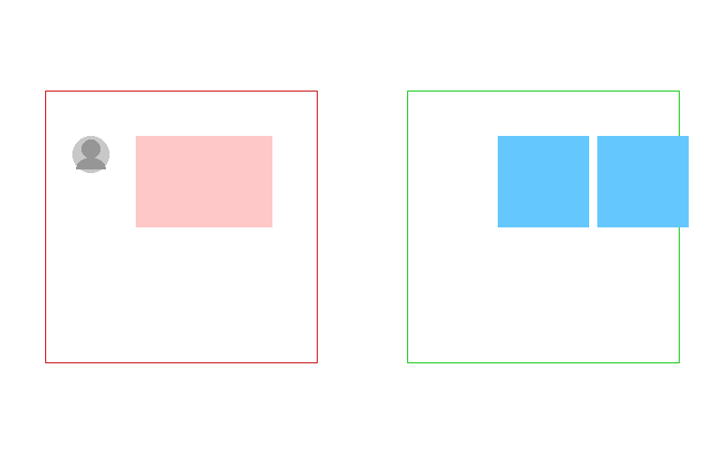
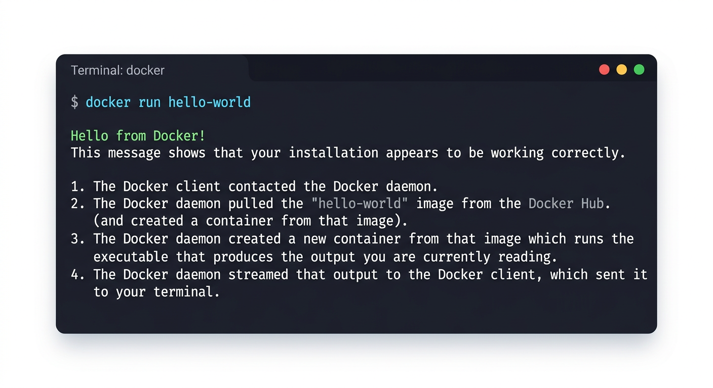
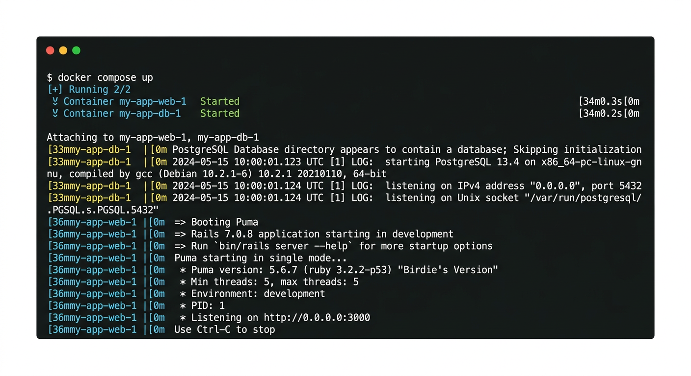

# 3장. Docker

## 3.1 Docker란?

Docker는 애플리케이션을 **컨테이너(Container)**라는 격리된 환경에서 실행할 수 있게 해주는 도구다. 컨테이너는 운영체제, 라이브러리, 설정 파일 등을 모두 포함하고 있어, 어떤 컴퓨터에서든 동일한 환경으로 프로그램을 실행할 수 있다.

### 왜 Docker가 필요한가?

생명정보학 도구를 개발하다 보면 다음과 같은 문제를 자주 겪게 된다:

- "내 컴퓨터에서는 되는데 다른 컴퓨터에서는 안 돼요"
- 파이썬 버전, 라이브러리 버전 충돌
- 운영체제마다 설치 방법이 다름
- 데이터베이스, 웹 서버 등 여러 서비스를 동시에 관리해야 함

이런 문제는 생명정보학에서 특히 심각하다. BLAST+는 특정 버전의 libgomp를 요구하고, Scanpy는 특정 버전의 NumPy와 호환되고, R의 DESeq2는 Bioconductor 버전에 의존한다. 연구실의 서버에서 잘 돌아가던 파이프라인이 동료의 노트북에서 에러를 내는 일은 흔하다.

Docker를 사용하면 이러한 문제를 해결할 수 있다. 개발 환경 자체를 코드(Dockerfile)로 정의하여 누구나 동일한 환경을 재현할 수 있다. "내 컴퓨터에서는 되는데"라는 말이 필요 없어진다.



### 가상 머신과의 차이

Docker 컨테이너는 가상 머신(VM)과 비슷해 보이지만, 중요한 차이가 있다. 가상 머신은 운영체제 전체를 포함하므로 무겁고 느린 반면, 컨테이너는 호스트 운영체제의 커널을 공유하므로 가볍고 빠르다.

구체적으로 비교하면:

| | 가상 머신 (VM) | Docker 컨테이너 |
|---|---|---|
| **크기** | 수 GB (OS 전체 포함) | 수십~수백 MB |
| **시작 시간** | 수 분 | 수 초 |
| **자원 사용** | OS별 메모리/CPU 점유 | 호스트 커널 공유, 가벼움 |
| **격리 수준** | 완전한 격리 (별도 OS) | 프로세스 수준 격리 |
| **사용 사례** | 완전히 다른 OS가 필요할 때 | 애플리케이션 배포, 개발 환경 |


## 3.2 Docker 설치

이 책에서는 모든 개발을 WSL(Windows) 또는 네이티브 리눅스/macOS 환경에서 진행한다. Docker도 WSL 내에서 직접 설치한다. Windows 사용자는 1장에서 설치한 WSL Ubuntu 터미널을 열고 진행한다.

> **참고**: Windows에서는 Docker Desktop이라는 GUI 프로그램을 설치하는 방법도 있지만, 이 책에서는 WSL 안에서 Docker Engine을 직접 설치하는 방법을 사용한다. Docker Desktop은 유료 라이선스 정책이 있고, WSL 직접 설치가 더 가볍고 안정적이다.

> **중요**: Docker 설치는 **사용자가 직접 터미널에서 수행해야 한다**. 설치 과정에 `sudo`(관리자 권한) 명령이 포함되어 있기 때문이다. `sudo`는 시스템 전체에 영향을 미치는 관리자 권한으로 명령을 실행하는 것이므로, 비밀번호를 입력해야 한다. **LLM(Claude Code 등)에게 sudo 비밀번호를 전달하는 것은 보안상 위험하므로**, sudo가 필요한 설치 작업은 반드시 사용자가 직접 수행한다.

터미널에서 다음 명령을 순서대로 실행한다:

```bash
# Docker 공식 GPG 키 추가
sudo apt-get update
sudo apt-get install ca-certificates curl
sudo install -m 0755 -d /etc/apt/keyrings
sudo curl -fsSL https://download.docker.com/linux/ubuntu/gpg -o /etc/apt/keyrings/docker.asc
sudo chmod a+r /etc/apt/keyrings/docker.asc

# Docker 저장소 추가
echo \
  "deb [arch=$(dpkg --print-architecture) signed-by=/etc/apt/keyrings/docker.asc] https://download.docker.com/linux/ubuntu \
  $(. /etc/os-release && echo "$VERSION_CODENAME") stable" | \
  sudo tee /etc/apt/sources.list.d/docker.list > /dev/null

# Docker 설치
sudo apt-get update
sudo apt-get install docker-ce docker-ce-cli containerd.io docker-buildx-plugin docker-compose-plugin

# 현재 사용자를 docker 그룹에 추가 (sudo 없이 docker 사용 가능)
sudo usermod -aG docker $USER
```

마지막 명령(`usermod`)은 매번 `sudo docker ...`를 입력하지 않아도 되게 해준다. 이 설정이 적용되려면 WSL 터미널을 완전히 종료했다가 다시 열어야 한다.

### 설치 확인

터미널에서 다음 명령을 실행하여 Docker가 정상적으로 설치되었는지 확인한다:

```bash
docker --version
docker run hello-world
```

`docker run hello-world`를 실행하면 Docker가 `hello-world` 이미지를 자동으로 다운로드하고 실행한다. "Hello from Docker!"라는 메시지가 출력되면 설치가 성공한 것이다. 이 과정에서 Docker의 핵심 동작 방식 — 이미지 다운로드 → 컨테이너 생성 → 실행 → 종료 — 을 한 번에 체험할 수 있다.



## 3.3 Docker 기본 개념

Docker에는 세 가지 핵심 개념이 있다: **이미지**, **컨테이너**, **Dockerfile**. 이 관계를 이해하면 Docker의 대부분을 이해한 것이나 마찬가지다.

### 이미지 (Image)

Docker 이미지는 컨테이너를 만들기 위한 **설계도**다. 운영체제, 프로그램, 설정 파일 등이 모두 포함되어 있다. Docker Hub(https://hub.docker.com/)에서 다양한 공식 이미지를 다운로드할 수 있다.

이미지는 **읽기 전용(read-only)**이다. 한 번 만들어진 이미지는 변경되지 않으며, 이를 기반으로 여러 개의 컨테이너를 만들 수 있다. 이 책에서 사용하는 대표적인 이미지로는 `node:20-alpine`(Node.js 런타임), `postgres:16-alpine`(PostgreSQL 데이터베이스) 등이 있다.

`alpine`이라는 태그가 붙은 이미지는 Alpine Linux라는 경량 리눅스 배포판을 기반으로 한다. 일반 Ubuntu 기반 이미지가 수백 MB인 데 반해, Alpine 기반 이미지는 수십 MB로 훨씬 가볍다.

### 컨테이너 (Container)

컨테이너는 이미지를 기반으로 **실제로 실행되는 인스턴스**다. 하나의 이미지로 여러 개의 컨테이너를 만들 수 있다. 이미지와 컨테이너의 관계는 프로그램의 설치 파일과 실행 중인 프로세스의 관계와 비슷하다.

컨테이너는 서로 격리되어 있다. 컨테이너 A에서 어떤 패키지를 설치하거나 파일을 수정해도, 컨테이너 B에는 영향을 주지 않는다. 컨테이너를 삭제하면 내부의 모든 변경 사항도 함께 사라진다. 데이터를 영구적으로 보존하려면 **볼륨(volume)**을 사용해야 한다.

### Dockerfile

Dockerfile은 Docker 이미지를 만들기 위한 **레시피 파일**이다. 어떤 기반 이미지를 사용하고, 어떤 파일을 복사하고, 어떤 명령을 실행할지 순서대로 기술한다.

```dockerfile
FROM node:20-alpine      # 기반 이미지: Node.js 20이 설치된 Alpine Linux
WORKDIR /app             # 작업 디렉토리 설정
COPY package.json .      # package.json 파일을 컨테이너에 복사
RUN npm install          # 의존성 설치
COPY . .                 # 나머지 소스 코드 복사
CMD ["npm", "run", "dev"] # 컨테이너 시작 시 실행할 명령
```

Dockerfile의 각 줄은 **레이어(layer)**를 형성한다. Docker는 이 레이어를 캐시하므로, `package.json`이 변경되지 않았다면 `RUN npm install` 단계를 건너뛴다. 그래서 변경 빈도가 낮은 파일(의존성 정의)을 먼저 복사하고, 빈도가 높은 파일(소스 코드)을 나중에 복사하는 것이 효율적이다.

### Docker Compose

실제 웹 애플리케이션은 보통 여러 서비스로 구성된다. 예를 들어 이 책에서 만드는 생명정보학 웹 도구는 SvelteKit 앱(프론트엔드 + 백엔드)과 PostgreSQL(데이터베이스)이 함께 동작해야 한다. 이럴 때 **Docker Compose**를 사용한다.

Docker Compose는 여러 개의 컨테이너를 **`compose.yml`** 파일 하나로 정의하고 한 번에 실행할 수 있게 해주는 도구다.

```yaml
services:
  web:
    build: .              # 현재 디렉토리의 Dockerfile로 이미지 빌드
    ports:
      - "3000:3000"       # 호스트의 3000번 포트를 컨테이너의 3000번 포트에 연결
  db:
    image: postgres:16    # Docker Hub의 공식 PostgreSQL 이미지 사용
    environment:
      POSTGRES_PASSWORD: mysecret
```

`ports` 설정은 호스트(내 컴퓨터)와 컨테이너 사이의 포트를 연결한다. `"3000:3000"`은 내 컴퓨터의 3000번 포트로 접속하면 컨테이너의 3000번 포트로 전달된다는 의미다. 브라우저에서 `http://localhost:3000`으로 접속하면 컨테이너 안에서 실행 중인 웹 서버에 연결된다.

실행은 다음 명령 하나로 가능하다:

```bash
docker compose up
```

이 명령을 실행하면 `compose.yml`에 정의된 모든 서비스의 이미지를 빌드(또는 다운로드)하고, 컨테이너를 생성하고, 네트워크로 연결한 뒤 실행한다. 하나의 명령으로 전체 개발 환경이 구성되는 것이다.



## 3.4 자주 사용하는 Docker 명령어

| 명령어 | 설명 |
|--------|------|
| `docker compose up` | compose.yml에 정의된 모든 서비스 시작 |
| `docker compose up -d` | 백그라운드에서 서비스 시작 (터미널을 다른 용도로 사용 가능) |
| `docker compose down` | 모든 서비스 종료 및 컨테이너 삭제 |
| `docker compose logs` | 서비스 로그 확인 (에러 디버깅에 유용) |
| `docker compose logs -f` | 실시간 로그 스트리밍 (Ctrl+C로 중단) |
| `docker ps` | 실행 중인 컨테이너 목록 확인 |
| `docker exec -it <컨테이너> bash` | 실행 중인 컨테이너 안으로 접속 (셸 사용) |

`docker compose up -d`는 특히 유용하다. `-d` 플래그(detached mode)를 붙이면 서비스가 백그라운드에서 실행되므로, 같은 터미널에서 다른 작업을 계속할 수 있다. Claude Code를 사용할 때는 터미널을 AI가 사용하므로, 백그라운드 실행이 편리하다.

`docker exec`는 실행 중인 컨테이너에 직접 접속하는 명령이다. 예를 들어 PostgreSQL 컨테이너에 접속하여 SQL 쿼리를 직접 실행하거나, 앱 컨테이너에서 BLAST+ 명령을 테스트할 때 사용한다.

## 3.5 Docker와 바이브 코딩

바이브 코딩에서 Docker의 역할은 더욱 중요하다. Claude Code에게 "BLAST+ 검색 도구를 만들어줘"라고 요청하면, Claude는 Dockerfile에 BLAST+ 설치 명령을 추가하고, compose.yml에 볼륨 마운트를 설정하고, 환경 변수를 구성해 준다.

이때 사람이 알아야 할 것은 Docker 명령어의 문법이 아니라, **왜 Docker가 필요한지, Dockerfile과 compose.yml이 각각 무슨 역할을 하는지**이다. 예를 들어:

- "BLAST+를 Docker 컨테이너에 설치해줘" → Claude가 Dockerfile 수정
- "데이터베이스를 영구적으로 보존하게 해줘" → Claude가 볼륨 설정 추가
- "웹 서버 포트를 5173으로 바꿔줘" → Claude가 ports 설정 수정

이런 요청을 할 수 있으려면, 이미지, 컨테이너, 볼륨, 포트의 개념을 이해하고 있어야 한다.

## 3.6 정리

- **Docker는 개발 환경을 코드로 정의하여 일관된 환경을 재현하는 도구**
  - "내 컴퓨터에서는 되는데" 문제를 해결
  - 가상 머신보다 가볍고 빠르다
- **세 가지 핵심 개념**: 이미지(설계도), 컨테이너(실행 인스턴스), Dockerfile(레시피)
- **Docker Compose로 여러 서비스를 한 번에 관리**
  - 웹 서버 + 데이터베이스 등을 `compose.yml` 하나로 정의
  - `docker compose up` 한 줄로 전체 환경 실행
- **Windows 사용자는 WSL 위에 Docker를 설치하여 사용**
- **바이브 코딩에서의 Docker**: 코드를 직접 작성할 필요는 없지만, 이미지, 컨테이너, 볼륨, 포트의 개념은 이해해야 AI에게 정확한 지시를 내릴 수 있다
