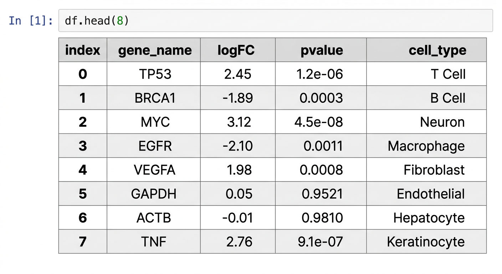
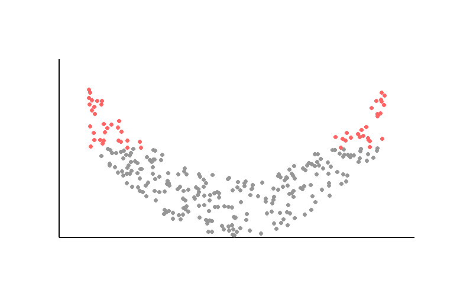
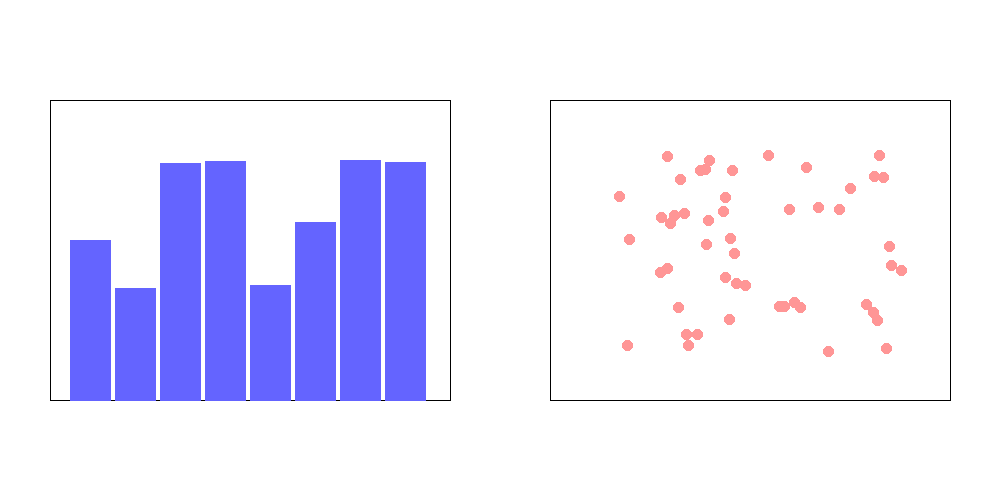
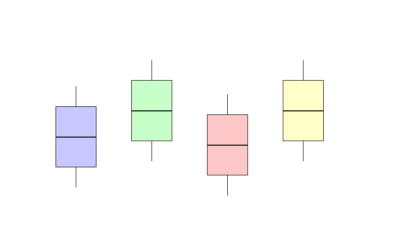
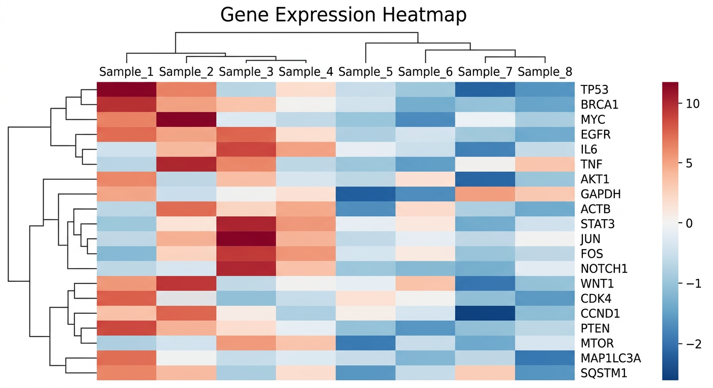

# 4장. Python 데이터 분석 기초

## 4.1 왜 Python인가?

생명정보학에서 Python은 사실상 표준 프로그래밍 언어다. 데이터 처리, 시각화, 통계 분석, 머신러닝까지 거의 모든 작업을 Python 생태계 안에서 수행할 수 있다. Scanpy(단일세포 분석), Biopython(서열 처리), PyMOL(분자 시각화) 등 생명정보학 전용 라이브러리도 대부분 Python으로 작성되어 있다.

바이브 코딩에서는 이 패키지들의 문법을 암기할 필요가 없다. 대신 **각 패키지가 무엇을 할 수 있는지**를 알고, AI에게 정확히 요청하는 것이 중요하다. 이 장에서는 데이터 분석에 사용되는 핵심 패키지들의 역할과 주요 개념을 소개한다.

비유하자면, 요리를 주문할 때 레시피를 몰라도 되지만, 메뉴판은 읽을 수 있어야 하는 것과 같다. "볶음밥"과 "리조또"의 차이를 모르면 원하는 음식을 주문할 수 없듯이, "박스 플롯"과 "히트맵"의 차이를 모르면 AI에게 원하는 시각화를 요청할 수 없다.

## 4.2 패키지 설치

WSL 환경에서 필요한 패키지를 설치한다:

```bash
pip install pandas numpy matplotlib seaborn scipy
```

> **팁**: AI에게 "pandas로 CSV 파일 읽어서 히스토그램 그려줘"라고 요청하면, AI가 알아서 import문과 코드를 작성해 준다. 하지만 **어떤 패키지가 어떤 역할을 하는지** 알아야 AI의 결과물이 맞는지 판단할 수 있다.

## 4.3 pandas — 테이블 데이터 처리

pandas는 표(테이블) 형태의 데이터를 다루는 패키지다. 엑셀 스프레드시트를 Python에서 다룬다고 생각하면 된다. 생명정보학에서는 유전자 발현 데이터, 변이 목록, 샘플 메타데이터 등 대부분의 데이터가 표 형태이므로 pandas는 거의 모든 분석의 출발점이 된다.

### 핵심 개념

- **DataFrame**: 행과 열로 이루어진 2차원 테이블. pandas의 핵심 자료구조다. 엑셀 시트 하나와 비슷하다.
- **Series**: DataFrame의 한 열(column). 1차원 데이터다.
- **Index**: 각 행을 식별하는 라벨. 유전자 이름이나 샘플 ID를 인덱스로 설정하면 데이터 접근이 편리해진다.

### 주요 작업

```python
import pandas as pd

# CSV 파일 읽기
df = pd.read_csv("gene_expression.csv")

# 데이터 미리보기
df.head()          # 상위 5행
df.shape           # (행 수, 열 수)
df.describe()      # 기초 통계량

# 열 선택
df["gene_name"]              # 한 열
df[["gene_name", "logFC"]]   # 여러 열

# 조건 필터링
significant = df[df["pvalue"] < 0.05]

# 정렬
df.sort_values("logFC", ascending=False)

# 새 열 추가
df["neg_log_p"] = -np.log10(df["pvalue"])
```



위 코드에서 `df[df["pvalue"] < 0.05]`는 p-value가 0.05 미만인 행만 골라내는 필터링이다. 엑셀에서 필터를 거는 것과 같은 작업이지만, 수십만 행도 순식간에 처리한다. `df.describe()`는 각 숫자 열의 평균, 표준편차, 최솟값, 최댓값 등을 한눈에 보여주는 요약 통계를 생성한다.

### AI에게 요청하는 예시

> "gene_expression.csv 파일을 읽어서 pvalue가 0.05 미만인 유전자만 필터링하고, logFC 기준으로 내림차순 정렬해서 상위 20개를 보여줘"

이 요청을 하려면 **pvalue, logFC가 무엇인지**, **필터링과 정렬이라는 개념**을 알아야 한다. 코드 문법은 몰라도 되지만, 데이터의 의미는 사람이 이해하고 있어야 한다.

## 4.4 NumPy — 수치 연산

NumPy는 대규모 수치 데이터를 빠르게 처리하는 패키지다. pandas의 내부에서도 NumPy를 사용하며, Scanpy, Matplotlib 등 거의 모든 과학 계산 패키지가 NumPy 위에 구축되어 있다. Python 과학 생태계의 기반이라 할 수 있다.

### 핵심 개념

- **ndarray**: N차원 배열. 같은 타입의 데이터를 담는 고성능 자료구조다. Python 기본 리스트보다 수십~수백 배 빠르다.
- **브로드캐스팅**: 크기가 다른 배열 간 연산을 자동으로 확장하는 기능. 예를 들어 배열의 모든 원소에 2를 곱할 때, 반복문 없이 `arr * 2`로 가능하다.
- **벡터 연산**: 반복문 없이 배열 전체에 연산을 한 번에 적용한다. `np.log2(arr)`는 배열의 모든 원소에 log2를 적용한다.

### 주요 작업

```python
import numpy as np

# 배열 생성
arr = np.array([1, 2, 3, 4, 5])
matrix = np.zeros((100, 100))    # 100x100 영행렬

# 기본 연산
arr.mean()      # 평균
arr.std()       # 표준편차
arr.max()       # 최댓값

# 벡터 연산 (반복문 불필요)
log_values = np.log2(arr + 1)    # 모든 원소에 log2 적용

# 난수 생성
random_data = np.random.normal(0, 1, size=1000)  # 정규분포
```

> **바이브 코딩에서의 활용**: NumPy 자체를 직접 쓸 일은 많지 않지만, AI가 생성하는 코드에 자주 등장한다. `np.log2`, `np.mean` 같은 표현이 나왔을 때 무엇을 하는 코드인지 이해할 수 있으면 충분하다.

## 4.5 Matplotlib — 기본 시각화

Matplotlib은 Python의 가장 기본적인 시각화 패키지다. 1999년부터 개발되어 온 역사 깊은 패키지로, 거의 모든 종류의 그래프를 그릴 수 있다. 학술 논문에 실리는 그래프 대부분이 Matplotlib으로 만들어진다.

### 핵심 개념

- **Figure**: 전체 그림 영역. 하나의 Figure 안에 여러 그래프를 배치할 수 있다. 종이 한 장이라고 생각하면 된다.
- **Axes**: 개별 그래프 영역. 실제로 데이터가 그려지는 공간이다. Figure 안에 놓이는 하나의 차트.
- **Subplot**: Figure를 격자로 나누어 여러 그래프를 배치하는 방식. 논문에서 Figure 1의 (A), (B), (C) 패널과 같다.

### 주요 그래프 유형

```python
import matplotlib.pyplot as plt

# 산점도 (Scatter plot)
plt.scatter(df["logFC"], df["neg_log_p"])
plt.xlabel("Log Fold Change")
plt.ylabel("-log10(p-value)")
plt.title("Volcano Plot")
plt.savefig("volcano.png", dpi=300)
plt.show()
```



Volcano plot은 차등 발현 분석(DEA)의 대표적인 시각화 방법이다. X축에 발현 변화량(logFC), Y축에 통계적 유의성(-log10 p-value)을 표시하여, 발현이 크게 변하면서 통계적으로 유의한 유전자를 한눈에 파악할 수 있다. 이름은 화산 분출 모양을 닮았다고 해서 붙여졌다.

```python
# 히스토그램
plt.hist(df["logFC"], bins=50)
plt.xlabel("Log Fold Change")
plt.ylabel("Frequency")
plt.show()
```

```python
# 여러 그래프 한 번에 (Subplot)
fig, axes = plt.subplots(1, 2, figsize=(12, 5))
axes[0].hist(df["logFC"], bins=50)
axes[0].set_title("Distribution of logFC")
axes[1].scatter(df["logFC"], df["neg_log_p"], s=1)
axes[1].set_title("Volcano Plot")
plt.tight_layout()
plt.savefig("combined.png", dpi=300)
```



`dpi=300`은 해상도를 300 DPI(dots per inch)로 설정하는 것인데, 학술 논문 출판에 요구되는 기본 해상도이다. 화면에서는 차이가 크지 않지만, 인쇄물에서는 선명도에 큰 차이가 난다.

### AI에게 요청하는 예시

> "logFC와 -log10(pvalue)로 volcano plot 그려줘. significant한 유전자(pvalue < 0.05, |logFC| > 1)는 빨간색으로 표시하고, 나머지는 회색으로. 그래프 해상도는 300 dpi로 저장해줘"

## 4.6 Seaborn — 통계 시각화

Seaborn은 Matplotlib 위에 구축된 **통계 시각화 전문 패키지**다. 더 적은 코드로 보기 좋은 통계 그래프를 만들 수 있다. Matplotlib이 모든 것을 그릴 수 있는 범용 도구라면, Seaborn은 통계 시각화에 특화된 고수준 도구다.

### Matplotlib과의 차이

| | Matplotlib | Seaborn |
|---|---|---|
| **수준** | 저수준 (세밀한 제어) | 고수준 (간결한 코드) |
| **스타일** | 기본 스타일 단순함 | 기본 스타일이 깔끔함 |
| **통계 기능** | 직접 구현 필요 | 회귀선, 분포 등 내장 |
| **DataFrame 연동** | 수동으로 데이터 전달 | DataFrame 직접 지원 |

실무에서는 두 패키지를 함께 사용하는 경우가 많다. Seaborn으로 기본 그래프를 빠르게 그리고, Matplotlib으로 세부 요소(제목, 레이블, 범례 위치 등)를 조정하는 식이다.

### 주요 그래프 유형

```python
import seaborn as sns

# 박스 플롯 — 그룹별 분포 비교
sns.boxplot(data=df, x="cell_type", y="expression")
plt.xticks(rotation=45)
plt.show()
```



박스 플롯은 데이터의 분포를 요약하여 보여준다. 상자의 중앙선은 중앙값(median), 상자의 위아래는 사분위 범위(IQR), 수염(whisker)은 이상치를 제외한 범위를 나타낸다. 여러 그룹의 분포를 비교할 때 가장 많이 사용되는 시각화 방법이다.

```python
# 히트맵 — 유전자 발현 매트릭스 시각화
sns.heatmap(expression_matrix, cmap="RdBu_r", center=0)
plt.title("Gene Expression Heatmap")
plt.show()
```



히트맵은 행렬 형태의 데이터를 색상으로 표현한다. 유전자 발현 데이터에서 행은 유전자, 열은 샘플이고, 색상의 강도가 발현량을 나타낸다. `cmap="RdBu_r"`은 빨강-파랑 색상표를 사용하고, `center=0`은 발현 변화 없음(0)을 흰색으로 설정한다. 발현이 증가한 유전자는 빨간색, 감소한 유전자는 파란색으로 직관적으로 구분할 수 있다.

```python
# 바이올린 플롯 — 분포의 형태까지 표현
sns.violinplot(data=df, x="condition", y="expression")
plt.show()
```

```python
# 산점도 + 회귀선
sns.regplot(data=df, x="gene_A", y="gene_B")
plt.show()
```

### AI에게 요청하는 예시

> "cell_type별 gene expression의 분포를 violin plot으로 비교해줘. 색상은 pastel 팔레트 사용하고, 각 그룹의 데이터 포인트도 strip plot으로 겹쳐서 보여줘"

## 4.7 SciPy — 과학 계산과 통계 검정

SciPy는 과학 계산에 필요한 다양한 알고리즘을 제공한다. 생명정보학에서는 주로 **통계 검정** 기능을 사용한다. 두 그룹 사이에 유의한 차이가 있는지, 두 변수 사이에 상관관계가 있는지를 통계적으로 판단할 때 SciPy의 함수들이 사용된다.

### 자주 사용하는 통계 검정

```python
from scipy import stats

# t-test — 두 그룹의 평균 비교
t_stat, p_value = stats.ttest_ind(group_a, group_b)
print(f"t-statistic: {t_stat:.4f}, p-value: {p_value:.4e}")

# Mann-Whitney U test — 비모수 검정 (정규분포 가정 불필요)
u_stat, p_value = stats.mannwhitneyu(group_a, group_b)

# Pearson 상관계수
corr, p_value = stats.pearsonr(gene_a_expression, gene_b_expression)
print(f"Correlation: {corr:.4f}, p-value: {p_value:.4e}")

# 다중 검정 보정 (Benjamini-Hochberg)
from scipy.stats import false_discovery_control
adjusted_pvalues = false_discovery_control(p_values, method='bh')
```

t-test는 두 그룹의 평균이 통계적으로 다른지를 검정한다. 예를 들어 약물 처리 그룹과 대조군의 유전자 발현 평균을 비교할 때 사용한다. Mann-Whitney U test는 데이터가 정규분포를 따르지 않을 때 사용하는 비모수 대안이다.

**다중 검정 보정**은 특히 중요하다. 유전자 2만 개를 동시에 검정하면, 순전히 우연에 의해서도 약 1,000개(2만 × 0.05)가 "유의하다"고 나올 수 있다. Benjamini-Hochberg 보정은 이런 거짓 양성(false positive)을 통제하여 실제로 의미 있는 결과만 남기는 방법이다.

### AI에게 요청하는 예시

> "treatment 그룹과 control 그룹의 gene expression을 t-test로 비교해줘. p-value가 0.05 미만인 유전자 목록을 뽑아주고, Benjamini-Hochberg 보정도 적용해줘"

이 요청에서 **t-test가 무엇인지**, **다중 검정 보정이 왜 필요한지**를 이해하고 있어야 AI의 결과를 올바르게 해석할 수 있다.

## 4.8 AI와 함께하는 데이터 분석

### 워크플로우

바이브 코딩으로 데이터 분석을 할 때의 일반적인 흐름이다:

1. **데이터 확인**: "이 CSV 파일의 구조를 보여줘" → AI가 `pd.read_csv`와 `df.head()`, `df.describe()` 실행
2. **전처리**: "결측값 제거하고, gene_name 열을 인덱스로 설정해줘" → AI가 `dropna()`, `set_index()` 적용
3. **분석**: "두 그룹 간 차이가 있는 유전자를 찾아줘" → AI가 통계 검정 수행
4. **시각화**: "결과를 volcano plot으로 그려줘" → AI가 Matplotlib/Seaborn으로 시각화
5. **해석**: 결과를 사람이 확인하고, 추가 분석 방향을 지시

이 흐름에서 1~4단계의 코드는 AI가 작성하지만, 5단계의 해석은 전적으로 사람의 몫이다. "이 유전자가 왜 상향 조절되었는가?", "이 결과가 기존 문헌과 일치하는가?" 같은 질문은 도메인 지식이 있어야 답할 수 있다.

### 핵심 포인트

| 사람이 해야 할 일 | AI가 해주는 일 |
|---|---|
| 분석 목표 설정 | 코드 작성 |
| 적절한 분석 방법 선택 | 패키지 import 및 함수 호출 |
| 결과 해석 | 그래프 생성 및 통계량 계산 |
| 생물학적 의미 판단 | 데이터 전처리 및 변환 |

> **핵심**: 코드를 외울 필요는 없다. 하지만 **"박스 플롯은 분포를 비교할 때 쓴다"**, **"t-test는 두 그룹의 평균을 비교한다"**, **"p-value가 작을수록 통계적으로 유의하다"** 같은 개념은 반드시 이해해야 한다. 이것이 AI에게 올바른 지시를 내리고, AI의 결과를 검증하는 힘이 된다.

## 4.9 정리

- **pandas**: 테이블 데이터(CSV, TSV) 읽기, 필터링, 정렬, 집계. 거의 모든 분석의 출발점
- **NumPy**: 수치 배열 연산, 수학 함수 (log, mean, std 등). 과학 계산의 기반
- **Matplotlib**: 기본 그래프 (산점도, 히스토그램, 서브플롯). 논문 출판 품질 지원
- **Seaborn**: 통계 시각화 (박스 플롯, 히트맵, 바이올린 플롯). 적은 코드로 깔끔한 그래프
- **SciPy**: 통계 검정 (t-test, 상관분석, 다중 검정 보정). 유의성 판단의 핵심
- **바이브 코딩의 핵심**: 문법이 아닌 **개념**을 이해하고, AI에게 정확히 요청하는 것
