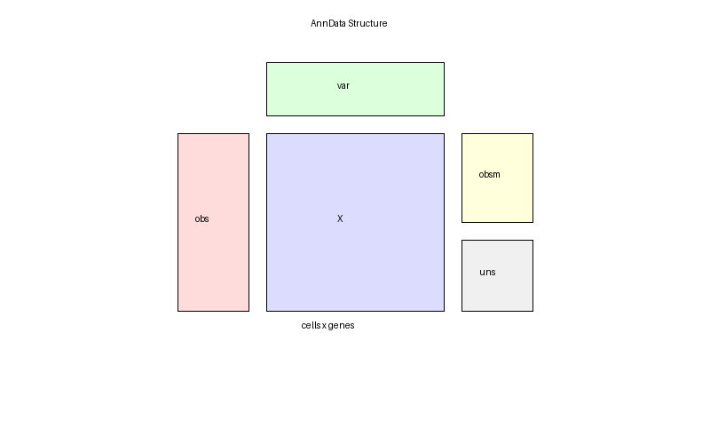
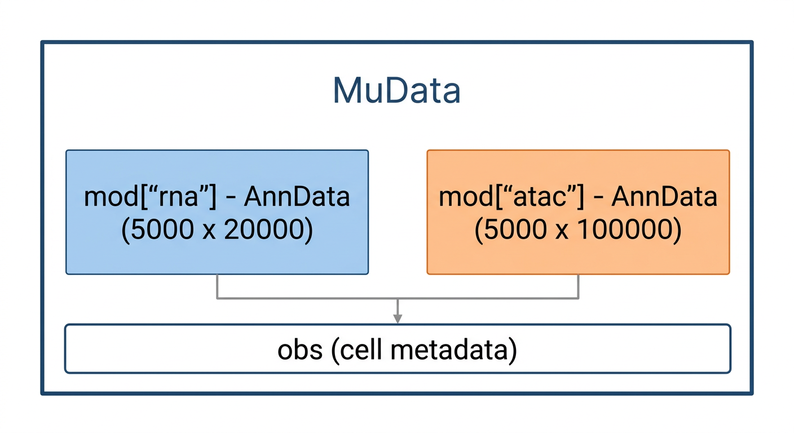
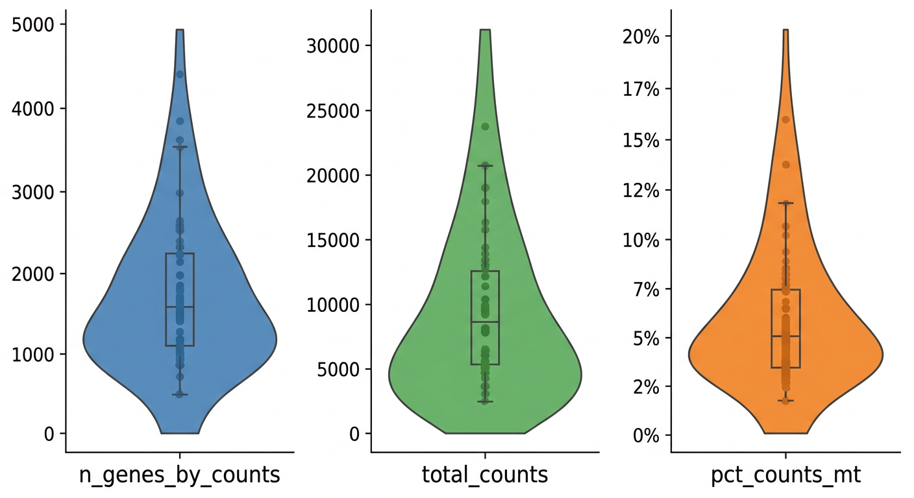
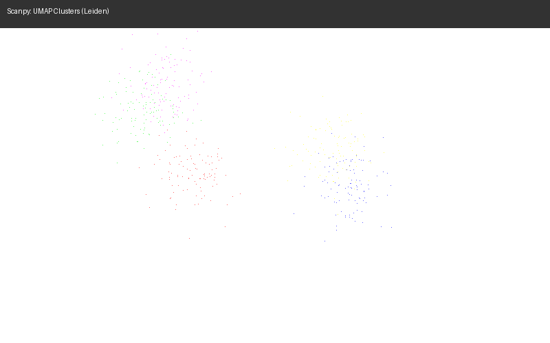
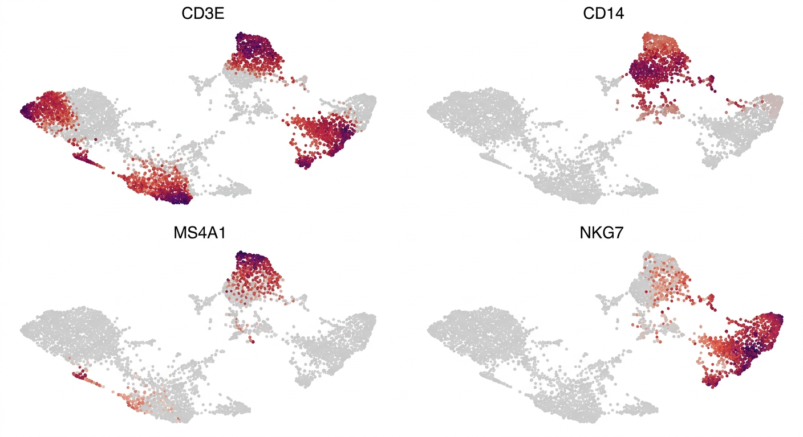

# 5장. 생명정보 데이터 분석 실전

4장에서 Python 데이터 분석의 기초를 익혔다면, 이제 실제 생명정보학 데이터를 분석해 볼 차례이다. 이 장에서는 두 가지 대표적인 분석 사례를 다룬다: **전장 유전체 시퀀싱(WGS) 분석**과 **단일세포 RNA-seq 분석**이다. 두 분석 모두 Claude Code와 대화하며 진행할 수 있지만, 각 단계가 왜 필요한지를 이해하고 있어야 AI에게 정확한 지시를 내릴 수 있다.

## 5.1 전장 유전체 시퀀싱(WGS) 분석

### WGS란?

전장 유전체 시퀀싱(Whole Genome Sequencing, WGS)은 생물의 **전체 게놈**을 읽는 기술이다. 사람의 경우 약 30억 개의 염기쌍을 모두 시퀀싱하여, 돌연변이(SNP, InDel), 구조 변이, 복제수 변이 등을 검출할 수 있다.

WGS 데이터 분석의 기본 흐름은 다음과 같다:

1. **품질 관리(QC)**: 원시 시퀀싱 리드의 품질 확인 및 저품질 리드 제거
2. **정렬(Alignment)**: 리드를 reference genome에 매핑
3. **변이 검출(Variant Calling)**: SNP, InDel 등의 변이 식별
4. **변이 주석(Annotation)**: 검출된 변이의 기능적 의미 해석
5. **필터링 및 해석**: 임상적 또는 연구적으로 의미 있는 변이 선별

### 주요 파일 형식

WGS 분석에서 다루게 되는 파일 형식을 이해하면 AI에게 요청할 때 더 정확한 지시를 내릴 수 있다.

| 형식 | 설명 | 용도 |
|------|------|------|
| **FASTQ** | 원시 시퀀싱 리드 + 품질 점수 | 시퀀서에서 나온 원본 데이터 |
| **BAM/CRAM** | reference genome에 정렬된 리드 | 정렬 결과 저장, 시각화 |
| **VCF** | 변이 정보 (위치, 유형, 빈도) | 변이 검출 결과 |
| **BED** | 게놈 구간 정보 (시작-끝 좌표) | 관심 영역(ROI) 정의 |

FASTQ 파일은 시퀀서에서 바로 나오는 원시 데이터이다. 각 리드마다 염기 서열과 품질 점수가 함께 기록되어 있다. BAM 파일은 이 리드들을 reference genome의 어디에 위치하는지 매핑한 결과이다. VCF 파일은 reference genome과 다른 부분, 즉 변이를 기록한 파일이다.

### 분석 도구

WGS 분석에는 여러 도구가 사용된다. Claude Code에게 설치와 실행을 요청할 수 있지만, 각 도구의 역할을 알아야 올바른 파이프라인을 구성할 수 있다.

| 도구 | 역할 | 비고 |
|------|------|------|
| **FastQC** | 시퀀싱 품질 확인 | 리드 길이, 품질 분포, 어댑터 오염 등 |
| **fastp / Trimmomatic** | 저품질 리드 제거 및 어댑터 트리밍 | fastp이 더 빠르고 간편 |
| **BWA-MEM2 / minimap2** | 리드를 reference genome에 정렬 | BWA-MEM2가 Illumina short read 표준 |
| **samtools** | BAM 파일 처리 (정렬, 인덱싱, 통계) | 거의 모든 WGS 파이프라인에 필수 |
| **GATK** | 변이 검출 (HaplotypeCaller) | Broad Institute에서 개발, 사실상 표준 |
| **bcftools** | VCF 파일 처리 및 필터링 | 변이 통계, 필터링, 병합 |
| **SnpEff / VEP** | 변이의 기능적 주석 | 아미노산 변화, 유전자 영향 예측 |

이 도구들은 대부분 Bioconda 채널을 통해 설치할 수 있으며, Docker 환경에서 관리하는 것이 재현성 면에서 유리하다.

### Claude Code로 WGS 분석하기

먼저 터미널에서 프로젝트 디렉토리를 만든다:

```bash
mkdir wgs-analysis
```

VS Code에서 **파일 → 폴더 열기**로 `wgs-analysis` 디렉토리를 연다. 새 창이 열리면, 분석 환경을 Docker로 구성한다. Claude Code에게 다음과 같이 요청한다:

> WGS 분석용 Docker 환경을 만들어줘. Bioconda 채널에서 fastqc, fastp, bwa-mem2, samtools, gatk4, bcftools를 설치하고, compose.yml과 Dockerfile을 만들어줘.

실제 분석 과정을 Claude Code와 대화하며 진행하는 예시이다:

> sample_R1.fastq.gz, sample_R2.fastq.gz 파일의 품질을 FastQC로 확인해줘

> fastp로 어댑터 트리밍하고, 품질 30 미만인 리드를 제거해줘

> 트리밍된 리드를 GRCh38 reference genome에 BWA-MEM2로 정렬해줘. 정렬 후 samtools로 정렬, 인덱싱까지 해줘

> GATK HaplotypeCaller로 변이를 검출하고, PASS 필터만 남겨줘

> 검출된 VCF 파일에서 exonic 영역의 missense 변이만 추출해줘

각 단계에서 사용자가 알아야 하는 것은 "어댑터 트리밍이 왜 필요한지", "매핑 퀄리티가 무엇인지", "missense 변이가 무엇인지" 같은 **도메인 지식**이다. 명령어의 구체적인 옵션은 Claude Code가 처리해 준다.

### Python으로 VCF 분석하기

변이 검출이 끝나면, Python으로 결과를 분석하고 시각화할 수 있다. 4장에서 배운 pandas와 matplotlib이 여기서 활용된다.

> VCF 파일을 읽어서 변이 유형별(SNP/InDel) 통계와 염색체별 분포를 시각화해줘

이 프롬프트에 대해 Claude Code가 생성하는 코드는 다음과 같다:

```python
import pandas as pd
import matplotlib.pyplot as plt

# VCF 파일을 pandas로 읽기 (헤더 행 건너뛰기)
vcf = pd.read_csv("variants.vcf", sep="\t", comment="#",
                   names=["CHROM", "POS", "ID", "REF", "ALT",
                          "QUAL", "FILTER", "INFO", "FORMAT", "SAMPLE"])

# 변이 유형별 개수
print(f"총 변이 수: {len(vcf)}")
print(f"SNP: {len(vcf[vcf['REF'].str.len() == vcf['ALT'].str.len()])}")
print(f"InDel: {len(vcf[vcf['REF'].str.len() != vcf['ALT'].str.len()])}")

# 염색체별 변이 분포 시각화
vcf["CHROM"].value_counts().sort_index().plot(kind="bar")
plt.title("염색체별 변이 수")
plt.xlabel("염색체")
plt.ylabel("변이 수")
plt.tight_layout()
plt.savefig("variants_per_chromosome.png")
```

이처럼 AI에게 요청하면 코드를 직접 작성하지 않아도 분석과 시각화를 수행할 수 있다.

## 5.2 단일세포 RNA-seq 분석

### 단일세포 분석이란?

전통적인 bulk RNA-seq은 수천~수백만 개의 세포를 한꺼번에 분석하여 **평균적인** 유전자 발현을 측정한다. 이 방식은 조직 전체의 발현 경향을 파악하는 데는 유용하지만, 조직 안에 어떤 종류의 세포가 있는지, 각 세포 유형에서 어떤 유전자가 활성화되어 있는지는 알 수 없다. 마치 과일 주스를 마시면서 어떤 과일이 들어갔는지는 알 수 있지만, 각 과일의 비율은 알 수 없는 것과 비슷하다.

단일세포 RNA-seq(scRNA-seq)은 **개별 세포 하나하나**의 유전자 발현을 측정한다. 이를 통해 다음과 같은 질문에 답할 수 있다:

- 이 조직에는 어떤 종류의 세포들이 있는가?
- 각 세포 유형의 비율은 어떻게 되는가?
- 특정 질환에서 어떤 세포 유형이 변화하는가?
- 세포들 사이의 발달 경로(trajectory)는 어떠한가?

10x Genomics의 Chromium 플랫폼 덕분에 한 번의 실험으로 수천~수만 개의 세포를 동시에 분석할 수 있게 되었고, 이제 단일세포 분석은 생명과학 연구의 핵심 기술로 자리잡았다. Scanpy는 이러한 단일세포 데이터를 분석하기 위한 Python 패키지다.

### 환경 구성

단일세포 분석 환경도 Docker로 구성한다. Claude Code에게 다음과 같이 요청한다:

> 단일세포 RNA-seq 분석용 Docker 환경을 만들어줘. scanpy, anndata, mudata를 포함하고, Jupyter Notebook도 사용할 수 있게 해줘. compose.yml과 Dockerfile을 만들어줘.

각 패키지의 역할을 알아야 AI에게 올바른 분석을 요청할 수 있다:

| 패키지 | 역할 | 주요 용도 |
|--------|------|-----------|
| **scanpy** | 단일세포 분석의 핵심 패키지 | 전처리, 클러스터링, 시각화 |
| **anndata** | h5ad 파일 형식 처리 | Scanpy의 데이터 구조(AnnData 객체) |
| **mudata** | h5mu 파일(멀티오믹스 데이터) 처리 | CITE-seq, 10x Multiome 등 |

Scanpy는 **scverse** 생태계의 일부이다. scverse는 단일세포 데이터 분석을 위한 Python 패키지 모음으로, Scanpy를 중심으로 squidpy(공간 전사체), scvi-tools(딥러닝 기반 분석), muon(멀티오믹스) 등이 포함된다. 하나의 일관된 데이터 구조(AnnData)를 공유하므로, 여러 패키지를 조합하여 분석할 수 있다.

### AnnData — 단일세포 데이터 구조

h5ad는 단일세포 데이터의 **표준 저장 형식**이다. HDF5 기반으로, 대용량 데이터를 효율적으로 저장하고 읽을 수 있다. 10,000개의 세포와 20,000개의 유전자를 포함하는 데이터를 CSV로 저장하면 수 GB가 되지만, h5ad로 저장하면 수십~수백 MB로 줄어든다.

하나의 h5ad 파일에는 다음 정보가 모두 담겨 있다:

| 속성 | 설명 | 예시 |
|------|------|------|
| **`X`** | 유전자 발현 매트릭스 (세포 × 유전자) | 10,000 세포 × 20,000 유전자 |
| **`obs`** | 세포(행)에 대한 메타데이터 | cell_type, sample_id, condition |
| **`var`** | 유전자(열)에 대한 메타데이터 | gene_name, highly_variable |
| **`obsm`** | 세포의 임베딩 좌표 | UMAP, t-SNE, PCA 좌표 |
| **`uns`** | 비구조화 데이터 | 색상 팔레트, 분석 파라미터 |



이 구조의 장점은 **하나의 파일에 분석에 필요한 모든 것이 담겨 있다**는 점이다. 발현 데이터, 세포 메타데이터, 분석 결과(UMAP 좌표, 클러스터 레이블 등)가 하나의 객체에 통합되어 있으므로, 데이터를 주고받을 때 파일 하나만 전달하면 된다.

### MuData — 멀티오믹스 데이터

최근에는 하나의 세포에서 RNA와 단백질(CITE-seq), 또는 RNA와 염색질 접근성(10x Multiome)을 동시에 측정하는 **멀티오믹스** 기술이 발전하고 있다. h5mu는 이런 멀티오믹스 데이터를 저장하는 형식이다.

> multiome.h5mu 파일을 읽고, RNA와 ATAC 데이터를 각각 분리해줘

```python
import mudata as md

# h5mu 파일 읽기
mdata = md.read_h5mu("multiome.h5mu")

# 개별 modality 접근
rna = mdata.mod["rna"]    # RNA 데이터 (AnnData)
atac = mdata.mod["atac"]  # ATAC 데이터 (AnnData)
```



각 modality는 독립적인 AnnData 객체이므로, RNA 데이터에는 Scanpy를, ATAC 데이터에는 SnapATAC이나 ArchR의 Python 래퍼를 사용하는 식으로 각각에 적합한 분석 방법을 적용할 수 있다.

### Scanpy 분석 워크플로우

단일세포 분석은 보통 다음 순서로 진행된다. 각 단계가 왜 필요한지 이해하면 AI에게 정확한 분석을 요청할 수 있다.

**품질 관리 (Quality Control)**

생 데이터에는 품질이 낮은 세포(죽은 세포, 이중 캡처 등)가 포함되어 있다. 이런 세포를 걸러내지 않으면 분석 결과가 왜곡된다.

주요 QC 지표:
- **유전자 수(n_genes_by_counts)**: 한 세포에서 검출된 유전자가 너무 적으면(예: 200개 미만) 품질이 낮은 세포일 가능성이 높다
- **미토콘드리아 유전자 비율(pct_counts_mt)**: 미토콘드리아 유전자의 비율이 높으면(예: 20% 이상) 세포가 손상되었을 가능성이 있다. 죽어가는 세포에서 세포질 RNA는 빠져나가지만 미토콘드리아 RNA는 남아 있기 때문이다

> 미토콘드리아 유전자 비율을 계산하고, QC 지표들을 바이올린 플롯으로 시각화해줘

```python
# 미토콘드리아 유전자 비율 계산
adata.var["mt"] = adata.var_names.str.startswith("MT-")
sc.pp.calculate_qc_metrics(adata, qc_vars=["mt"], inplace=True)

# QC 시각화
sc.pl.violin(adata, ["n_genes_by_counts", "total_counts", "pct_counts_mt"])
```



**정규화 및 전처리**

각 세포마다 시퀀싱 깊이(total read count)가 다르다. 정규화는 이 차이를 보정하여 세포 간 공정한 비교를 가능하게 한다. **고변동 유전자(HVG)** 선택은 세포 유형을 구분하는 데 기여하는 유전자만 골라내어 분석의 효율과 정확도를 높인다.

**차원 축소 및 클러스터링**

2,000개의 유전자를 사용한다면 각 세포는 2,000차원 공간의 한 점이다. PCA로 50차원으로 압축한 뒤, UMAP으로 2차원 시각화를 수행한다. 이후 Leiden 알고리즘으로 유사한 세포들을 클러스터로 묶는다.

> Leiden 클러스터링을 resolution 0.5로 수행하고, UMAP에 클러스터를 색상으로 표시해줘

```python
sc.tl.leiden(adata, resolution=0.5)
sc.pl.umap(adata, color="leiden")
```



**세포 유형 주석**

각 클러스터에서 특이적으로 높게 발현되는 **마커 유전자**를 확인하고, 이를 바탕으로 세포 유형을 결정한다.

> 클러스터별 마커 유전자를 찾고, CD3E, CD14, MS4A1, NKG7 발현을 UMAP에 표시해줘

```python
sc.tl.rank_genes_groups(adata, groupby="leiden")
sc.pl.umap(adata, color=["CD3E", "CD14", "MS4A1", "NKG7"])
```



예를 들어 CD3E가 높게 발현되는 클러스터는 T 세포, CD14가 높은 클러스터는 단핵구(monocyte), MS4A1(CD20)이 높은 클러스터는 B 세포일 가능성이 높다. 이런 마커 유전자 해석은 면역학, 세포생물학 등 도메인 지식에 기반한다.

### Claude Code로 단일세포 분석하기

> pbmc_10k.h5ad 파일을 읽고 QC 해줘. 미토콘드리아 비율 20% 이상, 유전자 수 200개 미만인 세포는 제거해줘

> 정규화하고 고변동 유전자 2000개 선택해서 PCA, UMAP 해줘

> Leiden 클러스터링 해주고, CD3E, CD14, MS4A1, NKG7 마커로 세포 유형을 UMAP에 표시해줘

이 대화에서 사용자는 코드를 한 줄도 작성하지 않았지만, **각 단계가 왜 필요한지, 어떤 파라미터를 사용해야 하는지**를 알고 있었기 때문에 정확한 지시를 내릴 수 있었다.

## 5.3 핵심 개념 정리

코드를 외울 필요는 없지만, AI에게 올바른 지시를 내리려면 다음 개념들을 이해해야 한다:

### WGS 분석

| 개념 | 설명 |
|------|------|
| **FASTQ** | 시퀀서에서 나온 원시 리드 데이터. 염기 서열 + 품질 점수 |
| **정렬 (Alignment)** | 리드를 reference genome에 매핑하는 과정. BWA-MEM2가 표준 |
| **변이 검출 (Variant Calling)** | reference genome과 다른 부분을 찾는 과정. GATK HaplotypeCaller가 표준 |
| **VCF** | 변이 정보를 저장하는 파일 형식. 위치, 유형, 품질 등을 포함 |
| **SNP / InDel** | 단일 염기 변이(SNP)와 삽입/결실(InDel). 가장 흔한 변이 유형 |

### 단일세포 분석

| 개념 | 설명 |
|------|------|
| **QC (Quality Control)** | 품질이 낮은 세포를 걸러내는 과정. 미토콘드리아 비율, 유전자 수가 주요 지표 |
| **정규화 (Normalization)** | 세포 간 시퀀싱 깊이 차이를 보정하는 과정 |
| **고변동 유전자 (HVG)** | 세포 간 발현 차이가 큰 유전자. 세포 유형 구분의 핵심 |
| **PCA / UMAP** | 고차원 데이터를 축소하여 시각화. 비슷한 세포끼리 가깝게 배치 |
| **클러스터링** | 유사한 세포를 그룹으로 묶는 과정. Leiden 알고리즘이 표준 |
| **마커 유전자** | 특정 세포 유형을 구분하는 유전자. 도메인 지식이 필요 |

## 5.4 정리

- **WGS 분석**: FASTQ → 트리밍 → 정렬(BAM) → 변이 검출(VCF) → 주석 → 해석
  - 파일 형식(FASTQ, BAM, VCF, BED)과 각 도구의 역할을 이해하면 Claude Code에게 파이프라인 구성을 요청할 수 있다
- **단일세포 분석**: h5ad 로딩 → QC → 정규화 → HVG 선택 → PCA → UMAP → 클러스터링 → 세포 유형 주석
  - AnnData 구조와 각 분석 단계의 목적을 이해하면 정확한 지시를 내릴 수 있다
- **공통 원칙**: 바이브 코딩의 핵심은 분석 파이프라인의 각 단계가 **왜 필요한지**를 이해하고, AI에게 단계별로 지시하는 것이다. 명령어를 외울 필요는 없지만, 도메인 지식은 반드시 필요하다
