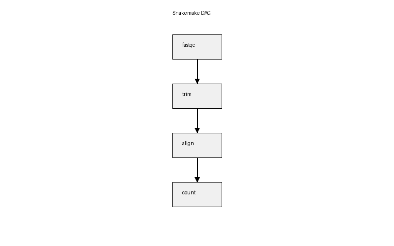
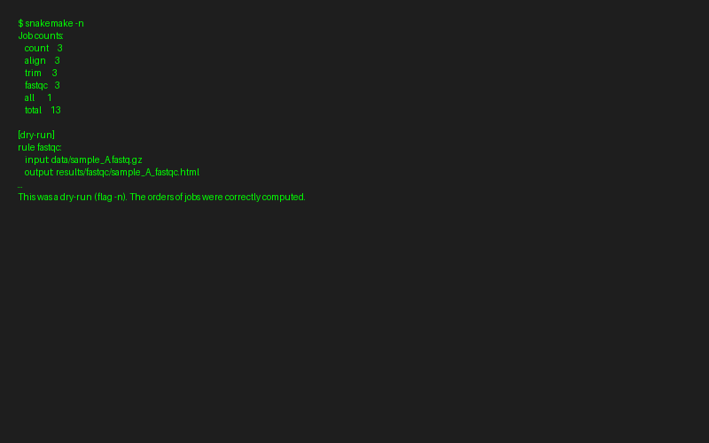

# 6장. Snakemake를 이용한 워크플로우 관리

## 6.1 워크플로우란?

생명정보학 분석은 보통 여러 단계를 순서대로 수행한다. 예를 들어 RNA-seq 분석은 다음과 같은 흐름을 따른다:

1. FASTQ 파일 품질 확인 (FastQC)
2. 어댑터 트리밍 (Trim Galore)
3. 레퍼런스 게놈에 정렬 (STAR)
4. 발현량 정량 (featureCounts)
5. 차등 발현 분석 (DESeq2)

이 과정을 매번 수동으로 실행하면 시간이 오래 걸리고, 실수가 생기기 쉽다. 터미널에서 명령을 하나씩 입력하다 보면 순서를 잘못 바꾸거나, 이전 단계의 출력 파일 이름을 틀리거나, 새 샘플이 추가되었는데 일부 단계만 다시 실행하는 등의 문제가 생긴다. 샘플이 3개뿐이라면 수동으로 관리할 수 있겠지만, 50개 샘플을 다룬다면 사실상 불가능하다.

**Snakemake는 이러한 분석 파이프라인을 자동화하는 워크플로우 관리 도구**이다. Python 기반 문법을 사용하여 각 분석 단계의 입력과 출력을 정의하면, Snakemake가 자동으로 실행 순서를 결정하고 필요한 단계만 실행해 준다.

### Snakemake의 장점

- **재현성**: 같은 Snakefile로 언제든 동일한 분석을 반복할 수 있다. 논문 리뷰어가 "분석을 다시 돌려보라"고 요청해도, 명령 하나로 전체 파이프라인을 재실행할 수 있다.
- **자동 의존성 관리**: 어떤 단계를 먼저 실행해야 하는지 자동으로 판단한다. 정렬 결과가 없으면 정렬부터 실행하고, 트리밍 결과가 없으면 트리밍부터 실행한다.
- **병렬 실행**: 독립적인 단계는 동시에 실행하여 시간을 절약한다. sample_A의 정렬과 sample_B의 정렬은 서로 의존하지 않으므로 동시에 실행할 수 있다.
- **부분 재실행**: 중간에 실패하면 실패한 단계부터 다시 시작한다. 50개 샘플 중 3개에서만 에러가 났다면, 성공한 47개는 건드리지 않고 3개만 다시 처리한다.

### 다른 워크플로우 도구와의 비교

생명정보학에는 Snakemake 외에도 여러 워크플로우 도구가 있다.

| 도구 | 언어 | 특징 |
|------|------|------|
| **Snakemake** | Python | 생명정보학에서 가장 널리 사용, Conda 통합 |
| **Nextflow** | Groovy/DSL | 클라우드 환경에 강점, nf-core 생태계 |
| **WDL** | 자체 DSL | Broad Institute 개발, Terra 플랫폼 연동 |
| **CWL** | YAML/JSON | 표준 규격, 이식성 높음 |

이 책에서는 Python 문법과 가장 유사하여 진입 장벽이 낮고, Bioconda와의 통합이 뛰어난 Snakemake를 사용한다.

## 6.2 환경 구성

Snakemake도 Docker 환경에서 실행하는 것이 재현성 면에서 유리하다. Claude Code에게 다음과 같이 요청한다:

> Snakemake 파이프라인 실행용 Docker 환경을 만들어줘. snakemake와 함께 conda/mamba를 포함해서, 각 rule에서 독립적인 Conda 환경을 사용할 수 있게 해줘. compose.yml과 Dockerfile을 만들어줘.

> **참고**: 복잡한 생명정보학 파이프라인에서는 Conda와 함께 사용하는 것이 일반적이다. 각 rule에 독립적인 Conda 환경을 지정할 수 있어, STAR는 STAR의 환경에서, DESeq2는 R의 환경에서 실행하는 것이 가능하다. 이렇게 하면 서로 다른 도구의 의존성이 충돌하는 문제를 피할 수 있다.

## 6.3 Snakemake 핵심 개념

### Rule (규칙)

Snakemake의 기본 단위는 **rule**이다. 하나의 rule은 **입력 → 처리 → 출력**을 정의한다. 요리 레시피에 비유하면, "재료(input)를 가져와서 조리(shell)하고 완성된 요리(output)를 내놓는다"는 구조이다.

```python
rule fastqc:
    input:
        "data/{sample}.fastq.gz"
    output:
        "results/fastqc/{sample}_fastqc.html"
    shell:
        "fastqc {input} -o results/fastqc/"
```

이 rule은 "data 폴더의 FASTQ 파일을 입력으로 받아 FastQC를 실행하고, 결과 HTML을 results/fastqc 폴더에 저장한다"는 의미이다. Snakemake는 output 파일이 이미 존재하면 해당 rule을 건너뛴다. 불필요한 재실행을 자동으로 방지하는 것이다.

### Wildcard (와일드카드)

`{sample}` 같은 와일드카드를 사용하면 **여러 샘플에 같은 규칙을 자동 적용**할 수 있다. 예를 들어 `sample_A.fastq.gz`, `sample_B.fastq.gz`, `sample_C.fastq.gz`가 있으면, 위 rule이 세 파일 모두에 자동으로 실행된다.

와일드카드는 Snakemake의 가장 강력한 기능 중 하나이다. 수동으로 파이프라인을 실행할 때는 각 샘플마다 명령을 반복해야 하지만, 와일드카드를 사용하면 rule 하나로 모든 샘플을 처리할 수 있다. 새 샘플이 추가되더라도 rule을 수정할 필요가 없다.

### DAG (방향성 비순환 그래프)

Snakemake는 rule 간의 의존 관계를 **DAG(Directed Acyclic Graph)**로 자동 구성한다. 한 rule의 출력 파일이 다른 rule의 입력 파일이면 자동으로 순서가 결정된다. 예를 들어 trim rule의 출력이 align rule의 입력이면, Snakemake는 반드시 trim을 먼저 실행한다.

DAG의 "비순환(Acyclic)"은 의존 관계가 원형으로 돌지 않는다는 뜻이다. A → B → C → A처럼 순환하면 무한 루프에 빠지므로, Snakemake는 이를 자동으로 감지하여 에러를 발생시킨다.



### expand() 함수

`expand()` 함수는 와일드카드를 구체적인 값으로 확장하는 함수이다. 예를 들어 `expand("results/{sample}.txt", sample=["A", "B", "C"])`는 `["results/A.txt", "results/B.txt", "results/C.txt"]`로 펼쳐진다. 주로 `rule all`에서 최종 목표 파일 목록을 지정할 때 사용한다.

### Conda 환경 통합

생명정보학 파이프라인에서는 서로 다른 도구가 서로 다른 의존성을 요구하는 경우가 많다. STAR는 C++ 라이브러리가 필요하고, DESeq2는 R과 Bioconductor가 필요하다. 이 두 환경을 하나의 Conda 환경에 넣으면 충돌이 발생할 수 있다.

Snakemake는 각 rule에 독립적인 Conda 환경을 지정할 수 있다. `--use-conda` 플래그를 붙여 실행하면, Snakemake가 각 rule에 지정된 YAML 파일을 읽어 자동으로 Conda 환경을 생성하고 활성화한다. 환경 정의가 코드와 함께 버전 관리되므로, 1년 후에 파이프라인을 다시 실행해도 동일한 버전의 도구가 설치된다.

### Config 파일

분석 파라미터를 Snakefile과 분리하여 관리할 수 있다. Snakefile은 "어떻게 분석할 것인가"를, config 파일은 "무엇을 분석할 것인가"를 담당한다. 새로운 프로젝트에서 같은 파이프라인을 사용하고 싶다면, Snakefile은 그대로 두고 config.yaml만 수정하면 된다.

### 로그 파일

각 rule에 `log` 지시자를 추가하면 실행 로그를 별도로 저장할 수 있다. 50개 샘플을 처리하다가 sample_37에서 에러가 났다면, `logs/align/sample_37.log`만 확인하면 된다. 에러 발생 시 원인 파악이 훨씬 쉬워진다.

## 6.4 Claude Code로 Snakefile 작성하기

Snakemake의 문법을 완벽하게 익히는 것보다, **분석 파이프라인의 흐름을 이해하고 AI에게 정확히 설명하는 것**이 더 중요하다. rule, wildcard, DAG, expand, Conda 환경 등 핵심 개념을 이해하고 있으면, Claude Code에게 정확한 지시를 내릴 수 있다.

### RNA-seq 파이프라인 생성

다음과 같이 요청한다:

> "RNA-seq 파이프라인을 Snakemake로 만들어줘. 입력은 data/ 폴더의 FASTQ 파일이고, FastQC → Trim Galore → STAR 정렬 → featureCounts 순서로 처리해줘. 샘플 목록은 config.yaml에서 읽어오게 하고, 각 단계마다 로그 파일을 남겨줘."

이 요청을 하려면 다음을 알아야 한다:

- **분석 단계의 순서**: 왜 트리밍 다음에 정렬을 하는지 (어댑터가 남아 있으면 정렬 정확도가 떨어진다)
- **각 도구의 역할**: FastQC는 품질 확인, Trim Galore는 어댑터 제거, STAR는 게놈 정렬, featureCounts는 유전자별 발현량 계산
- **입출력 파일 형식**: FASTQ(시퀀싱 원본) → trimmed FASTQ → BAM(정렬 결과) → counts(발현량 테이블)

반면, `expand()` 함수의 정확한 문법이나 `threads` 지시자의 사용법은 몰라도 된다. AI가 올바른 Snakemake 문법으로 작성해 준다.

### Conda 환경 분리 요청

> "각 rule에 독립적인 Conda 환경을 설정해줘. STAR와 featureCounts는 같은 환경을 쓰고, DESeq2는 R 환경을 별도로 만들어줘. envs/ 폴더에 YAML 파일을 생성해줘."

### Config 파일 분리

> "하드코딩된 샘플 목록과 파라미터를 config.yaml로 분리해줘. 샘플 이름, 레퍼런스 게놈 경로, 트리밍 품질 기준값을 config에서 읽어오게 바꿔줘."

### 파이프라인 확장

> "count rule 다음에 DESeq2로 차등 발현 분석하는 rule을 추가해줘. R 스크립트는 별도 파일로 분리하고, Conda 환경도 만들어줘."

> "align rule에서 STAR 대신 HISAT2를 사용하도록 바꿔줘."

> "sample_D가 추가됐으니까 config.yaml에 반영해줘."

### 실행과 디버깅

Snakemake를 실행할 때는 항상 드라이런(`-n`)으로 먼저 계획을 확인하는 것이 좋다. Claude Code에게 다음과 같이 요청할 수 있다:

> "Snakemake 드라이런을 실행해서 결과를 보여줘."

> "Snakemake를 4코어로 실행해줘."

> "DAG 그래프를 생성해줘."

에러가 발생하면 로그 파일을 함께 보여주면서 디버깅을 요청한다:

> "snakemake 실행하면 align 단계에서 에러가 나. logs/align/sample_A.log 보고 원인 알려줘."

로그 파일을 저장하는 설정이 되어 있어야 하므로, 처음 Snakefile을 만들 때 반드시 log 지시자를 포함하도록 요청하는 것이 좋다.



## 6.5 단일세포 분석 파이프라인

Scanpy를 이용한 단일세포 RNA-seq 분석도 Snakemake로 자동화할 수 있다. 단일세포 분석은 QC → 정규화 → 클러스터링이라는 순서를 따르므로, 각 단계를 rule로 분리하면 된다.

Claude Code에게 다음과 같이 요청한다:

> "Scanpy 기반 단일세포 RNA-seq 분석을 Snakemake 파이프라인으로 만들어줘. QC, 정규화, 클러스터링을 각각 별도 rule로 분리하고, 각 단계의 결과를 h5ad 파일로 저장해줘. 여러 샘플에 대해 동시에 실행할 수 있게 와일드카드를 사용해줘."

Snakemake에서는 `shell` 대신 `script` 지시자를 사용하면 Python이나 R 스크립트를 직접 실행할 수 있다. 스크립트 내에서 `snakemake.input[0]`, `snakemake.output[0]`으로 입출력 파일 경로를 참조할 수 있어, 스크립트를 Snakemake와 자연스럽게 연동할 수 있다.

주피터 노트북에서 프로토타이핑한 분석을 재현 가능한 파이프라인으로 전환할 때 특히 유용하다. AI에게 기존 노트북 코드를 전달하면서 "이걸 Snakemake로 변환해줘"라고 요청하면, rule 단위로 분리된 Snakefile과 스크립트 파일을 생성해 준다.

## 6.6 정리

- **Snakemake**: 생명정보학 분석 파이프라인을 자동화하는 워크플로우 관리 도구
  - 재현성, 자동 의존성 관리, 병렬 실행, 부분 재실행 지원
- **Rule**: 입력 → 처리 → 출력을 정의하는 기본 단위
- **Wildcard**: `{sample}` 같은 패턴으로 여러 샘플에 동일 규칙 적용
- **DAG**: rule 간 의존 관계를 자동으로 파악하여 실행 순서 결정
- **Conda 환경 통합**: 각 rule마다 독립적인 환경을 지정하여 의존성 충돌 방지
- **Config 파일**: 분석 파라미터를 Snakefile과 분리하여 재사용성 확보
- **바이브 코딩의 핵심**: 분석 파이프라인의 **흐름과 각 도구의 역할**을 이해하고, AI에게 단계별로 지시하는 것. `expand()` 문법보다 "왜 트리밍 후에 정렬하는지"를 아는 것이 더 중요하다
