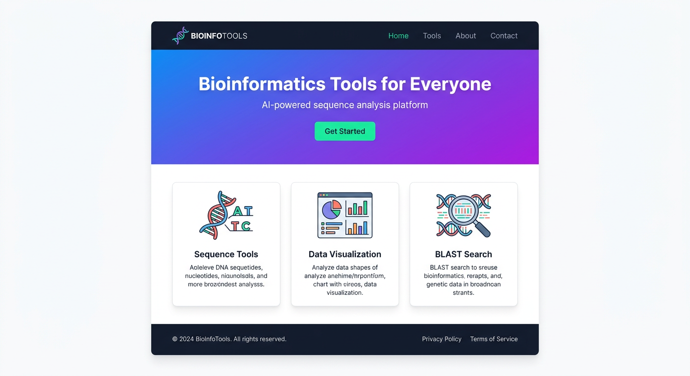
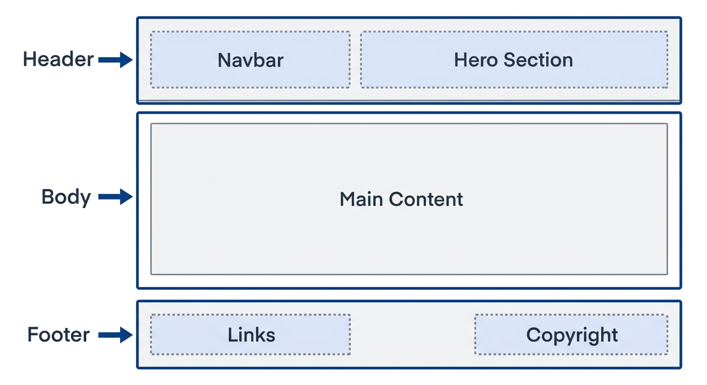
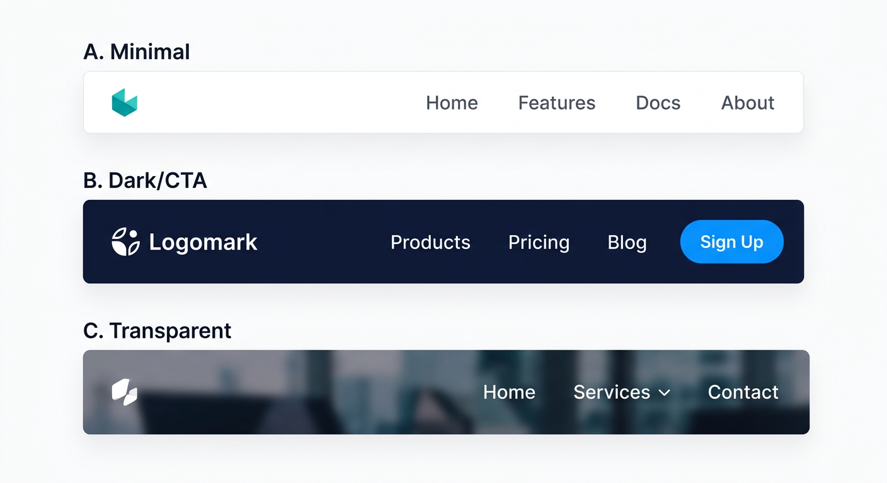
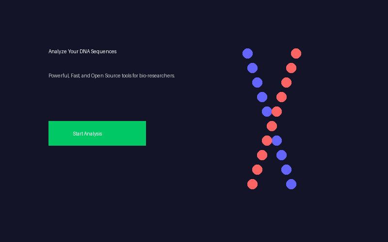
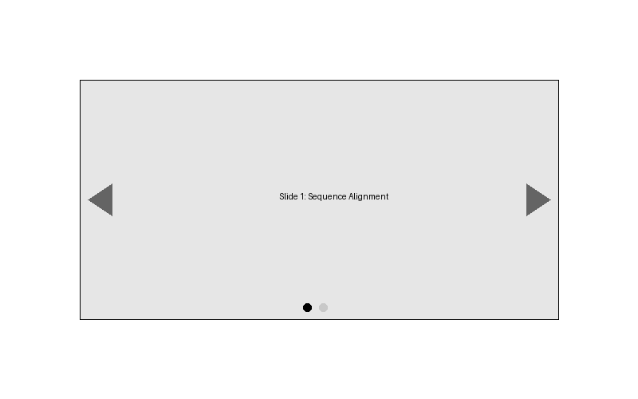
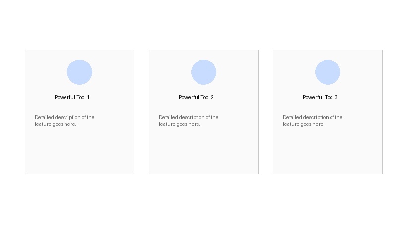
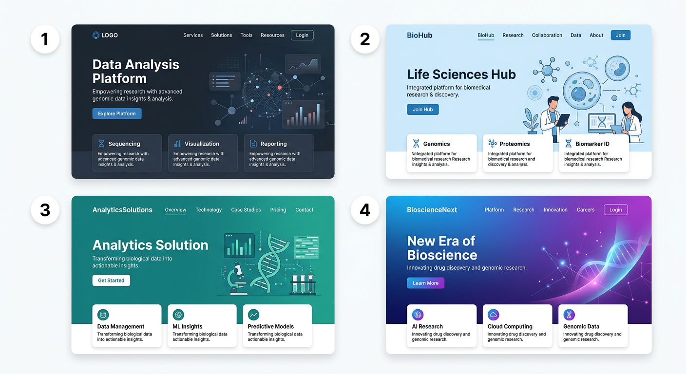
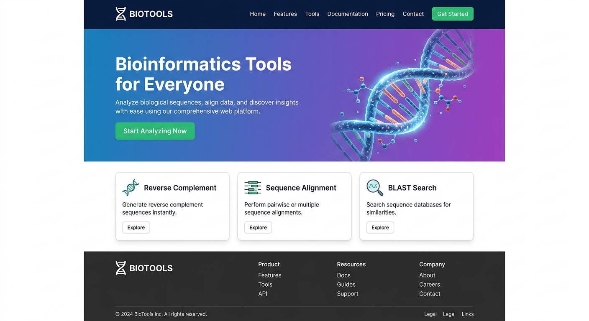
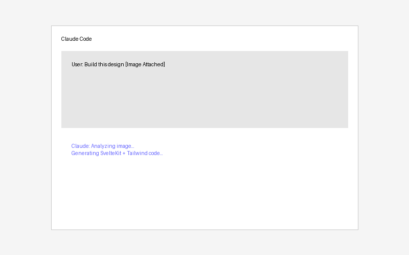

# 8장. 랜딩 페이지 디자인

## 8.1 랜딩 페이지란?

랜딩 페이지(Landing Page)는 웹 사이트의 **가장 첫 페이지**이다. 방문자가 URL에 접속했을 때 가장 먼저 보게 되는 화면으로, 웹 사이트의 첫인상을 결정한다. 좋은 랜딩 페이지는 방문자에게 "이 사이트가 무엇을 하는 곳인지"를 몇 초 만에 전달하고, "더 알아보고 싶다" 또는 "사용해 보고 싶다"는 마음이 들게 만든다.

생명정보학 웹 도구의 랜딩 페이지라면, 어떤 분석 도구를 제공하는지 한눈에 보여주고, 연구자가 바로 사용을 시작할 수 있도록 안내해야 한다. NCBI BLAST 웹사이트나 Galaxy 플랫폼의 첫 화면을 떠올려 보면, 모두 핵심 기능을 전면에 배치하고 간결한 설명과 시작 버튼을 제공한다.



## 8.2 랜딩 페이지의 구조

### Header, Body, Footer

웹 페이지는 크게 세 영역으로 구성된다. 이 구조는 거의 모든 웹사이트에서 공통적으로 사용되는 표준 패턴이다. 책의 표지, 본문, 뒤표지와 비슷하다고 생각하면 된다.



| 영역 | 포함 요소 |
|------|-----------|
| **Header** | 로고, 메인 메뉴(Navigation Bar), Hero 섹션 |
| **Body** | 주 콘텐츠 (기능 소개, 특징, 사용 방법 등) |
| **Footer** | 로고(주로 흑백), 하단 메뉴, 연락처, 주소, 법적 정보, 저작권 정보 등 |

실제 구현 시 각각을 별도의 컴포넌트 파일로 나누어서 구현한다. Header는 `Header.svelte`, Footer는 `Footer.svelte`처럼 분리하면, 여러 페이지에서 같은 컴포넌트를 재사용할 수 있다.

### Navigation Bar (Navbar)

Navigation Bar는 웹 사이트의 상단에 위치하는 메뉴이다. 로고와 주요 페이지 링크를 포함하며, 사용자가 사이트 내를 이동할 수 있게 한다. Navbar는 보통 화면 상단에 고정(sticky)되어 스크롤을 내려도 항상 보이도록 구현한다.

Navbar 디자인에서 고려할 점은 다음과 같다:
- **로고**: 좌측에 배치하는 것이 일반적이다
- **메뉴 항목**: Home, Tools, About, Contact 등 주요 섹션 링크
- **반응형 디자인**: 모바일 화면에서는 햄버거 메뉴(≡)로 접히는 구조가 일반적이다
- **시각적 구분**: 현재 페이지의 메뉴 항목을 강조하여 사용자가 어디에 있는지 알려준다



### Hero Section

Hero Section은 랜딩 페이지의 가장 **눈에 띄는 첫 번째 영역**이다. "Hero"라는 이름은 이 영역이 페이지의 "주인공" 역할을 한다는 데서 유래했다. 화면의 좌우 전체 너비를 사용하며, 다음 요소들을 포함한다:

- **헤드라인**: 사이트의 핵심 가치를 한 문장으로 전달. "Sequence Analysis Made Simple"처럼 무엇을 할 수 있는지 명확하게 표현한다.
- **서브 헤드라인**: 헤드라인을 보충하는 설명. "AI-powered bioinformatics tools for researchers"처럼 대상과 방법을 구체화한다.
- **CTA(Call to Action) 버튼**: 사용자가 취해야 할 행동을 유도하는 버튼이다. "시작하기", "도구 사용하기" 등의 문구를 사용한다. CTA 버튼은 눈에 잘 띄는 색상으로 만들고, 클릭하면 도구 페이지나 회원가입 페이지로 이동하게 한다.
- **배경 이미지 또는 일러스트**: 시각적 임팩트를 주는 요소. DNA 이중나선, 분자 구조 등 생명정보학과 관련된 이미지를 사용하면 사이트의 성격을 직관적으로 전달할 수 있다.

> 참고: Hero Section 디자인 패턴에 대한 자세한 내용은 https://www.awebco.com/blog/hero-section/ 에서 확인할 수 있다.



### Carousel

Carousel(캐러셀)은 여러 이미지나 콘텐츠를 **슬라이드 형태**로 보여주는 요소이다. 여러 기능이나 특징을 순차적으로 소개할 때 유용하다. 좌우 화살표로 넘기거나, 자동으로 일정 시간 간격으로 전환되도록 설정할 수 있다.

다만, 캐러셀은 사용자가 원하는 정보를 놓칠 수 있다는 단점이 있다. 자동 슬라이드가 빠르면 내용을 다 읽기 전에 넘어가고, 느리면 사용자가 기다려야 한다. 핵심 정보는 캐러셀에만 의존하지 말고, 별도 섹션에도 표시하는 것이 좋다.



### Features Section

웹 도구의 주요 기능을 소개하는 영역이다. 보통 **카드(Card)** 형태로 3~4개의 핵심 기능을 나열한다. 각 카드에는 아이콘, 기능 이름, 간단한 설명을 포함한다.

생명정보학 웹 도구의 Features Section이라면 "Reverse Complement", "Sequence Alignment", "BLAST Search" 같은 핵심 도구를 카드로 보여줄 수 있다. 카드를 클릭하면 해당 도구 페이지로 이동하도록 구현하면, 사용자가 원하는 기능에 빠르게 접근할 수 있다.



## 8.3 UI 컴포넌트

자주 사용되는 웹 구성 요소를 패턴화한 것을 **UI 컴포넌트**라 한다. 2011년 등장한 트위터 부트스트랩 프레임워크(https://getbootstrap.com/docs/4.0/components/)에서 유래된 것들이 많다. 이 컴포넌트들의 이름을 아는 것이 중요한 이유는, AI에게 디자인을 요청할 때 정확한 이름을 사용하면 의도한 결과를 얻기 훨씬 쉽기 때문이다.

"상단에 메뉴 바를 만들어줘"보다 "상단에 Navbar를 만들어줘"가 더 정확한 결과를 낸다. "슬라이드 형태로 보여줘"보다 "Carousel로 보여줘"가 더 명확하다.

랜딩 페이지에서 자주 사용되는 컴포넌트:

| 컴포넌트 | 설명 |
|----------|------|
| **Navbar** | 상단 네비게이션 바. 로고와 메뉴 항목을 포함 |
| **Hero** | 첫 화면의 대형 배너 영역. 헤드라인, CTA 버튼, 배경 이미지 포함 |
| **Card** | 카드형 콘텐츠 블록. 아이콘, 제목, 설명을 묶어 표시 |
| **Carousel** | 슬라이드 형태의 콘텐츠. 좌우 화살표로 전환 |
| **Button** | 클릭 가능한 버튼. Primary(주요 행동), Secondary(보조 행동), Ghost(투명 배경) 등의 변형이 있다 |
| **Badge** | 작은 라벨/태그. "New", "Beta" 같은 상태 표시에 사용 |
| **Footer** | 하단 정보 영역. 저작권, 링크, 연락처 포함 |

이 외에도 **Modal**(팝업 대화 상자), **Tooltip**(마우스를 올리면 나타나는 설명), **Accordion**(접었다 펼 수 있는 목록) 등 다양한 컴포넌트가 있다. 이들의 정확한 이름을 알수록 AI에게 원하는 디자인을 정확하게 요청할 수 있다.

## 8.4 AI를 활용한 디자인 목업 생성

### 이미지 생성 AI를 활용한 디자인

Google Gemini, ChatGPT(DALL-E), Midjourney 등의 AI를 통해 디자인 목업을 생성할 수 있다. 앞서 배운 Header, Body, Footer 및 컴포넌트 개념을 활용하여 프롬프트를 구체적으로 작성하면 더 정확한 결과를 얻을 수 있다.

**기본 프롬프트 예시:**

```
생명정보학 웹 도구의 랜딩 페이지를 디자인해줘.
상단에는 로고와 Navbar, 큰 Hero Section에는 DNA 관련 이미지와
"Sequence Analysis Made Simple" 헤드라인, "시작하기" 버튼이 있고,
아래에는 3개의 기능 카드가 있는 디자인.
```

여러 번 생성해보고 마음에 드는 것을 선택한다. AI가 생성하는 디자인은 매번 다르므로, 3~5개 정도 생성한 뒤 가장 적합한 것을 고르는 것이 좋다.



**더 구체적인 프롬프트 예시:**

```
Header: 좌측에 로고, 우측에 Home/Tools/About/Contact 메뉴가 있는 Navbar.
Hero Section: 배경은 그라데이션, 좌측에 헤드라인 "Bioinformatics Tools for Everyone",
서브라인 "AI-powered sequence analysis", CTA 버튼 "Get Started".
우측에는 DNA 구조 일러스트.
Features: 3개의 Card — Reverse Complement, Sequence Alignment, BLAST Search.
Footer: 로고(흑백), 링크 목록, 저작권 정보.
```

프롬프트가 구체적일수록 원하는 결과에 가까운 디자인이 나온다. 여기서 "Navbar", "Hero Section", "CTA 버튼", "Card" 같은 용어를 사용하는 것이 핵심이다. 이 용어들은 웹 디자인의 공통 언어이므로, AI가 정확하게 해석할 수 있다.



### Claude Code의 design 스킬

Claude Code에는 **design 스킬**이 내장되어 있어, 디자인 목업 이미지를 기반으로 실제 코드를 생성할 수 있다. 디자인 목업 이미지를 Claude Code 채팅창에 복사 붙여넣기한 뒤 구현을 요청하면 된다.

```text
> 이 디자인 목업을 참고하여 랜딩 페이지를 SvelteKit + Tailwind CSS로 구현해줘.
> (이미지를 복사 붙여넣기)
```

Claude Code는 이미지를 분석하여 레이아웃, 색상, 컴포넌트 구조를 파악하고 코드를 생성한다. 완벽하게 동일한 결과를 기대하기보다는, 전체적인 레이아웃과 구조를 잡는 출발점으로 활용하는 것이 좋다. 생성된 코드를 기반으로 "Hero Section의 배경색을 좀 더 진하게 바꿔줘", "카드의 간격을 넓혀줘" 같은 세부 조정을 요청하면 된다.



## 8.5 SvelteKit에서 랜딩 페이지 구현

### 레이아웃 구성

SvelteKit에서는 `src/routes/+layout.svelte` 파일이 모든 페이지에 공통으로 적용되는 레이아웃을 정의한다. Header와 Footer를 여기에 배치하면, 모든 페이지에 자동으로 같은 Header와 Footer가 표시된다. 새 페이지를 추가할 때마다 Header와 Footer를 다시 작성할 필요가 없다.

```svelte
<!-- src/routes/+layout.svelte -->
<script>
  import Header from '$lib/components/Header.svelte';
  import Footer from '$lib/components/Footer.svelte';
  import '../app.css';
</script>

<Header />
<main>
  <slot />
</main>
<Footer />
```

`<slot />`은 각 페이지의 고유 콘텐츠가 들어가는 자리이다. `/` URL로 접속하면 `+page.svelte`의 내용이 `<slot />` 위치에 삽입되고, `/tools` URL로 접속하면 `tools/+page.svelte`의 내용이 삽입된다. Header와 Footer는 어떤 페이지를 열든 항상 동일하게 유지된다.

`$lib`은 SvelteKit에서 `src/lib/` 디렉토리를 가리키는 별칭(alias)이다. `$lib/components/Header.svelte`라고 쓰면 `src/lib/components/Header.svelte` 파일을 가져온다.

### 컴포넌트 분리

각 UI 요소를 별도의 Svelte 컴포넌트로 분리하여 `src/lib/components/` 디렉토리에 저장한다:

```
src/lib/components/
├── Header.svelte       # Navbar 포함
├── Footer.svelte       # 하단 정보
├── Hero.svelte         # Hero 섹션
├── FeatureCard.svelte  # 기능 카드
└── Carousel.svelte     # 캐러셀 (필요 시)
```

컴포넌트를 분리하면 여러 이점이 있다. 먼저 재사용이 가능하다. FeatureCard 컴포넌트를 한 번 만들면, 랜딩 페이지뿐 아니라 다른 페이지에서도 사용할 수 있다. 또한 유지보수가 쉽다. Footer를 수정하고 싶으면 `Footer.svelte` 파일 하나만 수정하면 모든 페이지에 반영된다. AI에게 수정을 요청할 때도 "Footer.svelte의 저작권 연도를 2025로 바꿔줘"처럼 구체적으로 지시할 수 있다.

### 랜딩 페이지 조립

`src/routes/+page.svelte`에서 컴포넌트들을 조립하여 랜딩 페이지를 완성한다:

```svelte
<!-- src/routes/+page.svelte -->
<script>
  import Hero from '$lib/components/Hero.svelte';
  import FeatureCard from '$lib/components/FeatureCard.svelte';
</script>

<Hero />

<section class="py-16 px-4 max-w-6xl mx-auto">
  <h2 class="text-3xl font-bold text-center mb-12">주요 기능</h2>
  <div class="grid grid-cols-1 md:grid-cols-3 gap-8">
    <FeatureCard
      title="Reverse Complement"
      description="DNA 시퀀스의 역상보 서열을 생성합니다."
    />
    <FeatureCard
      title="Sequence Alignment"
      description="두 시퀀스 간의 정렬을 수행합니다."
    />
    <FeatureCard
      title="BLAST Search"
      description="데이터베이스에서 유사 서열을 검색합니다."
    />
  </div>
</section>
```

여기서 Tailwind CSS 클래스의 의미를 간단히 살펴보면:
- `py-16`: 위아래 패딩 4rem
- `max-w-6xl mx-auto`: 최대 너비 72rem, 좌우 자동 여백으로 중앙 정렬
- `grid grid-cols-1 md:grid-cols-3`: 모바일에서는 1열, 태블릿 이상(md)에서는 3열 그리드
- `gap-8`: 그리드 항목 간 간격 2rem

`md:grid-cols-3`에서 `md:`는 Tailwind의 반응형 접두사이다. 화면 너비가 768px 이상일 때만 적용된다는 뜻이다. 이렇게 하면 모바일에서는 카드가 세로로 쌓이고, 태블릿이나 데스크톱에서는 가로로 나란히 표시된다. 이를 **모바일 퍼스트(mobile-first)** 접근이라 한다.

이런 Tailwind 클래스를 모두 외울 필요는 없다. AI에게 "카드를 모바일에서는 1열, 데스크톱에서는 3열로 배치해줘"라고 요청하면 적절한 클래스를 생성해 준다. 다만, "반응형", "모바일 퍼스트", "그리드" 같은 개념을 알아야 이런 요청을 할 수 있다.

## 8.6 정리

- **랜딩 페이지는 웹 사이트의 첫인상을 결정하는 중요한 페이지**
  - Header(Navbar) + Hero Section + Features + Footer 구조
  - 몇 초 안에 사이트의 목적을 전달해야 한다
- **UI 컴포넌트의 명칭과 역할을 이해하면 AI에게 더 정확한 지시가 가능**
  - Navbar, Hero, Card, Carousel, Button, Badge, Footer, Modal, Tooltip 등
  - "메뉴 바"보다 "Navbar", "슬라이드"보다 "Carousel"이 정확한 결과를 낸다
- **이미지 생성 AI로 디자인 목업을 만들고, Claude Code로 구현**
  - 프롬프트에 컴포넌트 명칭을 사용하여 구체적으로 요청
  - Claude Code의 design 스킬로 이미지 기반 코드 생성 가능
- **SvelteKit에서는 컴포넌트를 분리하여 레이아웃에 조립하는 방식으로 구현**
  - `+layout.svelte`로 공통 Header/Footer 관리
  - `$lib/components/`에 재사용 가능한 컴포넌트 분리
  - Tailwind CSS의 반응형 접두사(`md:`, `lg:`)로 다양한 화면 크기 대응
