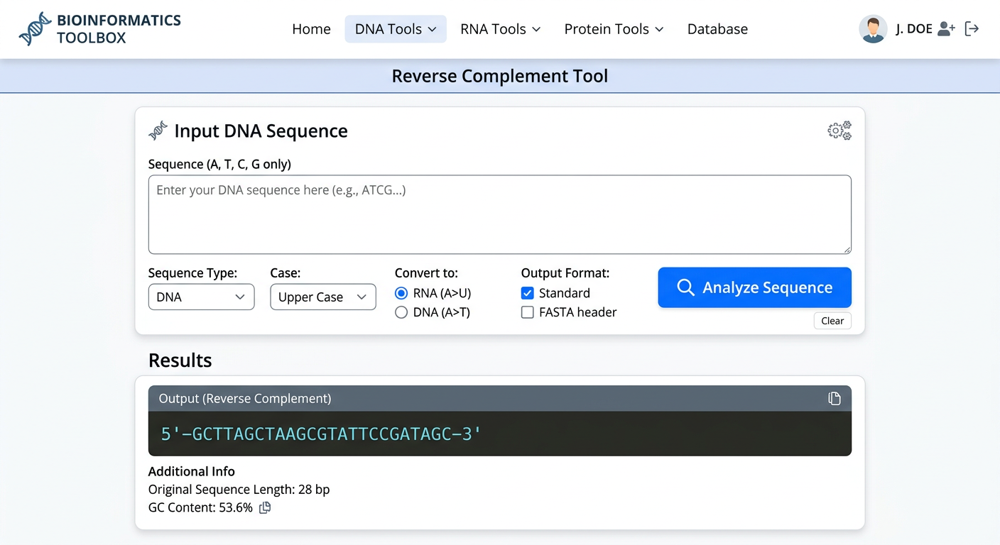
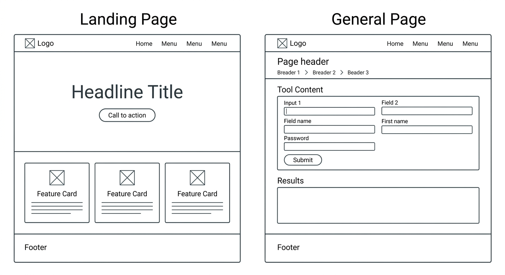
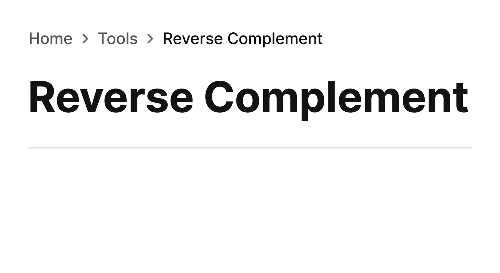
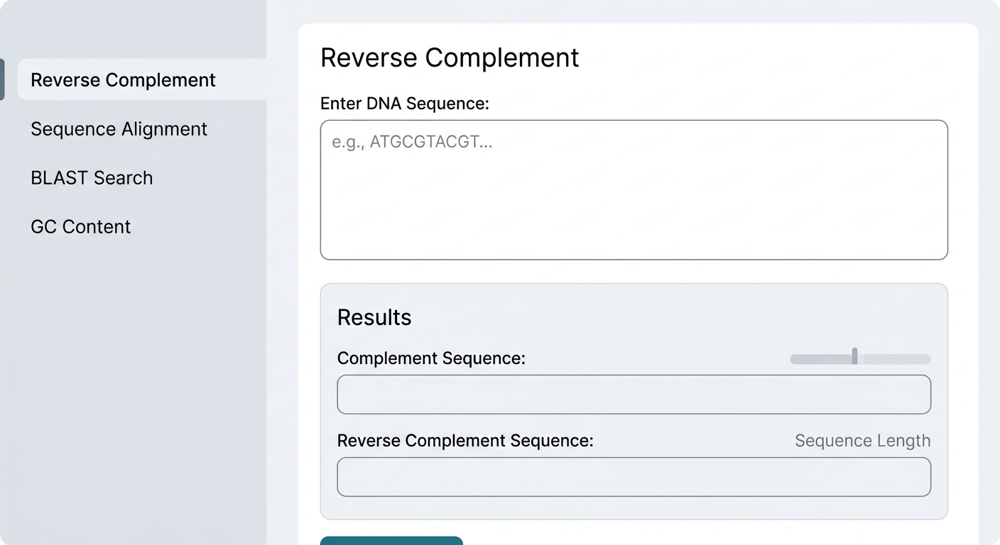
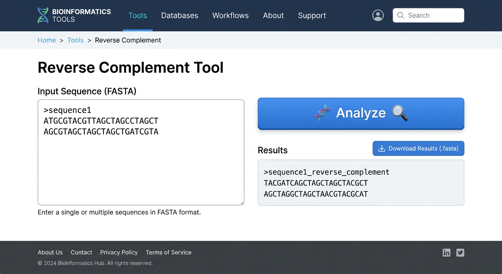
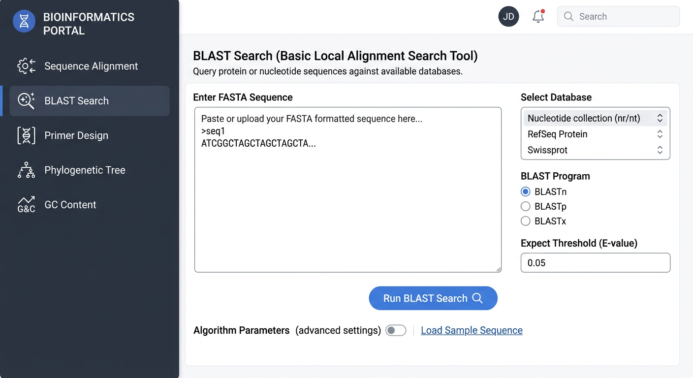
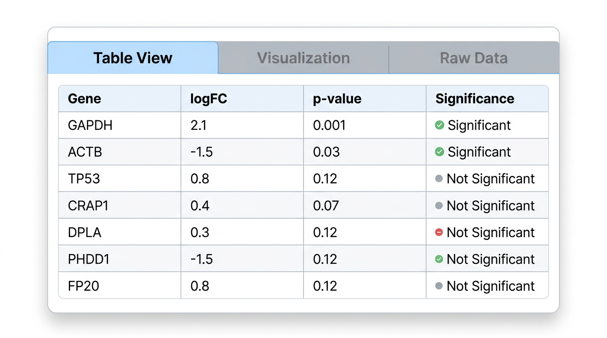
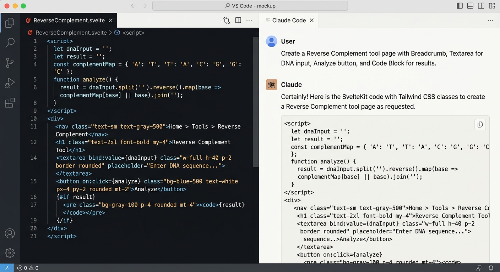

# 9장. 일반 페이지 디자인

## 9.1 일반 페이지란?

일반 페이지는 랜딩 페이지를 제외한 **나머지 모든 페이지**를 의미한다. 실제 웹 도구의 기능을 제공하는 핵심 페이지들이다. 랜딩 페이지의 화려한 Hero Section, Carousel 등의 디자인 요소를 축소하고, **모든 페이지에 공통적인 일관된 디자인**을 적용한다.



## 9.2 일반 페이지의 구조

### 공통 레이아웃

일반 페이지는 랜딩 페이지와 동일한 Header(Navbar)와 Footer를 공유하되, Hero Section의 높이를 크게 줄여 간결한 형태로 사용한다. 랜딩 페이지의 Hero가 화면 좌우 전체 너비에 큰 높이를 차지하는 것과 달리, 일반 페이지의 Hero는 페이지 제목 정도만 표시하는 얇은 배너 형태이다.



| 영역 | 랜딩 페이지 | 일반 페이지 |
|------|-------------|-------------|
| **Header** | Navbar + 큰 Hero Section | Navbar + 축소된 Hero (페이지 타이틀 배너) |
| **Body** | 기능 소개, 특징 카드 등 | 실제 도구 인터페이스, 콘텐츠 |
| **Footer** | 동일 | 동일 |

### Page Header (Breadcrumb 포함)

일반 페이지의 상단에는 현재 위치를 알려주는 **Breadcrumb**과 **페이지 제목(Heading)**을 배치한다.

```
Home > Tools > Reverse Complement
```



### Sidebar

도구가 여러 개이거나 설정 옵션이 많은 경우, **Sidebar**를 활용하여 네비게이션을 제공한다.



## 9.3 도구 페이지에서 자주 사용되는 컴포넌트

생명정보학 웹 도구의 일반 페이지에서 자주 사용되는 UI 컴포넌트들이다.

### 입력 폼 컴포넌트

| 컴포넌트 | 용도 | 예시 |
|----------|------|------|
| **Textarea** | 긴 텍스트 입력 (시퀀스 등) | FASTA 시퀀스 입력 |
| **Input** | 단일 값 입력 | 파라미터 값, 검색어 |
| **Select / Dropdown** | 선택지 중 하나 선택 | 알고리즘 선택, 데이터베이스 선택 |
| **Checkbox** | 다중 선택 | 출력 옵션 선택 |
| **Radio** | 단일 선택 | 분석 모드 선택 |
| **File Upload** | 파일 업로드 | FASTA 파일, VCF 파일 등 |
| **Button** | 실행/제출 | "분석 시작", "결과 다운로드" |
| **Label** | 입력 필드 설명 | 각 입력 필드의 이름 |

### 출력/결과 컴포넌트

| 컴포넌트 | 용도 | 예시 |
|----------|------|------|
| **Table** | 표 형태의 결과 표시 | BLAST 검색 결과, 통계 요약 |
| **Code Block** | 코드/시퀀스 표시 | 결과 시퀀스, 명령어 예시 |
| **Tab** | 여러 결과 뷰 전환 | 텍스트 뷰 / 시각화 뷰 |
| **Spinner** | 로딩 상태 표시 | 분석 진행 중 |
| **Alert / Toast** | 알림 메시지 | 성공/오류 메시지 |
| **Progress Bar** | 진행률 표시 | 대용량 파일 처리 진행률 |
| **Pagination** | 결과 페이지 이동 | 검색 결과가 많을 때 |

### 시각화 컴포넌트

| 컴포넌트 | 용도 |
|----------|------|
| **Chart** | 데이터 시각화 (막대, 선, 파이 차트 등) |
| **Heatmap** | 유전자 발현 히트맵 등 |
| **Sequence Viewer** | 시퀀스 정렬 결과 시각화 |

## 9.4 일반 페이지 디자인 패턴

### 단일 도구 페이지

하나의 도구만 제공하는 간단한 페이지이다. 입력 → 실행 → 결과의 흐름을 하나의 페이지에서 처리한다.

```
┌──────────────────────────────┐
│  Navbar                      │
├──────────────────────────────┤
│  Breadcrumb                  │
│  페이지 제목 (Heading)         │
├──────────────────────────────┤
│  입력 영역                    │
│  ┌────────────────────────┐  │
│  │  Textarea (시퀀스 입력)  │  │
│  └────────────────────────┘  │
│  [분석 시작] 버튼              │
├──────────────────────────────┤
│  결과 영역                    │
│  ┌────────────────────────┐  │
│  │  결과 출력 (Table/Code) │  │
│  └────────────────────────┘  │
│  [다운로드] 버튼               │
├──────────────────────────────┤
│  Footer                      │
└──────────────────────────────┘
```



### 다중 도구 페이지

여러 도구를 제공하는 경우, Sidebar로 도구를 선택하고 우측에서 사용하는 구조이다.

```
┌──────────────────────────────────┐
│  Navbar                          │
├──────┬───────────────────────────┤
│      │  Breadcrumb               │
│ Side │  페이지 제목               │
│ bar  ├───────────────────────────┤
│      │                           │
│ 도구1 │  선택된 도구의              │
│ 도구2 │  입력/결과 영역             │
│ 도구3 │                           │
│      │                           │
├──────┴───────────────────────────┤
│  Footer                          │
└──────────────────────────────────┘
```



### 탭 기반 결과 표시

분석 결과를 여러 형태로 보여줘야 할 때, Tab 컴포넌트를 활용한다.



## 9.5 SvelteKit에서 일반 페이지 구현

### 파일 기반 라우팅

SvelteKit은 **파일 기반 라우팅**을 사용한다. `src/routes/` 디렉토리의 폴더 구조가 URL 구조가 된다.

```
src/routes/
├── +page.svelte              → /         (랜딩 페이지)
├── +layout.svelte            → 공통 레이아웃
├── about/
│   └── +page.svelte          → /about
└── tools/
    ├── +page.svelte           → /tools   (도구 목록)
    ├── +layout.svelte         → tools 하위 공통 레이아웃
    ├── revcomp/
    │   └── +page.svelte       → /tools/revcomp
    └── alignment/
        └── +page.svelte       → /tools/alignment
```

### Reverse Complement 예시

```svelte
<!-- src/routes/tools/revcomp/+page.svelte -->
<script>
  let inputSequence = '';
  let result = '';

  function reverseComplement(seq) {
    const complement = { A: 'T', T: 'A', G: 'C', C: 'G' };
    return seq
      .toUpperCase()
      .split('')
      .reverse()
      .map(base => complement[base] || base)
      .join('');
  }

  function handleSubmit() {
    // FASTA 헤더 제거 후 시퀀스만 추출
    const lines = inputSequence.split('\n');
    const seq = lines.filter(l => !l.startsWith('>')).join('');
    result = reverseComplement(seq);
  }
</script>

<div class="max-w-4xl mx-auto p-6">
  <nav class="text-sm text-gray-500 mb-4">
    <a href="/" class="hover:underline">Home</a> &gt;
    <a href="/tools" class="hover:underline">Tools</a> &gt;
    <span>Reverse Complement</span>
  </nav>

  <h1 class="text-3xl font-bold mb-6">Reverse Complement</h1>

  <div class="space-y-4">
    <label class="block">
      <span class="text-lg font-medium">Input Sequence (FASTA)</span>
      <textarea
        bind:value={inputSequence}
        class="mt-2 w-full h-40 p-3 border rounded-lg font-mono"
        placeholder=">sequence1&#10;ATCGATCG"
      ></textarea>
    </label>

    <button
      on:click={handleSubmit}
      class="bg-blue-600 text-white px-6 py-2 rounded-lg hover:bg-blue-700"
    >
      분석 시작
    </button>

    {#if result}
      <div class="mt-6">
        <h2 class="text-xl font-semibold mb-2">결과</h2>
        <pre class="bg-gray-100 p-4 rounded-lg font-mono overflow-x-auto">{result}</pre>
        <button
          on:click={() => navigator.clipboard.writeText(result)}
          class="mt-2 text-blue-600 hover:underline"
        >
          결과 복사
        </button>
      </div>
    {/if}
  </div>
</div>
```

## 9.6 AI를 활용한 일반 페이지 디자인

일반 페이지도 랜딩 페이지와 마찬가지로 AI를 활용하여 디자인할 수 있다. 프롬프트에 컴포넌트 명칭을 정확히 사용하면 더 좋은 결과를 얻을 수 있다.

**프롬프트 예시:**

```
Reverse Complement 도구 페이지를 디자인해줘.
상단에 Breadcrumb (Home > Tools > Reverse Complement)과 페이지 제목.
입력 영역에는 FASTA 시퀀스를 붙여넣을 수 있는 큰 Textarea와 "분석 시작" Button.
결과 영역에는 Code Block으로 결과 시퀀스를 표시하고, "복사" 버튼과 "다운로드" 버튼.
전체적으로 깔끔하고 과학적인 느낌의 디자인.
```

Claude Code에서는 디자인 목업 이미지를 참조하여 구현을 요청할 수 있다:

```text
> 이 디자인 목업을 참고하여 /tools/revcomp 페이지를 구현해줘.
> SvelteKit + Tailwind CSS를 사용하고, 입력/결과 영역을 Card 컴포넌트로 감싸줘.
```



## 9.7 정리

- **일반 페이지는 랜딩 페이지와 동일한 Header/Footer를 공유하되, Hero Section을 축소**
  - Breadcrumb + Heading으로 현재 위치와 페이지 제목을 표시
- **도구 페이지에서 자주 사용되는 컴포넌트를 숙지**
  - 입력: Textarea, Input, Select, File Upload, Button
  - 출력: Table, Code Block, Tab, Spinner, Alert
  - 시각화: Chart, Heatmap, Sequence Viewer
- **디자인 패턴을 상황에 맞게 선택**
  - 단일 도구: 입력 → 실행 → 결과 흐름
  - 다중 도구: Sidebar 활용
  - 복합 결과: Tab 기반 전환
- **SvelteKit의 파일 기반 라우팅으로 페이지를 구성**
  - 폴더 구조 = URL 구조
- **AI에게 컴포넌트 명칭을 정확히 사용하여 디자인 및 구현을 요청**
